# UNIVERSIDAD PERUANA DE CIENCIAS APLICADAS


## "Informe de Trabajo Final"

**A1SI0729 - Desarrollo de Aplicaciones Open Source**

**Ingeniería de Software – 5to Ciclo**

**Profesor:** Alberto Wilmer Sánchez Seña  
**Sección:** 4313  
**Startup:** BetterLife  
**Producto:** CleanView  

---

### Integrantes:

| Nombre                                | Código       |
|---------------------------------------|--------------|
|Renzo Sebastian Uribe Livia            |U202311745    |
|Fabian Alejandro Oliva Lopez           |U202312013    |
|Marcia Victoria Melgarejo Gomez        |U20231C505    |
|Gabriel Fernando Gordon Salas          |U20221E229    |
|Valentino Sandoval Paiva               |U20211A962    |

**Abril 2025**

## Registro de Versiones del Informe

| Version | Fecha      | Autor                             | Descripcion                                                                                                                                                                                                                                                                                 |
| ------- | ---------- | ---------------------------------- | ------------------------------------------------------------------------------------------------------------------------------------------------------------------------------------------------------------------------------------------------------------------------------------------- |
| TB1     | 26/08/2025 | Renzo Sebastian Uribe Livia        | Desarrollé el Lean UX Problem Statements,Lean UX Assumptions,Diseño de entrevistas,Coompetidores y Estrategias y tácticas frente a competidores                                                                                                                                             |
| TB1     | 05/09/2025 | Renzo Sebastian Uribe Livia        | Desarrollé las User Stories,Product Backlog, Class Diagrams, Class Dictionary, Database Diagram, Sprint Planning 1, Sprint Backlog 1                                                                                                                                                        |
| TB1     | 29/08/2025 | Valentino Sandoval Paiva           | Desarrollé la Descripción de la Startup, Solution Profile, el regitro de una entrevista a un usuario del segmento 1 y 2, y realicé una entrevista.                                                                                                                                          |
| TB1     | 05/09/2025 | Valentino Sandoval Paiva           | Desarrollé el Empathy Mapping, User Task Matrix, Style Guidelines y Software configuration Management                                                                                                                                                                                       |
| TB1     | 25/09/2025 | Fabian Alejandro Oliva Lopez       | Realice el Startup Profile. Completando los antecedentes y problematica                                                                                                                                                                                                                     |
| TB1     | 27/09/2025 | Fabian Alejandro Oliva Lopez       | Realice las entrevistas. Grabando y resumiendo para el Registro de entrevistas.                                                                                                                                                                                                             |
| TB1     | 01/09/2025 | Marcia Victoria Melgarejo Gomez    | Complete el Ubiquitous Language. Realice el Domain-Driven Software Architecture al finalizar el Software Architecture Context Diagram, Software Architecture Container Diagrams y Software Architecture Components Diagrams.                                                                |
| TB1     | 06/09/2025 | Marcia Victoria Melgarejo Gomez    | Desarrolle el Sprint 1, al desarrollar el Sprint Planning 1, Testing Suite Evidence for Sprint Review, Execution Evidence for Sprint Review, Services Documentation Evidence for Sprint Review, Software Deployment Evidence for Sprint Review y Team Collaboration Insights during Sprint. |
| TB1     | 08/09/2025 | Gabriel Fernando Gordon Salas      | Desarrolle el Landing Page, cumpliendo los User Stories que me delegaron.                                                                                                                                                                                                                   |
| TB1     | 29/08/2025 | Gabriel Fernando Gordon Salas      | Desarrolle los as-is y to-be scenarios, además del registro de 1 entrevista por segmento objetivo.                                                                                                                                                                                          |
| TB1     | 06/09/2025 | Valentino Sandoval Paiva           | Desarrolle los wireframes y mockups de la landing page, además de los wireframes, mockups, wireflows y user flows diagrams para la aplicación web.                                                                                                                                          |
| TB1     | 11/10/2025 | Marcia Victoria Melgarejo Gomez    | Desarrolle los mockups de la landing pagE, Landing Page Wireframe, conclusiones , Student Ourtcome.                                                                                                                                                                                         |
| TB1     | 08/09/2025 | Renzo Sebastian Uribe Livia        | Desarrolle el Landing Page, cumpliendo los User Stories que me delegaron.                                                                                                                                                                                                                   |
| TP | 10/05/2025 | Renzo Sebastian Uribe Livia     | Desarrollo del Bounded Context de **Home**                  |
| TP | 10/05/2025 | Valentino Sandoval Paiva        | Desarrollo del Sprint 2 y Bounded Context de **Collection** |
| TP | 10/05/2025 | Fabian Alejandro Oliva Lopez    | Desarrollo del Bounded Context de **Control Panel**         |
| TP | 10/05/2025 | Marcia Victoria Melgarejo Gomez | Desarrollo del Bounded Context de **Sustainable Actions**   |
| TP | 10/05/2025 | Gabriel Fernando Gordon Salas   | Desarrollo del Bounded Context de **Reports**               |
| TB2 | 12/06/2025 | Renzo Sebastian Uribe Livia     |               |
| TB2 | 12/06/2025 | Valentino Sandoval Paiva        | |
| TB2 | 12/06/2025 | Fabian Alejandro Oliva Lopez    |        |
| TB2 | 12/06/2025 | Marcia Victoria Melgarejo Gomez |    |
| TB2 | 12/06/2025 | Gabriel Fernando Gordon Salas   |             |

## Project Report Collaboration Insights


| URL de la organización del proyecto  |          URL del repositorio del reporte          |
| :-----------------------------------: | :-----------------------------------------------: | 
| https://github.com/1ASI0729-2510-4313-G1-CleanView | https://github.com/1ASI0729-2510-4313-G1-CleanView/CleanView-Report |

| URL del repositorio de la landing page | URL del repositorio del frontend | URL del repositorio del BackEnd |
| :-----------------------------------------------: | :------------------------------: |:------------------------------: |
| https://github.com/1ASI0729-2510-4313-G1-CleanView/Landing-Page | https://github.com/1ASI0729-2510-4313-G1-CleanView/Frontend |https://github.com/1ASI0729-2510-4313-G1-CleanView/Backend-Web-Applications |


**URL LANDING PAGE DESPLEGADO**: https://1asi0729-2510-4313-g1-cleanview.github.io/Landing-Page/

**URL FRONTEND DESPLEGADO:**: https://frontend-web-applications.vercel.app/

**URL BACKEND DESPLEGADO:**: 


TB1: Se han realizado todas las tareas asignadas para la entrega del TF1, las cuales se encuentran registradas en el repositorio de Github de la organización del equipo bajo el enlace https://github.com/1ASI0729-2510-4313-G1-CleanView. Para elaborar el informe cada miembro corrigio y añadio puntos que se debian mejorar de la anterior entrega en el siguiente repositorio:  https://github.com/1ASI0729-2510-4313-G1-CleanView/CleanView-Report, de la misma manera para el desarrollo de la landing page se trabajo en este repositorio: https://github.com/1ASI0729-2510-4313-G1-CleanView/Landing-Page .

TB2: Se han -----------------------------------

TB1:

<br>**Vista de commits: **Report:****

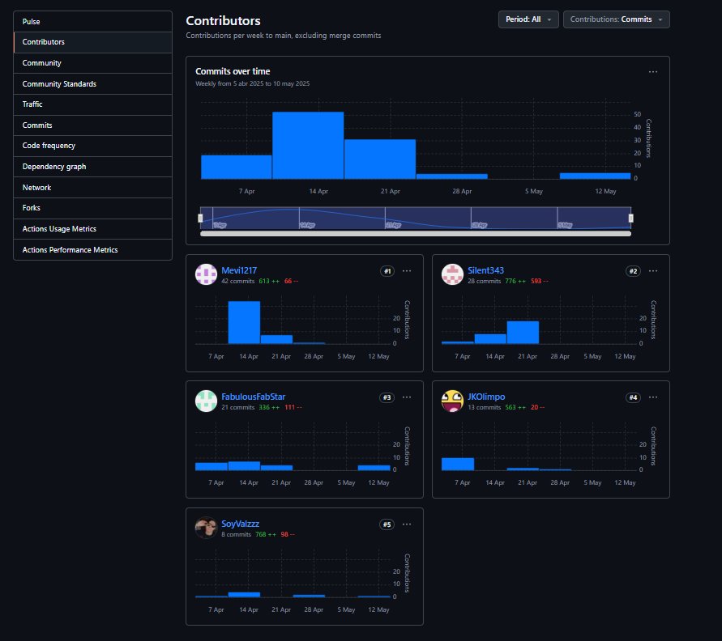

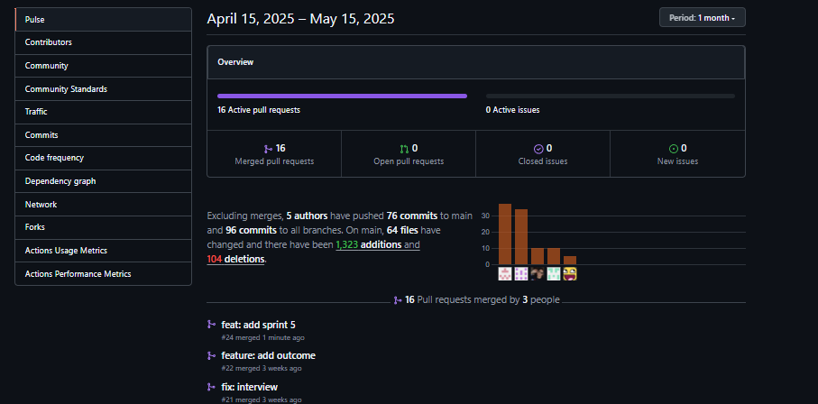

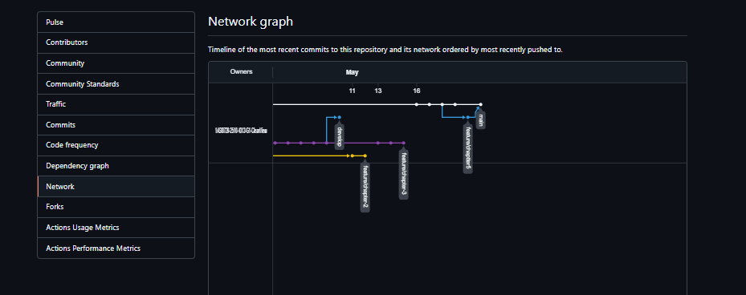


- Renzo Sebastian Uribe Livia: 13
- Fabian Alejandro Oliva Lopez: 21
- Marcia Victoria Melgarejo Gomez: 42
- Gabriel Fernando Gordon Salas: 28
- Valentino Sandoval Paiva: 8

TB2:


<br>**Vista de commits: **Report:****


- Renzo Sebastian Uribe Livia: 13
- Fabian Alejandro Oliva Lopez: 21
- Marcia Victoria Melgarejo Gomez: 42
- Gabriel Fernando Gordon Salas: 28
- Valentino Sandoval Paiva: 8


TB1:<br>
|Integrante|Tarea Asignada|
|-|-|
|Renzo Sebastian Uribe Livia|Lean UX Problem Statements,Lean UX Assumptions,Diseño de entrevistas,Coompetidores,Estrategias y tácticas frente a competidores,User Stories,Product Backlog, Class Diagrams, Class Dictionary, Database Diagram, Sprint Planning 1, Sprint Backlog 1|
|Sandoval Paiva Valentino|Descripción de la Startup, 5w y 2h, Solution Profile, Antecedentes y problemática, el regitro de una entrevista , Empathy Mapping, User Task Matrix, Style Guidelines y Software configuration Management.|
| Fabian Alejandro Oliva Lopez | Startup Profile, Descripción de la Startup, Antecedentes y problemática, Entrevistas, Registro de entrevistas, User Personas, Ubiquitous Language, Domain-Driven Software Architecture, Software Architecture Context Diagram, Software Architecture Container Diagrams, Software Architecture Components Diagrams, Sprint 1, Sprint Planning 1, Testing Suite Evidence for Sprint Review, Execution Evidence for Sprint Review, Services Documentation Evidence for Sprint Review, Software Deployment Evidence for Sprint Review, Team Collaboration Insights during Sprint. |
| Marcia Victoria Melgarejo Gomez | Segmentos objetivos, registro de entrevistas, as-is scenario mapping, to-be scenario mapping, landing page wireframes, landing page mockups, web application wireframes, web application mockups, web applications wireflow diagrams, web applications user flow diagrams, desarrollo de la landing page. |
| Gabriel Fernando Gordon Salas | Student outcome , conclusiones, Landing Page Wireframe, Landing Page Mock-up, Testing Suite Evidence for Sprint Review, landing page mockups, web application wireframes, web application mockups, wSoftware Deployment Evidence for Sprint Review |

**TP:**

| Integrante                          | Tarea Asignada                                                                                                                                                                                                                                                                                                                                                                                                                                                                                              |
| ----------------------------------- | ----------------------------------------------------------------------------------------------------------------------------------------------------------------------------------------------------------------------------------------------------------------------------------------------------------------------------------------------------------------------------------------------------------------------------------------------------------------------------------------------------------- |
| **Renzo Sebastian Uribe Livia**     | Se encargó del desarrollo del bounded context de **Home**, creando la estructura base de la página principal de la plataforma. Implementó el diseño responsivo, los componentes de navegación y los elementos visuales clave para mejorar la experiencia del usuario. Además, trabajó en la integración de datos en tiempo real para mostrar información resumida del sistema en el dashboard inicial. Participó en la revisión del diseño de interfaz y en pruebas funcionales.                            |
| **Sandoval Paiva Valentino**        | Desarrolló el Sprint 2 completo, incluyendo la planificación, ejecución, documentación y revisión del sprint. Estuvo a cargo del desarrollo del bounded context de *Collection Points*, implementando las funcionalidades necesarias para la gestión de puntos de recolección, sus formularios de registro, visualización y validaciones. También colaboró activamente en las pruebas, la integración con otros módulos y el despliegue funcional del contexto asignado.                                    |
| **Fabian Alejandro Oliva Lopez**    | Desarrolló el bounded context de **Control Panel**, encargado de centralizar la configuración y gestión de parámetros del sistema. Implementó componentes de control para sensores, dispositivos y notificaciones. Además, desarrolló validaciones de entrada y manejo de errores para garantizar la integridad de los datos. Participó en la conexión con la base de datos local de pruebas y en la integración con otros contextos como Home y Reports.                                                   |
| **Marcia Victoria Melgarejo Gomez** | Fue responsable del bounded context de **Sustainable Actions**, orientado al registro, seguimiento y visualización de acciones sostenibles realizadas por los usuarios. Desarrolló formularios dinámicos para ingresar acciones, filtros por tipo de acción y gráficos para medir el impacto ambiental. También trabajó en la conexión con el backend para almacenar registros y en la generación de reportes visuales. Participó en sesiones de revisión de código y pruebas funcionales.                  |
| **Gabriel Fernando Gordon Salas**   | Desarrolló el bounded context de **Reports**, implementando módulos para la generación de reportes dinámicos y visualizaciones gráficas. Utilizó librerías de gráficos para representar estadísticas relacionadas con residuos recolectados, impacto ambiental y rendimiento de cada zona. Diseñó una interfaz clara para la selección de filtros de tiempo, tipo de dato y exportación de reportes. Además, colaboró en el testeo cruzado con los demás contextos para asegurar consistencia en los datos. |

**TB2:**

## Student Outcome
| Resultado del curso                                                               | Evidencia individual                                                                                                                                                                                                                                                                                                                                                                                                                                                                                                                                                                                                                                                                                                                                                                                                                                                                                                                                                                                                                                                                                                                                                                                                                                                                                                                                                                                                                    | Evidencia grupal                                                                                                                                                                                                                                                                                                                                                                                                                                                                                                                    |
| --------------------------------------------------------------------------------- | --------------------------------------------------------------------------------------------------------------------------------------------------------------------------------------------------------------------------------------------------------------------------------------------------------------------------------------------------------------------------------------------------------------------------------------------------------------------------------------------------------------------------------------------------------------------------------------------------------------------------------------------------------------------------------------------------------------------------------------------------------------------------------------------------------------------------------------------------------------------------------------------------------------------------------------------------------------------------------------------------------------------------------------------------------------------------------------------------------------------------------------------------------------------------------------------------------------------------------------------------------------------------------------------------------------------------------------------------------------------------------------------------------------------------------------- | ----------------------------------------------------------------------------------------------------------------------------------------------------------------------------------------------------------------------------------------------------------------------------------------------------------------------------------------------------------------------------------------------------------------------------------------------------------------------------------------------------------------------------------- |
| **3.c1 Comunica de manera oral con efectividad a diferentes rangos de audiencia** | **Gabriel Gordon**<br>**TB1:** Presenté el diseño de la landing page, los mock-ups y diagramas al equipo, explicando visualmente el flujo del usuario. También expliqué el diagrama de clases y el modelo de base de datos durante sesiones colaborativas.<br>**TP:** Expuse el módulo de *Reports*, explicando su lógica visual y técnica a todo el equipo, adaptando el lenguaje para programadores y diseñadores.<br><br> **Renzo Uribe**<br>**TB1:** Expuse ideas para la estructura del sistema en sesiones de ideación.<br>**TP:** Expliqué la arquitectura del módulo *Home*, su integración con otros módulos y resolví dudas técnicas en reuniones grupales.<br><br> **Valentino Sandoval**<br>**TB1:** Lideré sesiones para validar las historias de usuario y propuestas de arquitectura.<br>**TP:** Dirigí reuniones del Sprint 2, presenté avances del módulo *Collection Points* y expliqué su integración a los demás integrantes.<br><br> **Fabián Oliva**<br>**TB1:** Presenté propuestas sobre cómo organizar la interfaz de configuración.<br>**TP:** Expliqué el módulo *Control Panel* en sesiones grupales, detallando sus funcionalidades clave y aclarando dudas.<br><br> **Marcia Melgarejo**<br>**TB1:** Participé en presentaciones del journey map y del diseño de la app.<br>**TP:** Expuse el flujo funcional del módulo *Sustainable Actions* y cómo se alinea con los objetivos ecológicos del sistema. | **TB1:** El equipo realizó sesiones colaborativas para revisar y presentar diagramas, flujos y diseños. Se demostró una comunicación efectiva al explicar conceptos técnicos y de diseño, facilitando la toma de decisiones en etapas tempranas.<br><br>**TP:** En las reuniones grupales del Sprint 2, todos los integrantes presentaron sus avances, explicaron el funcionamiento de sus módulos y dieron retroalimentación constructiva. Se logró una comunicación oral fluida que permitió una integración exitosa del sistema. |
| **3.c2 Comunica por escrito con efectividad a diferentes rangos de audiencia**    | **Gabriel Gordon**<br>**TB1:** Redacté documentación de los user persona, journey map, impact map, backlog, wireframes y mock-ups con lenguaje claro y técnico.<br>**TP:** Elaboré descripciones funcionales del módulo *Reports* y colaboré en la redacción técnica de los entregables finales.<br><br> **Renzo Uribe**<br>**TB1:** Escribí partes del documento de arquitectura del sistema.<br>**TP:** Documenté el diseño funcional del módulo *Home*, flujos de navegación y estructura de carpetas.<br><br> **Valentino Sandoval**<br>**TB1:** Redacté partes de las historias de usuario y backlog inicial.<br>**TP:** Escribí la documentación del módulo *Collection Points*, incluyendo formularios, validaciones y casos de uso.<br><br> **Fabián Oliva**<br>**TB1:** Redacté parte de la propuesta técnica del sistema.<br>**TP:** Documenté el módulo *Control Panel*, incluyendo endpoints, estructura técnica y comportamiento funcional.<br><br> **Marcia Melgarejo**<br>**TB1:** Elaboré documentación escrita del impacto ambiental del sistema y contribuciones al diseño UX.<br>**TP:** Documenté el módulo *Sustainable Actions*, su flujo funcional y su aporte a los objetivos del sistema.                                                                                                                                                                                                                      | **TB1:** El equipo elaboró entregables escritos organizados y detallados que comunicaban efectivamente tanto la visión del producto como la arquitectura propuesta. Esto permitió que todos tuvieran una comprensión común de la base del proyecto.<br><br>**TP:** La documentación del sistema fue desarrollada de manera colaborativa. Cada miembro redactó las especificaciones de su módulo con lenguaje técnico y accesible, permitiendo una integración clara y comprensible de todas las partes del sistema.                 |

## Repertorio

  - [Student Outcome](#student-outcome)
  - [Capítulo I: Introducción](#capítulo-i-introducción)
    - [1.1. Startup Profile](#11-startup-profile)
    - [1.1.1. Descripción de la Startup](#111-descripción-de-la-startup)
    - [1.1.2. Perfiles de integrantes del equipo](#112-perfiles-de-integrantes-del-equipo)
    - [1.2. Solution Profile](#12-solution-profile)
    - [1.2.1. Antecedentes y problemática](#121-antecedentes-y-problemática)
    - [1.2.2. Lean UX Process](#122-lean-ux-process)
    - [1.2.2.1. Lean UX Problem Statements](#1221-lean-ux-problem-statements)
    - [1.2.2.2. Lean UX Assumptions](#1222-lean-ux-assumptions)
    - [1.2.2.3. Lean UX Hypothesis Statements](#1223-lean-ux-hypothesis-statements)
    - [1.2.2.4. Lean UX Canvas](#1224-lean-ux-canvas)
    - [1.3. Segmentos objetivo](#13-segmentos-objetivo)
  - [Capítulo II: Requirements Elicitation \& Analysis](#capítulo-ii-requirements-elicitation--analysis)
    - [2.1. Competidores](#21-competidores)
    - [2.1.1. Análisis competitivo](#211-análisis-competitivo)
    - [2.1.2. Estrategias y tácticas frente a competidores](#212-estrategias-y-tácticas-frente-a-competidores)
    - [2.2. Entrevistas](#22-entrevistas)
    - [2.2.1. Diseño de entrevistas](#221-diseño-de-entrevistas)
    - [2.2.2. Registro de entrevistas](#222-registro-de-entrevistas)
    - [2.2.3. Análisis de entrevistas](#223-análisis-de-entrevistas)
    - [2.3. Needfinding](#23-needfinding)
    - [2.3.1. User Personas](#231-user-personas)
    - [2.3.2. User Task Matrix](#232-user-task-matrix)
    - [2.3.3. User Journey Mapping](#233-user-journey-mapping)
    - [2.3.4. Empathy Mapping](#234-empathy-mapping)
    - [2.3.5. As-is Scenario Mapping](#235-as-is-scenario-mapping)
    - [2.4. Ubiquitous Language](#24-ubiquitous-language)
  - [Capítulo III: Requirements Specification](#capítulo-iii-requirements-specification)
    - [3.1. To-Be Scenario Mapping](#31-to-be-scenario-mapping)
    - [3.2. User Stories](#32-user-stories)
    - [3.3. Impact Mapping](#33-impact-mapping)
    - [3.4. Product Backlog](#34-product-backlog)
  - [Capítulo IV: Product Design](#capítulo-iv-product-design)
    - [4.1. Style Guidelines.](#41-style-guidelines)
    - [4.1.1. General Style Guidelines.](#411-general-style-guidelines)
    - [4.1.2. Web Style Guidelines.](#412-web-style-guidelines)
    - [4.2. Information Architecture](#42-information-architecture)
      - [4.2.1. Organization Systems](#421-organization-systems)
      - [4.2.2. Labeling Systems](#422-labeling-systems)
      - [4.2.3. SEO Tags and Meta Tags](#423-seo-tags-and-meta-tags)
      - [4.2.4. Searching Systems](#424-searching-systems)
      - [4.2.5. Navigation Systems](#425-navigation-systems)
    - [4.3. Landing Page UI Design](#43-landing-page-ui-design)
      - [4.3.1. Landing Page Wireframe](#431-landing-page-wireframe)
        - [Desktop Web Browser:](#desktop-web-browser)
        - [Mobile Web Browser:](#mobile-web-browser)
      - [4.3.2. Landing Page Mock-up](#432-landing-page-mock-up)
        - [Desktop Web Browser:](#desktop-web-browser-1)
        - [Mobile Web Browser:](#mobile-web-browser-1)
    - [4.4. Web Applications UX/UI Design](#44-web-applications-uxui-design)
      - [4.4.1. Web Applications Wireframes](#441-web-applications-wireframes)
      - [4.4.2. Web Applications Wireflow Diagrams](#442-web-applications-wireflow-diagrams)
      - [4.4.3. Web Applications Mock-ups](#443-web-applications-mock-ups)
      - [4.4.4. Web Applications User Flow Diagrams](#444-web-applications-user-flow-diagrams)
    - [4.5. Web Applications Prototyping](#45-web-applications-prototyping)
    - [4.6. Domain-Driven Software Architecture](#46-domain-driven-software-architecture)
    - [4.6.1. Software Architecture Context Diagram](#461-software-architecture-context-diagram)
    - [4.6.2. Software Architecture Container Diagrams](#462-software-architecture-container-diagrams)
    - [4.6.3. Software Architecture Components Diagrams](#463-software-architecture-components-diagrams)
    - [4.7. Software Object-Oriented Design](#47-software-object-oriented-design)
      - [4.7.1. Class Diagrams](#471-class-diagrams)
    - [4.8. Database Design](#48-database-design)
    - [4.7.2. Database Dictionary](#472-database-dictionary)
      - [4.8.1. Database Diagram](#481-database-diagram)
  - [Capítulo V: Product Implementation, Validation \& Deploymentt](#capítulo-v-product-implementation-validation--deploymentt)
    - [5.1. Software Configuration Management.](#51-software-configuration-management)
    - [5.1.1. Software Development Environment Configuration.](#511-software-development-environment-configuration)
  - [Diseño y Desarrollo](#diseño-y-desarrollo)
    - [5.1.2. Source Code Management.](#512-source-code-management)
    - [5.1.3. Source Code Style Guide \& Conventions.](#513-source-code-style-guide--conventions)
    - [5.1.4. Software Deployment Configuration.](#514-software-deployment-configuration)
    - [5.2 Landing Page, Services \& Applications Implementation.](#52-landing-page-services--applications-implementation)
    - [5.2.1 . Sprint 1](#521--sprint-1)
      - [5.2.1.1 Sprint Planning 1.](#5211-sprint-planning-1)
      - [5.2.1.2 Sprint Backlog 1.](#5212-sprint-backlog-1)
      - [5.2.1.3 Development Evidence for Sprint Review](#5213-development-evidence-for-sprint-review)
      - [5.2.1.4 Testing Suite Evidence for Sprint Review.](#5214-testing-suite-evidence-for-sprint-review)
      - [5.2.1.5 Execution Evidence for Sprint Review.](#5215-execution-evidence-for-sprint-review)
      - [5.2.1.6 Services Documentation Evidence for Sprint Review.](#5216-services-documentation-evidence-for-sprint-review)
      - [5.2.1.7 Software Deployment Evidence for Sprint Review.](#5217-software-deployment-evidence-for-sprint-review)
      - [5.2.1.8 Team Collaboration Insights during Sprint.](#5218-team-collaboration-insights-during-sprint)
    - [5.2.2 . Sprint 2](#522--sprint-2)
      - [5.2.2.1 Sprint Planning 2.](#5221-sprint-planning-2)
      - [5.2.2.2 Sprint Backlog 2.](#5222-sprint-backlog-2)
      - [5.2.2.3 Development Evidence for Sprint Review](#5223-development-evidence-for-sprint-review)
      - [5.2.2.4 Testing Suite Evidence for Sprint Review.](#5224-testing-suite-evidence-for-sprint-review)
      - [5.2.2.5 Execution Evidence for Sprint Review.](#5225-execution-evidence-for-sprint-review)
      - [5.2.2.6 Services Documentation Evidence for Sprint Review.](#5226-services-documentation-evidence-for-sprint-review)
      - [5.2.2.7 Software Deployment Evidence for Sprint Review.](#5227-software-deployment-evidence-for-sprint-review)
      - [5.2.2.8 Team Collaboration Insights during Sprint.](#5228-team-collaboration-insights-during-sprint)
    - [5.2.3 . Sprint 3](#523--sprint-3)
      - [5.2.3.1 Sprint Planning 3.](#5231-sprint-planning-3)
      - [5.2.3.2 Sprint Backlog 3.](#5232-sprint-backlog-3)
      - [5.2.3.3 Development Evidence for Sprint Review](#5233-development-evidence-for-sprint-review)
      - [5.2.3.4 Testing Suite Evidence for Sprint Review.](#5234-testing-suite-evidence-for-sprint-review)
      - [5.2.3.5 Execution Evidence for Sprint Review.](#5235-execution-evidence-for-sprint-review)
      - [5.2.3.6 Services Documentation Evidence for Sprint Review.](#5236-services-documentation-evidence-for-sprint-review)
      - [5.2.3.7 Software Deployment Evidence for Sprint Review.](#5237-software-deployment-evidence-for-sprint-review)
      - [5.2.3.8 Team Collaboration Insights during Sprint.](#5238-team-collaboration-insights-during-sprint)
    - [5.2.4 . Sprint 4](#524--sprint-4)
      - [5.2.4.1 Sprint Planning 4.](#5241-sprint-planning-4)
      - [5.2.4.2 Sprint Backlog 4.](#5242-sprint-backlog-4)
      - [5.2.4.3 Development Evidence for Sprint Review](#5243-development-evidence-for-sprint-review)
      - [5.2.4.4 Testing Suite Evidence for Sprint Review.](#5244-testing-suite-evidence-for-sprint-review)
      - [5.2.4.5 Execution Evidence for Sprint Review.](#5245-execution-evidence-for-sprint-review)
      - [5.2.4.6 Services Documentation Evidence for Sprint Review.](#5246-services-documentation-evidence-for-sprint-review)
      - [5.2.4.7 Software Deployment Evidence for Sprint Review.](#5247-software-deployment-evidence-for-sprint-review)
      - [5.2.4.8 Team Collaboration Insights during Sprint.](#5248-team-collaboration-insights-during-sprint)
    - [5.3 Validation Interviews](#53-validation-interviews)
      - [5.3.1 Diseño de Entrevistas](#531-diseño-de-entrevistas)
      - [5.3.2 Registro de Entrevistas](#532-registro-de-entrevistas)
      - [5.3.3 Evaluaciones según Heurísticas](#533-evaluaciones-según-heurísticas)
    - [5.4 Video About-the-Product](#54-video-about-the-product)
    - [Conclusiones](#conclusiones)
    - [Bibliografia](#bibliografia)
    - [Anexos](#anexos)

# Capítulo I: Introducción

## 1.1. Startup Profile

### 1.1.1. Descripción del Startup

En el contexto actual, muchas empresas enfrentan el desafío de gestionar de manera eficiente sus residuos y cumplir con las normativas ambientales, mientras buscan reducir costos operativos. **CleanView** surge como una solución tecnológica que permite a las empresas gestionar sus residuos de manera eficiente, optimizando los procesos de reciclaje y ayudando a reducir la generación de desechos a través de la inteligencia artificial y análisis de datos en tiempo real.

**Misión**:
Ofrecer una plataforma innovadora en tiempo real para ayudar a las empresas a gestionar sus residuos de manera eficiente, facilitando el monitoreo, la reducción de desechos y el cumplimiento de normativas ambientales. Trabajamos en conjunto con nuestros segmentos objetivos para crear soluciones que optimicen sus procesos, con el compromiso de seguir los códigos éticos y morales que establece la Universidad Peruana de Ciencias Aplicadas, en cumplimiento con las normas APA 7 para garantizar la legibilidad y claridad en nuestra documentación.

**Visión**:
Ser la herramienta líder en la gestión de residuos para empresas a nivel global, ayudando a miles de negocios a optimizar sus operaciones, reducir costos asociados a la gestión de desechos y promover la sostenibilidad ambiental mediante el uso de tecnología innovadora.

**Valores**:

- **Innovación y sostenibilidad**  
- **Compromiso con el medio ambiente**  
- **Transparencia y confianza**  
- **Eficiencia y calidad**


#### 1.1.2. Perfiles de integrantes del equipo

| Nombre                        | Rol                     | Contacto                                   | Habilidades y conocimientos técnicos |
|-------------------------------|-------------------------|--------------------------------------------|--------------------------------------|
| Renzo Sebastian Uribe Livia   | Ingeniero de software   | renzosebastianuribelivia@gmail.com         | Desarrollo en C++, diseño de HTML    |
| Fabian Alejandro Oliva Lopez  | Ingeniero de sofware    | fabianalejandro1001@gmail.com              | Desarrollo en Visual Studio          |                                                                             
| Marcia Victoria Melgarejo Gomez|Ingeniera de Software   |melgarejogomezmarcia@gmail.com              | Desarrollo en C++, HTML, CSS, JS     |
| Gabriel Fernando Gordon Salas | Ingeniero de Software   | gabrielfgs2004@gmail.com                   | Desarrollo en C++, HTML, CSS, JS, SQL, Python|
| Valentino Sandoval Paiva |  Ingeniero de software                       |      valentinosandoval2805@gmail.com                                      | Desarrollo en C++, HTML, CSS, JS, SQL, Python, Java                                     |

## 1.2. Solution Profile

La aplicación lleva por nombre **CleanView**. El propósito de la aplicación se centra en la gestión eficiente de residuos, permitiendo a las empresas acceder a datos detallados sobre la generación de desechos, su almacenamiento adecuado y las mejores prácticas de reciclaje. Además, facilita el monitoreo en tiempo real de la producción de residuos, notificando a los usuarios cuando es momento de reducir su generación de desechos o coordinar la recolección con centros de reciclaje cercanos.

Finalmente, **CleanView** promete a sus usuarios ser la herramienta clave para gestionar sus residuos de manera inteligente, ayudando a las empresas a reducir pérdidas económicas por mala gestión de desechos, optimizar sus procesos de reciclaje y mejorar la eficiencia operativa. Además, les permitirá tomar decisiones informadas para cumplir con regulaciones ambientales y aumentar la sostenibilidad de sus operaciones.

### 1.2.1 Antecedentes y problemática

Las empresas, especialmente en sectores industriales y comerciales, generan grandes cantidades de residuos diariamente. La falta de herramientas tecnológicas para monitorear y analizar su producción de desechos dificulta la toma de decisiones sostenibles. Esta situación provoca un incremento en los costos operativos, dificulta el cumplimiento de normas ambientales y afecta negativamente su impacto ecológico.

Para comprender mejor esta problemática, se aplica la técnica de las **5W’s + 2H’s**:

#### 🟩 What (¿Qué sucede?)
Las empresas producen residuos en grandes cantidades sin una gestión eficiente. No cuentan con datos claros ni soluciones digitales para reducir, clasificar o reciclar de forma efectiva.

#### 🟩 Why (¿Por qué es un problema?)
La falta de visibilidad y control sobre los residuos:
- Incrementa los costos operativos.
- Impide el cumplimiento de normativas ambientales.
- Afecta la reputación y sostenibilidad de la empresa.
- Desaprovecha oportunidades de ahorro y reciclaje.

#### 🟩 Who (¿A quiénes afecta?)
- A las **empresas** que buscan mejorar su sostenibilidad y reducir costos.
- A los **responsables de operaciones, logística o sostenibilidad** dentro de las organizaciones.
- A la **sociedad en general**, debido al impacto ambiental negativo.

#### 🟩 When (¿Cuándo ocurre?)
De forma **constante**, especialmente conforme las empresas aumentan su producción y volumen de residuos sin adoptar soluciones tecnológicas de control.

#### 🟩 Where (¿Dónde ocurre?)
En **zonas industriales, urbanas y comerciales**, donde operan empresas con poca digitalización en la gestión de residuos. Es más común en países donde la cultura ambiental o normativas aún están en desarrollo.

#### 🟩 How (¿Cómo sucede?)
- Falta de herramientas para medir y analizar residuos.
- No existen alertas o recomendaciones para reducir desechos.
- No hay conexión directa con centros de reciclaje.
- La información, cuando existe, es dispersa y no procesable en tiempo real.

#### 🟩 How Much (¿Cuánto cuesta o impacta?)
- **Económicamente**: Aumentan los gastos por transporte, almacenamiento o multas ambientales.
- **Ambientalmente**: Mayor contaminación y pérdida de materiales reciclables.
- **Socialmente**: Daño a la imagen corporativa y pérdida de confianza de consumidores y aliados estratégicos.


### 1.2.2 Lean UX Process

El proceso de Lean UX se enfoca en crear productos digitales eficientes mediante la experimentación rápida y la validación constante de hipótesis, priorizando la colaboración y el aprendizaje continuo. En el caso de nuestra plataforma de gestión de residuos, el proceso Lean UX se desarrolló en las siguientes fases:

#### Comprender
En esta fase, se realiza una investigación cualitativa y cuantitativa con empresas de diferentes sectores, enfocándonos en entender cómo gestionan actualmente sus residuos. A través de entrevistas y encuestas, descubrimos que la mayoría de las empresas no tienen acceso a datos claros sobre su producción de residuos, lo que dificulta la toma de decisiones informadas y sostenibles. Este entendimiento nos permitió identificar los puntos de dolor principales y las áreas de oportunidad.

#### Esbozar
Con los hallazgos de la investigación, comenzamos a crear prototipos de baja fidelidad para la plataforma. Estos prototipos se enfocaron en funcionalidades clave como:
- **Dashboard** que presenta métricas clave sobre la generación de residuos.
- **Registro de actividades** de reciclaje realizadas por la empresa.
- **Recomendaciones automáticas** para reducir los residuos generados.
- **Mapa interactivo** con centros de reciclaje cercanos a la ubicación de la empresa.

#### Probar
Se realizaron pruebas de usabilidad con empresas piloto que nos permitieron validar la funcionalidad de los prototipos. Durante las pruebas, observamos cómo los usuarios interactuaban con el dashboard y las recomendaciones, y recopilamos feedback sobre la claridad de la interfaz y la utilidad de las funcionalidades. Con esta información, ajustamos el diseño para asegurar que se alineara con las necesidades reales de los usuarios.

#### Medir
Una vez implementados los prototipos mejorados, comenzamos a medir el rendimiento de las funcionalidades clave. Analizamos métricas como la tasa de interacción con el dashboard, el tiempo dedicado a la visualización de los reportes, y la frecuencia con la que los usuarios interactuaban con las recomendaciones. También recopilamos datos sobre la satisfacción del usuario para guiar futuras iteraciones del producto, asegurándonos de que la plataforma fuera fácil de usar y realmente útil para los responsables de la gestión de residuos.


#### 1.2.2.1 Lean UX Problem Statements

##### Problem Statement 1
Muchas empresas generan grandes cantidades de residuos sin contar con herramientas digitales que les permitan monitorear en tiempo real la producción de desechos y el impacto ambiental de sus actividades. Esto genera problemas como el incumplimiento de normativas ambientales, el aumento de costos operativos y la falta de visibilidad sobre los residuos reciclables o peligrosos, afectando tanto su eficiencia como su imagen corporativa.

**¿Cómo podríamos diseñar una solución digital que permita a las empresas tener visibilidad en tiempo real sobre la generación de residuos, ayudándolas a reducir su impacto ambiental, cumplir con regulaciones y optimizar sus costos operativos?**

---

##### Problem Statement 2
En la actualidad, muchas empresas carecen de acceso a datos claros y prácticos sobre cómo reducir su producción de residuos y mejorar sus prácticas de reciclaje. Como resultado, las decisiones se toman sin una base sólida, lo que puede generar desperdicios innecesarios, pérdida de recursos reciclables y un impacto negativo en la sostenibilidad empresarial.

**¿Cómo podríamos diseñar la experiencia dentro de la plataforma para proporcionar a las empresas recomendaciones personalizadas y fáciles de seguir para reducir la generación de residuos y mejorar sus procesos de reciclaje de forma eficiente?**

---

##### Problem Statement 3
Muchos responsables de sostenibilidad o logística dentro de las empresas no tienen visibilidad sobre los centros de reciclaje cercanos ni sobre las fechas óptimas de recolección de residuos. Esto provoca retrasos en la recolección, la acumulación de desechos no reciclados y la falta de acción frente a residuos que podrían ser reciclados o reutilizados.

**¿Cómo podríamos diseñar la plataforma para ofrecer alertas personalizadas y un mapa interactivo de centros de reciclaje cercanos, ayudando a las empresas a coordinar mejor la recolección y optimizar el reciclaje de sus residuos?**

#### 1.2.2.2 Lean UX Assumptions

### 1.2.2.2.1 Business Assumptions
- Existe un mercado no atendido de pequeñas y medianas empresas que requieren soluciones tecnológicas para el monitoreo y gestión de sus residuos.
- Las pérdidas económicas de las empresas están vinculadas a la mala gestión de residuos, lo que genera una necesidad urgente de soluciones para optimizar los procesos de reciclaje y reducir la producción de desechos.
- Las empresas están dispuestas a invertir en soluciones que les permitan mejorar su eficiencia operativa y cumplir con regulaciones ambientales, por lo que podrían ver valor en una plataforma como *Plataforma de Gestión de Residuos*.

### 1.2.2.2.2 Business Outcomes
- Generar oportunidades de monetización mediante un modelo freemium y suscripciones premium, ofreciendo servicios adicionales como reportes detallados y notificaciones personalizadas.
- Mejorar la percepción de la marca de la plataforma como una solución innovadora y eficiente para la gestión de residuos en empresas, especialmente en PyMEs y grandes corporaciones.
- Facilitar alianzas con organizaciones de sostenibilidad y proveedores de reciclaje para fortalecer la red de soluciones disponibles.

### 1.2.2.2.3 User Assumptions
- Los responsables de la gestión de residuos en las empresas no utilizan actualmente herramientas digitales especializadas, sino que se basan en métodos manuales (hojas de cálculo, registros físicos).
- Tienen interés en reducir la producción de residuos y optimizar el reciclaje, pero no siempre saben cómo abordar estas tareas de manera eficiente.
- Existen barreras de conocimiento y recursos para implementar prácticas sostenibles de forma efectiva, por lo que buscan soluciones accesibles y fáciles de usar.

### 1.2.2.2.4 User Outcomes
- Los usuarios reportan una mayor eficiencia en la gestión de residuos, con un mejor seguimiento de los desechos generados y optimización de los procesos de reciclaje.
- Las empresas disminuyen las pérdidas económicas asociadas a la mala gestión de residuos, como los costos por desechos no reciclados o la acumulación innecesaria de desechos.
- Los responsables de sostenibilidad dentro de las empresas logran tomar decisiones más informadas y cumplen con las normativas ambientales de forma más eficaz.

### 1.2.2.3 Lean UX Hypothesis Statements

#### Hypothesis Statement 1
Creemos que lograremos una mejora en la eficiencia en la gestión de residuos y una reducción en los costos asociados a la mala gestión de desechos.

Sabremos que si las empresas  
Obtienen visibilidad en tiempo real sobre la generación de residuos y las oportunidades de reciclaje,  
Cuando veamos con una solución digital que permita monitorear los residuos generados, ofrecer recomendaciones de reducción y conectar con centros de reciclaje cercanos.

---

#### Hypothesis Statement 2
Creemos que lograremos un aumento en la toma de decisiones informadas para la optimización de los procesos de reciclaje y reducción de desechos.

Sabremos que si los responsables de sostenibilidad en las empresas  
Tienen acceso a datos detallados sobre su producción de residuos y sus impactos ambientales,  
Cuando veamos con una funcionalidad que ofrezca recomendaciones claras y datos visuales sobre cómo reducir la generación de residuos y mejorar el reciclaje.

---

#### Hypothesis Statement 3
Creemos que lograremos una mejora en el cumplimiento de normativas ambientales y un aumento en la eficiencia operativa de las empresas.

Sabremos que si las empresas  
Reciben alertas personalizadas y recomendaciones para mejorar sus prácticas de reciclaje y cumplir con las regulaciones ambientales,  
Cuando veamos con un sistema que envíe notificaciones sobre fechas de recolección, objetivos de reducción de residuos y cumplimiento de normativas ambientales.

#### 1.2.2.4. Lean UX Canvas

  
*Nota: Este es un placeholder para el Lean Canvas.*

### 1.3. Segmentos objetivo

**Segmento 1: Personas Naturales**  
- **Características:**  
  - Ciudadanos comprometidos con el medio ambiente o interesados en comenzar prácticas sostenibles.  
  - Edades entre 20 y 60 años.  
  - Nivel socioeconómico medio a alto.  
  - Interés en la gestión de residuos domésticos, reciclaje y reducción del impacto ambiental.

- **Necesidades:**  
  - Aplicación intuitiva para registrar y analizar sus hábitos de consumo y reciclaje.  
  - Recomendaciones personalizadas para reducir su generación de residuos.  
  - Mapa interactivo con centros de reciclaje cercanos.  
  - Alertas y notificaciones sobre fechas de recolección y tips ecológicos.


**Segmento 2: Empresas (PyMEs, Grandes Empresas y ONGs)**  
- **Características:**  
  - Organizaciones de distintos tamaños, desde pequeñas hasta grandes, incluyendo ONGs enfocadas en sostenibilidad.  
  - Sectores como manufactura, comercio, servicios, logística, y tecnología.  
  - Ingresos mensuales variados: desde $10,000 hasta más de $1,000,000 USD.

- **Necesidades:**  
  - Herramientas digitales para monitorear en tiempo real la generación de residuos.  
  - Análisis y reportes detallados sobre impacto ambiental y reducción de costos.  
  - Integración con sistemas internos de gestión.  
  - Recomendaciones prácticas para cumplir con normativas medioambientales.  
  - Funcionalidades colaborativas para conectar con centros de reciclaje y otras instituciones sostenibles.

# Capítulo II: Requirements Elicitation & Analysis

## 2.1. Competidores

**Comimtel**: Comimtel es una de las empresas más reconocidas en Perú en el tratamiento de residuos de aparatos eléctricos y electrónicos (RAEE). Cuenta con más de 20 años de experiencia y se destaca por su enfoque en la valorización de residuos y el cumplimiento de normas ambientales. Su robusto sistema de trazabilidad y su planta de valorización en Lima le permiten operar a nivel nacional, convirtiéndola en un referente del sector de gestión de residuos tecnológicos.

**CARYMA**: Esta empresa peruana se especializa en la gestión integral de residuos sólidos, tanto peligrosos como no peligrosos. CARYMA se caracteriza por su compromiso con el medio ambiente y cuenta con el registro de Empresa Operadora de Residuos Sólidos otorgado por el Ministerio del Ambiente. Su experiencia en recolección, transporte y disposición final de residuos la posiciona como un aliado confiable para industrias que requieren servicios ambientalmente responsables.

**Ulloa**: Con más de 27 años en el mercado, Ulloa S.A. se ha consolidado como una empresa especializada en el transporte y gestión de residuos peligrosos y no peligrosos. Su flota moderna, certificaciones internacionales y alcance nacional le permiten atender a sectores estratégicos como minería, construcción y agroindustria. Ulloa destaca por su enfoque en seguridad, cumplimiento normativo y servicios de destrucción especializada.

### 2.1.1. Análisis competitivo
 **¿Por qué llevar a cabo este análisis?** 
 Para entender cómo se posiciona CleanWind frente a otros competidores en el mercado de soluciones sostenibles de gestión de residuos y detectar oportunidades de mejora o diferenciación.

### Competitive Analysis Landscape

| **Nombre de los Startups**               |                                       | **CleanWind** | **Comimtel** | **CARYMA** | **Ulloa** |
|--------------------------|----------------------------------------------------|---------------|--------------|------------|-----------|
| **Perfil**               | Overview                                           | Plataforma de gestión de residuos con estadísticas, recomendaciones y conexión a recicladoras. | Empresa especializada en tratamiento de RAEE. | Gestión integral de residuos sólidos peligrosos y no peligrosos. | Transporte y gestión de residuos peligrosos y no peligrosos a nivel industrial. |
|                          | Ventaja competitiva / ¿Qué valor ofrece a los clientes?           | Interfaz digital, datos en tiempo real, alertas y trazabilidad. | Planta de valorización propia, experiencia en RAEE. | Registro EO-RS, cumplimiento legal y enfoque ambiental. | Certificaciones ISO y amplia cobertura logística. |
| **Perfil de Marketing**  | Mercado objetivo                                   | Empresas medianas, grandes y ciudadanos conscientes. | Empresas tecnológicas y entidades públicas. | Empresas industriales y comercios que generan residuos. | Minería, construcción, energía, agroindustria. |
|                          | Estrategias de marketing                           | Modelo freemium, redes sociales, alianzas con recicladoras. | Reputación en el sector y asesorías especializadas. | Servicios personalizados y compromiso ambiental. | Relación directa con empresas industriales y servicios a gran escala. |
| **Perfil del Producto**  | Productos & Servicios                              | Plataforma web con monitoreo, mapas, reportes y recomendaciones. | Valorización y disposición de RAEE, reportes físicos. | Recolección, transporte y disposición de residuos, asesoría técnica. | Transporte, gestión y destrucción notarial. |
|                          | Precios & Costos                                   | Freemium + Premium ($15/mes). | Cotización según tipo y volumen. | Cotización por tipo de residuo y servicio. | Tarifa según residuo y logística. |
|                          | Canales de distribución (Web y/o Móvil)           | Web y móvil (en desarrollo). | Presencial y atención directa. | Presencial y atención por contacto. | Presencial con contacto por web corporativa. |
| **Análisis SWOT**        | Fortalezas                                         | Digital, accesible, conexión con recicladoras, enfoque educativo. | Experiencia técnica y planta propia. | Certificación MINAM y enfoque ambiental. | Cobertura nacional y flota especializada. |
|                          | Debilidades                                        | Proyecto en etapa inicial. | Limitado a RAEE. | Sin plataforma tecnológica. | Operación tradicional sin automatización digital. |
|                          | Oportunidades                                      | Alianzas con municipalidades, integración con apps educativas. | Expansión en RAEE domiciliarios. | Adopción de tecnologías de monitoreo. | Digitalización y modernización de procesos. |


### 2.1.2. Estrategias y tácticas frente a competidores.
Nuestra estrategia se basa en la diferenciación tecnológica y el uso de datos en tiempo real para optimizar la gestión de residuos en empresas. Así, nuestras tácticas clave son:

🟩 **Optimizar la experiencia del usuario en la plataforma**

Garantizar que el panel sea visualmente intuitivo, fácil de navegar y accesible para responsables ambientales, operativos y administrativos, lo que impulsa la adopción de la herramienta y fideliza a los clientes.

🟩 **Colaborar con centros de reciclaje y autoridades locales**

Establecer alianzas con entidades recicladoras, municipios y operadores ambientales para facilitar la conexión directa desde la plataforma, automatizando recolecciones y asegurando rutas sostenibles para los residuos.

🟩 **Realizar campañas educativas de concientización ambiental**

Promover buenas prácticas de manejo de residuos, cumplimiento de normativas y beneficios del reciclaje corporativo a través de contenidos digitales, webinars y redes sociales dirigidas a empresas y ciudadanos responsables.

🟩 **Fomentar la adopción de CleanWind**

Ofrecer planes gratuitos con funcionalidades clave, e incentivos como reportes personalizados o conexión con proveedores en los primeros meses, para atraer usuarios iniciales, validar el modelo y generar confianza en el mercado.

## 2.2. Entrevistas
Las entrevistas de usuarios para CleanWind tienen como objetivo principal comprender las necesidades, preocupaciones y expectativas de los usuarios potenciales en relación con la gestión de residuos dentro de sus empresas. Asimismo, se busca identificar las dificultades en la medición, reducción y reciclaje de desechos, así como su interés en herramientas tecnológicas que promuevan una gestión ambiental más eficiente.

### 2.2.1 Diseño de entrevistas
Para el diseño de las entrevistas, se ha tomado en cuenta el perfil de los diferentes segmentos de usuarios de CleanWind (empresas medianas, grandes empresas y ciudadanos interesados en reciclar), así como sus objetivos, características y principales desafíos. Se definieron los objetivos de la investigación, las preguntas clave y los temas a abordar durante cada entrevista.


### 2.2.2 Registro de entrevistas

Video de las entrevistas: https://upcedupe-my.sharepoint.com/:v:/g/personal/u202312013_upc_edu_pe/EYdkH2BP16hCmVbjeXNVnmcBRZggWBN1BD-u5_knJIiqnQ?e=hTQWMM&nav=eyJyZWZlcnJhbEluZm8iOnsicmVmZXJyYWxBcHAiOiJTdHJlYW1XZWJBcHAiLCJyZWZlcnJhbFZpZXciOiJTaGFyZURpYWxvZy1MaW5rIiwicmVmZXJyYWxBcHBQbGF0Zm9ybSI6IldlYiIsInJlZmVycmFsTW9kZSI6InZpZXcifX0%3D

## Entrevistas del segmento objetivo: personas Naturales

| **Entrevista** | 1 | **Nombre** | Guillermo Tantalean |
|----------------|---|------------|----------------|
| **Edad**       | 19 | **Ciudad** | Lima         |
| **Captura de la entrevista** <br>  | **Descripción** <br> Paolo Saavedra explica que se dedica al diseño web de manera independiente, apoyándose fundamentalmente en Figma para el prototipado y en Adobe Illustrator para la elaboración de elementos ilustrativos. Destaca que, aunque tiene la habilidad técnica y la experiencia necesaria, su principal obstáculo es la falta de un espacio dedicado exclusivamente a conectar diseñadores con potenciales clientes. | |
| **URL de la grabación** | URL: https://upcedupe-my.sharepoint.com/personal/u202312013_upc_edu_pe/_layouts/15/stream.aspx?id=%2Fpersonal%2Fu202312013%5Fupc%5Fedu%5Fpe%2FDocuments%2Fupc%2Dpre%2D202501%2D1ASI0729%2D2510%2D4313%2DCleanView%2DEntrevistas%2Emp4&nav=eyJyZWZlcnJhbEluZm8iOnsicmVmZXJyYWxBcHAiOiJTdHJlYW1XZWJBcHAiLCJyZWZlcnJhbFZpZXciOiJTaGFyZURpYWxvZy1MaW5rIiwicmVmZXJyYWxBcHBQbGF0Zm9ybSI6IldlYiIsInJlZmVycmFsTW9kZSI6InZpZXcifX0&ga=1&referrer=StreamWebApp%2EWeb&referrerScenario=AddressBarCopied%2Eview%2E4d7e8b79%2D043f%2D44e4%2D8ee6%2Db342b1494c9a| 
|**Timing** | 0:05 - 6:16 |

| **Entrevista** | 2 | **Nombre** | Guisseppe Gotuzzo |
|----------------|---|------------|-------------------|
| **Edad**       | 19 | **Ciudad** | Ica               |
| **Captura de la entrevista** <br>  | **Descripción** <br> ... | |
| **URL de la grabación** | URL: https://upcedupe-my.sharepoint.com/personal/u202312013_upc_edu_pe/_layouts/15/stream.aspx?id=%2Fpersonal%2Fu202312013%5Fupc%5Fedu%5Fpe%2FDocuments%2Fupc%2Dpre%2D202501%2D1ASI0729%2D2510%2D4313%2DCleanView%2DEntrevistas%2Emp4&nav=eyJyZWZlcnJhbEluZm8iOnsicmVmZXJyYWxBcHAiOiJTdHJlYW1XZWJBcHAiLCJyZWZlcnJhbFZpZXciOiJTaGFyZURpYWxvZy1MaW5rIiwicmVmZXJyYWxBcHBQbGF0Zm9ybSI6IldlYiIsInJlZmVycmFsTW9kZSI6InZpZXcifX0&ga=1&referrer=StreamWebApp%2EWeb&referrerScenario=AddressBarCopied%2Eview%2E4d7e8b79%2D043f%2D44e4%2D8ee6%2Db342b1494c9a | 
|**Timing** | 6:24 - 10:05 |


| **Entrevista** | 3 | **Nombre** | Alvaro Gomez |
|----------------|---|------------|--------------|
| **Edad**       | 19 | **Ciudad** | Ica          |
| **Captura de la entrevista** <br>  | **Descripción** <br> ... | |
| **URL de la grabación** | URL: https://upcedupe-my.sharepoint.com/personal/u202312013_upc_edu_pe/_layouts/15/stream.aspx?id=%2Fpersonal%2Fu202312013%5Fupc%5Fedu%5Fpe%2FDocuments%2Fupc%2Dpre%2D202501%2D1ASI0729%2D2510%2D4313%2DCleanView%2DEntrevistas%2Emp4&nav=eyJyZWZlcnJhbEluZm8iOnsicmVmZXJyYWxBcHAiOiJTdHJlYW1XZWJBcHAiLCJyZWZlcnJhbFZpZXciOiJTaGFyZURpYWxvZy1MaW5rIiwicmVmZXJyYWxBcHBQbGF0Zm9ybSI6IldlYiIsInJlZmVycmFsTW9kZSI6InZpZXcifX0&ga=1&referrer=StreamWebApp%2EWeb&referrerScenario=AddressBarCopied%2Eview%2E4d7e8b79%2D043f%2D44e4%2D8ee6%2Db342b1494c9a | 
|**Timing** | 10:12 - 15:22 |


## Entrevistas del segmento objetivo: Empresarios 

| **Entrevista** | 4 | **Nombre** | Alejandro Oroncoy |
|----------------|---|------------|--------------------|
| **Edad**       | 20 | **Ciudad** | Lima              |
| **Captura de la entrevista** <br>  | **Descripción** <br> Alejandro forma parte de una pequeña empresa que opera en una oficina de dimensiones reducidas. Aunque el espacio de trabajo es acogedor y funcional, a menudo enfrentan dificultades relacionadas con la gestión de residuos. Esto se debe principalmente a que, al ser una empresa de tamaño limitado, cuentan únicamente con una persona encargada de supervisar y manejar todos los residuos generados. Esta situación provoca que, en ocasiones, se acumulen desechos o no se sigan correctamente los protocolos de reciclaje y disposición adecuada. Además, la falta de infraestructura específica y de un sistema organizado de recolección selectiva complica aún más el manejo eficiente de los residuos, afectando tanto la limpieza del lugar como el compromiso de la empresa con la sostenibilidad ambiental. | |
| **URL de la grabación** | URL: https://upcedupe-my.sharepoint.com/personal/u202312013_upc_edu_pe/_layouts/15/stream.aspx?id=%2Fpersonal%2Fu202312013%5Fupc%5Fedu%5Fpe%2FDocuments%2Fupc%2Dpre%2D202501%2D1ASI0729%2D2510%2D4313%2DCleanView%2DEntrevistas%2Emp4&nav=eyJyZWZlcnJhbEluZm8iOnsicmVmZXJyYWxBcHAiOiJTdHJlYW1XZWJBcHAiLCJyZWZlcnJhbFZpZXciOiJTaGFyZURpYWxvZy1MaW5rIiwicmVmZXJyYWxBcHBQbGF0Zm9ybSI6IldlYiIsInJlZmVycmFsTW9kZSI6InZpZXcifX0&ga=1&referrer=StreamWebApp%2EWeb&referrerScenario=AddressBarCopied%2Eview%2E4d7e8b79%2D043f%2D44e4%2D8ee6%2Db342b1494c9a | 
|**Timing** | 15:30 - 21:20 |


### 2.2.3. Análisis de entrevistas.

## Analisis del segmento de Personas naturales
Las entrevistas a los distintos ciudadanos aún se encuentra en una fase inicial o exploratoria del reciclaje doméstico, con una clara necesidad de orientación, motivación e infraestructura accesible. Sin embargo, presentan alta disposición a adoptar herramientas tecnológicas que faciliten la organización, el acceso a información, y refuercen su compromiso ambiental a través de estímulos constantes. CleanView tiene una gran oportunidad de posicionarse como un aliado cotidiano y educativo, siempre que logre adaptar su solución a la rutina y limitaciones de este tipo de usuario.

## Análisis del segmento de empresarios
La entrevista a un empresario de una empresa en crecimiento permitió conocer cómo gestionan actualmente sus residuos y su apertura hacia soluciones tecnológicas. Actualmente, los residuos que generan son principalmente papeles y componentes electrónicos antiguos. Estos son almacenados temporalmente en un espacio físico dentro de la oficina, hasta que una persona externa acude mensualmente a recogerlos. Esta situación representa un desafío, ya que estos residuos ocupan espacio innecesario y generan incomodidad en el entorno de trabajo. El entrevistado consideró que una plataforma como CleanWind sería útil para recibir alertas o establecer límites visuales que indiquen cuándo gestionar la recolección, especialmente en empresas con jornadas laborales híbridas. Si bien no mantienen contacto directo con centros de reciclaje, recurren mensualmente a terceros para la recolección y venta de piezas electrónicas en desuso. Finalmente, el entrevistado mostró interés en recibir reportes mensuales sobre su impacto ambiental y reducción de costos, con el objetivo de utilizar esta información para tomar decisiones más sostenibles en el futuro.

## 2.3. Needfinding

### 2.3.1. User Personas
>  Segmento 1 : Empresas


>  Segmento 2 : Personas Naturales

.png)

### 2.3.2. User Task Matrix

> Leonardo Dan

| Actividades                                       | Frecuencia | Importancia |
| --------------------------------------------------|------------|-------------|
| Analizar datos en tiempo real                     | Diario     | Alto        |
| Generar reportes de impacto ambiental             | Semanal    | Alto        |
| Revisar cimplimiento de normativas ambientales    | Mensual    | Alto        |
| Capacitar al equipo en uso de la app              | Diario     | Alto        |
 
> Diana Costa

| Actividades                                       | Frecuencia | Importancia |
| --------------------------------------------------|------------|-------------|
| Registrar residuos diarios                        | Diario     | Alto        |
| Monitorear el impacto ambiental                   | Semanal    | Alto        |
| Compartir avances en redes sociales               | Mensual    | Medio       |
| Recibir alertas de recolección                    | Diario     | Alto        |

 
### 2.3.3. User Journey Mapping

>  Journey map - segmento 1 : Empresas

.png)

>  Journey map - segmento 2 : Personas Naturales

.png)

### 2.3.4. Empathy Mapping

>  Empathy Mapping - segmento 1 : Empresas


>  Empathy Mapping - segmento 2 : Personas Naturales


### 2.3.5. As-is Scenario Mapping

> As-is Segmento 1 : Empresas


> As-is Segmento 2 : Personas Naturales


## 2.4. Ubiquitous Language

En esta sección se presenta un glosario de términos clave relacionados al dominio de CleanWind: la gestión inteligente de residuos. Los términos están en inglés con su equivalente en español entre paréntesis. Las definiciones están redactadas en español y buscan facilitar una comunicación clara y compartida entre todos los miembros del equipo y los stakeholders del proyecto.

| **Término (EN)**        | **Término (ES)**             | **Definición**                                                                 |
|-------------------------|------------------------------|---------------------------------------------------------------------------------|
| **Waste**              | (Residuos)                   | Materiales descartados por una empresa o persona que pueden ser reciclados o eliminados. |
| **Recycling Center**   | (Centro de reciclaje)        | Lugar especializado donde se reciben y procesan residuos reciclables.          |
| **Dashboard**          | (Panel de control)           | Vista principal donde se presentan métricas, gráficas e información relevante sobre los residuos generados. |
| **Recycling Activity** | (Actividad de reciclaje)     | Registro realizado por el usuario indicando el tipo y cantidad de residuo gestionado. |
| **Impact Report**      | (Reporte de impacto)         | Documento que muestra el efecto ambiental de los residuos generados y gestionados. |
| **Environmental Impact** | (Impacto ambiental)        | Consecuencias que las actividades humanas, como la generación de residuos, tienen sobre el medio ambiente. |
| **Freemium**           | (Plan gratuito limitado)     | Modelo que permite a los usuarios acceder a funciones básicas sin costo.        |
| **Premium Plan**       | (Plan premium)               | Versión paga de la plataforma con funcionalidades avanzadas.                   |
| **Notification**       | (Notificación)               | Mensaje o alerta que informa al usuario sobre acciones a tomar o recordatorios importantes. |
| **Recycling Map**      | (Mapa de reciclaje)          | Herramienta visual que permite ubicar centros de reciclaje cercanos al usuario. |
| **Provider**           | (Proveedor)                  | Empresa o entidad que brinda servicios de recolección o reciclaje de residuos. |


# Capítulo III : Requirements Specification 

## 3.1. To-Be Scenario Mapping
>  Segmento 1 : Empresas


> Segmento 2 : Personas Naturales


## 3.2. User Stories  
| Epic / Story ID | Título | Descripción | Criterios de Aceptación | Relacionado con (Epic ID) |
|-----------------|--------|-------------|--------------------------|----------------------------|
| EP-01           | Experiencia del Usuario en la Landing Page  | **Como** visitante **Quiero** tener una experiencia fluida y atractiva en la landing page de la plataforma **Para** que pueda entender fácilmente los beneficios y funcionalidades clave, y tomar una decisión informada sobre registrarme. | - Debe contener una sección destacada que explique los beneficios principales de la plataforma. <br> - El diseño debe ser visualmente atractivo, adaptado a diferentes resoluciones | - |
| US-001          | Navegación Clara  | **Como** visitante interesado en la gestión de residuos <br/> **Quiero** acceder a las secciones clave de la página <br/> **Para** comprender los servicios que ofrece CleanView. | *Escenario 1:* <br/> **"Acceso intuitivo a secciones"** <br/> **Dado que** el visitante accede a la página web <br/> **Cuando** el visitante navega a travéz de ella y quiera derigirse a cada apartado <br/> **Entonces** la página web muestra un menú para redireccionar al visitante <br><br> *Escenario 2:* <br> **Acceso desde distintos dispositivos** <br> **Dado que** el visitante accede a la página desde otro dispositivo <br/> **Cuando** el visitante interactúa con la interfaz para buscar información sobre servicios <br/> **Entonces** la página web adapta su diseño y muestra un menú de navegación accesible con el acceso a las secciones | EP-01 |
| US-002          | Accesos Visibles para Login/Registro | **Como** visitante <br/> **Quiero** registrarme a la aplicación <br/> **Para** acceder a los servicios que ofrecen | *Escenario 1:* <br/> **"Opciónes de registro"** <br/> **Dado que** el visitante se encuentra en la página web <br/> **Cuando** el visitante decea registrarse en la aplicación <br/> **Entonces** la página web muestra accesos de Inicio de sesión y registro. <br><br> *Escenario 2:* <br> **Acceso a la app por segmentos** <br> **Dado que**  el visitante se encuentra en la página web <br/> **Cuando** el visitante decea registrarse en la aplicación <br/> **Entonces** el visitante accede al apartado de registro <br> **Y** el sistema le muestra opciones de registro como empresa y ciudadano | EP-01 |
| US-003           | Comprensión del Valor de la Plataforma | **Como** visitante <br/> **Quiero** entender cómo CleanView me ayuda con la gestión de residuos <br/> **Para** evaluar su implementación | *Escenario 1:* <br/> **"Mensaje claro de beneficios"** <br/> **Dado que** el visitante ingresa a la página web <br/> **Cuando** el visitante lea la sección principal de beneficios <br/> **Entonces** el visitante entiendo el impacto y utilidad de la plataforma <br><br> *Escenario:* <br/> **"Acceso a información institucional"** <br/> **Dado que** el visitante navega por la página web <br/> **Cuando** el visitante va a la sección “Sobre Nosotros” <br/> **Entonces** el visitante obtiene la claridad sobre su el propósito y compromiso ambiental de la empresa | EP-01 |
| US-004             | Accesibilidad a distintos idiomas | **Como** visitante <br/> **Quiero** visualizar la información con el idioma que mejor entienda <br/> **Para** de una forma clara los servicios de la empresa  | *Escenario 1:* <br/> **"Persistencia del idioma seleccionado"** <br/> **Dado que** el visitante está navegando por la página web <br/> **Cuando** el visitante navega entre diferentes secciones de la página o regresa en una visita posterio <br/> **Entonces** el sistema recuerda su selección y muestra automáticamente la página en el idioma elegido sin necesidad de volver a seleccionarlo <br><br> *Escenario 2:* <br> **Selección manual desde el menú** <br> **Dado que**  el visitante se encuentra en la página web <br/> **Cuando** el visitante decea cambiar el idioma de la página <br/> **Entonces** la página web despliega una lista con los idiomas disponibles <br> **Y** la página actualiza automáticamente su contenido al idioma elegido | EP-01 |
| US-005           | Uso de Imágenes y Gráficos Ilustrativos | **Como** visitante <br/> **Quiero** ver ilustraciones del funcionamiento de la app <br/> **Para** comprender su uso y beneficios. | *Escenario 1:* <br/> **"Sección visual informativa"** <br/> **Dado que** el visitante vee las secciones explicativas <br/> **Cuando** el visitante observa las imágenes o gráficos <br/> **Entonces** el visitante comprendo visualmente cómo opera la plataforma. <br><br> *Escenario 2:* <br/> **"Experiencia visual atractiva y fluida"** <br/> **Dado que** el visitante explora la página por primera vez <br/> **Cuando** se desplaza por las secciones que contienen imágenes, íconos animados o gráficos explicativos <br/> **Entonces** el sistema presenta transiciones suaves, efectos visuales moderados y un diseño coherente | EP-01 |
| US-006           | Contacto Directo vía Formulario | **Como** visitante <br/> **Quiero** enviar un mensaje mediante un formulario <br/> **Para** recibir una respuesta del equipo de CleanView | *Escenario 1:* <br/> **"Formulario funcional y directo"** <br/> **Dado que** el visitante tenga una duda o sugerencia <br/> **Cuando** el visitante se diriga a la sección de "Contacto" <br/> **Entonces** la página web muestra un formulario con los datos que el visitante desee compartir <br><br> *Escenario 2:* <br/> **"Confirmación de envío y seguimiento"** <br/> **Dado que** el visitante completa el formulario de contacto y lo envía <br/> **Cuando** el sistema procesa correctamente la solicitud <br/> **Entonces**  el visitante recibe una notificación en pantalla confirmando el envío exitoso | EP-01 |
| US-007 | Visualización de Recompensas Atractiva | **Como** visitante interesado <br/> **Quiero** ver representaciones visuales de las recompensas <br/> **Para** motivarme a participar en el reciclaje con CleanView. | *Escenario:* <br/> **"Motivación visual a través de recompensas"** <br/> **Dado que** llego a la sección de beneficios <br/> **Cuando** veo íconos, premios o puntos mostrados <br/> **Entonces** me siento incentivado a registrarme y participar. | EP-01 |
| US-008 | Información de Recompensas y Reciclaje | **Como** ciudadano comprometido <br/> **Quiero** conocer cómo reciclar correctamente y obtener recompensas <br/> **Para** motivarme a usar la aplicación de forma constante. | *Escenario:* <br/> **"Sección de recompensas visible"** <br/> **Dado que** reviso la página <br/> **Cuando** navego por la sección de reciclaje y puntos <br/> **Entonces** entiendo cómo funciona el sistema de recompensas. | EP-01 |
| US-009           | Chat de soporte ambiental | **Como** visitante <br/> **Quiero** consultar dudas con un asistente virtual <br/> **Para** obtener respuestas sin depender del soporte humano | *Escenario 1:* <br/> **" Comunicación con el asistente virtual en la landing page "** <br/> **Dado que** el visitante visita nuestra pagina web <br/> **Cuando** el visitante selecciona el chat del asistente virtual <br/> **Entonces** el asistente virtual lo saluda con el mensaje e “Hola, ¿Qué te gustaría saber sobre nuestra app?”. <br/><br/> *Escenario 2:* <br/> **" Preguntas frecuentes sobre residuos "** <br/> **Dado que** el visitante visita nuestra pagina web <br/> **Cuando** el visitante selecciona el chat del asistente virtual <br/> **Entonces** el asistente virtual muestra las preguntas frecuentes | EP-01 |
| EP-02           | Monitoreo y Gestión de Residuos en Tiempo Real | **Como** empresario **Quiero** monitorear, recibir alertas y gestionar los residuos en tiempo real mediante sensores y zonas configurables **Para** tomar decisiones rápidas y evitar situaciones críticas o acumulaciones innecesarias de residuos. | - El sistema debe recibir y visualizar datos en tiempo real desde los sensores IoT instalados. <br> - El usuario debe poder configurar zonas de monitoreo desde el panel de control. <br> - Se deben generar alertas automáticas (notificaciones) cuando los niveles de residuos superen un umbral definido. <br> - Las alertas deben indicar claramente la ubicación y tipo de residuo detectado. <br> - El empresario debe poder visualizar gráficos o reportes históricos de generación de residuos. | - |
| US-010           | Monitoreo de residuos en tiempo real | **Como** empresario <br/> **Quiero** visualizar la cantidad y tipo de residuos generados en tiempo real <br/> **Para** tomar decisiones en base a los resultados. | *Escenario 1:* <br/> **"El empresario visualiza el panel de Control"** <br/> **Dado que** el empresario usa la plataforma CleanView. <br/> **Cuando** el empresario accede al panel de monitoreo <br/> **Entonces** el sistema muestra la información del control de residuos en sus almacenes <br/><br/> *Escenario 2:* <br/> **"Visualización de alertas por residuos"** <br/> **Dado que** el empresario usa la plataforma CleanVier. <br/> **Cuando** accede al panel de control. <br/> **Entonces** el sistema detecta un incremento inusual en la generación de residuos. <br> **Y** el sistema genera una alerta automática sobre el problema. <br/><br/> *Escenario 3:* <br/> **"Identificación de los residuos"** <br/> **Dado que** el empresario registrado en la plataforma <br/> **Cuando** el empreserio accede al panel de monitoreo <br/> **Entonces** el sistema detecta un incremento inusual en la generación de residuos. <br> **Y** el sistema me muestra los detalles del residuo  | EP-02 |
| US-011           | Alertas por umbrales críticos | **Como** empresario <br/> **Quiero**     alertas cuando los residuos superen un umbral <br/> **Para** poder tomar decisiones que garanticen el cumplimento ambiental | *Escenario 1:* <br/> **"Notificación de desperdicio crítico"** <br/> **Dado que** el empresario se registra en la app CleanView <br/> **Cuando** el sistema detecta un desperdicio que supera un umbral definido. <br/> **Entonces** el sistema envía una notificación o alerta al correo de la empresa <br/><br/> *Escenario 2:* <br/> **"Configuración de umbrales"** <br/> **Dado que** el empresario se registra en la app CleanView  <br/> **Cuando** el empresario configura un nuevo umbral distinto además de lo legal. <br/> **Entonces** el sistema usa este nuevo umbral para activar alertas  | EP-02 |
| US-012           | Integración con sensores IoT | **Como** empresario <br/> **Quiero** usar sensores inteligentes <br/> **Para** monitoreo automático los residuos | *Escenario 1:* <br/> **” Visualización de residuos por sensor"** <br/> **Dado que** el empresario se encuentra en la página de Panel de Control <br/> **Cuando** el empresario selecciona "Ver" en la parte de sensores <br/> **Entonces** el sistema muestra la información del sensor y los residuos encontrados. <br/><br/> *Escenario 2:* <br/> **" Registro de un nuevo sensor inteligente"** <br/> **Dado que** el empresario adquiere un nuevo sensor inteligente <br/> **Cuando** el empresario acceda a la sección Panel de Control <br/>**Y** el empresario selecciona en añadir sensores en el sistema.<br/> **Y** el empresario completa los campos requeridos para su instalación.<br/> **Entonces** el sistema guarda el sensor en base de datos. <br/> **Y** el sistema muestra un mensaje de confirmación.<br/><br/> *Escenario 3:* <br/> **" Eliminación de sensor inteligente"** <br/> **Dado que** el empresario adquiere un nuevo sensor inteligente <br/> **Cuando** el empresario acceda a la sección Panel de Control <br/> **Y** el empresario selecciona el botón de “borrar" sección, <br/> **Y** el empresario presiona el icono de tacho al lado del sensor que desea eliminar. <br/> **Entonces** el sistema muestra un mensaje de confirmación para eliminar| EP-02 |
| US-013           | Notificación por tipo de residuo | **Como** empresario <br/> **Quiero** recibir alertas si un tipo específico de residuo aumenta <br/> **Para** mantenerme informado | *Escenario 1:* <br/> **" Generación de alerta por superación de umbral "** <br/> **Dado que** el empresario se encuentra en la página de Panel de Control <br> **Cuando** el umbral para un tipo de residuo supera el 80% de capacidad. <br/> **Entonces** el sistema genera una alerta y envia por correo electrónico al empresario. | EP-02 |
| US-014           | Añadir nueva zona de monitoreo | **Como** empresario <br/> **Quiero** añadir una nueva zona de monitoreo con sensores <br/> **Para** gestionar los residuos en distintas áreas. | *Escenario 1:* <br/> **"Registro de nueva zona correctamente"** <br/> **Dado que** el empresario crea una nueva zona/almacen para monitorear residuos <br/> **Cuando** el empresario acceda a “Mis Zonas” desde el Panel de Control <br/> **Entonces** el sistema muestra un formulario para añadir la zona de la empresa <br/><br/> *Escenario 2:* <br/> **"Visualización de zona registrada"** <br/> **Dado que** el empresario registra una nueva zona <br/> **Cuando** el usuario acceda a la sección “Mis Zonas” <br/> **Entonces** el sistema muestra la nueva zona en la lista junto con el número de sensores y los datos asignados <br/><br/> *Escenario 3:* <br/> **"Prevención de zonas duplicadas "** <br/> **Dado que** el empresario quiere registrar una nueva zona <br/> **Cuando** el empresario intenta registrar una nueva zona con la misma información <br/> **Entonces** el sistema muestra un mensaje indicando que esa zona ya fue registrada previamente | EP-02 |
| US15           |  Panel de Control y Análisis de Datos  | **Como** empresario, **Quiero** analizar datos de residuos, alertas y zonas,  **Para** tomar decisiones y gestionar mis áreas de monitoreo. | *Escenario 1:* <br/> **"Comparación porcentual"** <br/> **Dado que**  el empresario se encuentra en la página de Panel de Control <br/> **Cuando** el empresario selecciona el periodo que quiere ver los porcentajes <br/> **Entonces** el sistema muestra el porcentaje de incremento o disminución por tipo de residuo respecto al periodo anterior <br><br> *Escenario 2:* <br/> **"Comparación gráfica mensual"** <br/> **Dado que**  el empresario se encuentra en la página de Panel de Control <br/> **Cuando** el empresario selecciona el periodo que quiere ver los porcentajes <br/> **Entonces** el sistema muestra una gráfica comparativa de residuos generados por mes | EP-02 |
| US-016           | Comparación entre periodos | **Como** empresario <br/> **Quiero** comparar residuos entre meses <br/> **Para** identificar patrones de generación de residuos | *Escenario 1:* <br/> **"Comparación gráfica mensual"** <br/> **Dado que** el empresario se registra en la app CleanView <br/> **Cuando** el empresario accede a la página "Panel de Control". <br/> **Entonces** el sistema muestra una gráfica comparativa de residuos generados por mes <br/><br/> *Escenario 2:* <br/> **"Comparación porcentual"** <br/> **Dado que** el empresario se encuentra en la página de Panel de Control <br/> **Cuando** el empresario selecciona el periodo que quiere ver los porcentajes <br/> **Entonces** el sistema muestra el porcentaje de incremento o disminución por residuo  <br/><br/> *Escenario 3:* <br/> **"Exportación de comparación"** <br/> **Dado que** el empresario se encuentra en la página de Panel de Control <br/> **Cuando** el empresario finaliza una comparación de residuos <br/> **Entonces** el sistema deberá permitir exportar los resultados del gráfico | EP-02 |
| US-017      | Visualizar gráfico comparativo   | **Como** usuario <br/> **Quiero** ver un gráfico de barras que compare datos entre meses y zonas <br/> **Para** analizar el comportamiento de residuos.                         | *Escenario:* <br/> **"Mostrar gráfico comparativo"** <br/> **Dado que** estoy en el panel de control <br/> **Cuando** cargo la página <br/> **Entonces** veo un gráfico de barras con datos por mes y zona.     | EP-02           |
| EP-03 | Exportación de Reportes Personalizados | **Como** usuario (ciudadano o empresario) <br/> **Quiero** exportar reportes en formato PDF o Excel <br/> **Para** analizarlos fuera del sistema y compartirlos con mi equipo o hacer seguimiento de mis acciones sostenibles. | - El sistema debe permitir la exportación de reportes desde la sección de Panel de Control. <br> - Para empresas, el reporte debe incluir: zona, tipo de residuo, cantidad recolectada (kg) y fecha de última recolección. <br> - Para ciudadanos, el reporte debe incluir: fecha, punto de acopio visitado, tipo de residuo y puntos CleanPoints obtenidos. <br> - El sistema debe ofrecer opciones para filtrar reportes por mes y año antes de exportar. <br> - Los reportes deben poder ser descargados en formato PDF o Excel (.xlsx) según la preferencia del usuario. | - |
| US-18     | Exportación de reportes | **Como** empresario <br/> **Quiero** exportar reportes en PDF o Excel <br/> **Para** analizarlos fuera del sistema y compartirlos con mi equipo | *Escenario 1:* <br/> **"Exportación de reporte"** <br/> **Dado que** el empresario se registra en la app CleanView <br/> **Cuando** el empresario se encuentra en la página de Panel de Control <br/> **Entonces** el empresario seleccione opción “Exportar” <br> **Y** el sistema debe mostrar opciones del formato en el que quiero exportar los datos. <br/><br/> *Escenario 2:* <br/> **" Exportación de reporte en formato PDF "** <br/> **Dado que** el empresario se encuentra en la página de Panel de Control <br/> **Cuando** el empresario selecciona la opción “PDF” <br/> **Entonces** el sistema genera un archivo pdf con el contenido del reporte <br/><br/> *Escenario 3:* <br/> **" Exportación de reporte en formato EXCEL "** <br/> **Dado que** el empresario se encuentra en la página de Panel de Control <br/> **Cuando** el empresario seleccione la opción “EXCEL” <br/> **Entonces** el sistema genera un archivo .xlsx con los datos tabulados incluyendo fechas y cantidades. | EP-03 |
| US-019     | Exportar reportes para empresas | **Como** empresario <br/> **Quiero** exportar reportes en PDF o Excel <br/> **Para** analizarlos fuera del sistema y compartirlos con mi equipo | *Escenario 1:* <br/> **"Exportar reporte desde panel"** <br/> **Dado que** estoy en la sección de Panel de Control <br/> **Cuando** selecciono la opción “Exportar” <br/> **Entonces** el sistema muestra las opciones de formato y filtros por mes y año. <br/><br/> *Escenario 2:* <br/> **"Exportar en formato PDF"** <br/> **Dado que** selecciono “PDF” como formato <br/> **Cuando** confirmo la exportación <br/> **Entonces** el sistema genera un archivo PDF con zona, tipo de residuo, kg recolectados y última recolección. <br/><br/> *Escenario 3:* <br/> **"Exportar en formato Excel"** <br/> **Dado que** selecciono “Excel” como formato <br/> **Cuando** confirmo la exportación <br/> **Entonces** el sistema genera un archivo .xlsx con los datos tabulados incluyendo zona, tipo de residuo, kg y última recolección. | EP-03 |
| US-020     | Exportar reportes personales | **Como** ciudadano <br/> **Quiero** exportar mi historial de reciclaje <br/> **Para** hacer seguimiento de mi aporte ambiental | *Escenario 1:* <br/> **"Exportar reporte ciudadano"** <br/> **Dado que** me encuentro en la sección de Panel de Usuario <br/> **Cuando** selecciono “Exportar” <br/> **Entonces** el sistema me permite elegir el formato y el periodo (mes/año). <br/><br/> *Escenario 2:* <br/> **"Exportar reporte en PDF"** <br/> **Dado que** elijo el formato PDF <br/> **Cuando** confirmo la exportación <br/> **Entonces** el sistema genera un archivo con fecha, punto de acopio visitado, tipo de residuo y CleanPoints recolectados. <br/><br/> *Escenario 3:* <br/> **"Exportar reporte en Excel"** <br/> **Dado que** elijo el formato Excel <br/> **Cuando** confirmo la exportación <br/> **Entonces** el sistema genera un archivo .xlsx con las mismas columnas y datos tabulados. | EP-03 |
| US-021     | Filtrar reportes por periodo | **Como** usuario <br/> **Quiero** seleccionar un mes y año para exportar los datos <br/> **Para** enfocarme en un periodo específico de recolección o reciclaje | *Escenario:* <br/> **"Filtrado por periodo"** <br/> **Dado que** estoy en la opción de exportación de reportes <br/> **Cuando** selecciono un mes y un año <br/> **Entonces** el sistema genera un archivo solo con los datos correspondientes al periodo indicado. | EP-03 |
| US-022     | Visualizar reporte antes de exportar | **Como** usuario <br/> **Quiero** ver una vista previa del reporte <br/> **Para** asegurarme de que la información es correcta antes de descargar | *Escenario:* <br/> **"Vista previa de reporte"** <br/> **Dado que** selecciono filtros de exportación <br/> **Cuando** visualizo la sección del historial de participacion o de recojo <br/> **Entonces** el sistema me muestra una parte de los datos que serán incluidos en el archivo. | EP-03 |
| EP-04 | Acciones Sostenibles y Comunidad | **Como** usuario **Quiero** acceder, filtrar, comentar, marcar como favorito y compartir tips sobre sostenibilidad **Para** fomentar buenas prácticas ambientales, conectarme con la comunidad y motivar hábitos responsables. | - El usuario debe poder filtrar los tips por categoría de residuo y el sistema debe actualizar dinámicamente los resultados. <br> - Se debe permitir al usuario marcar tips como favoritos y que se vean primeros en la sección. <br> - El usuario debe poder comentar en los tips para compartir experiencias o recomendaciones. <br> - El sistema debe permitir ganar puntos por interacciones sostenibles y canjearlos por recompensas al llevar residuos a puntos de acopio. | - |
| US-23           | Consejos para manejo de residuos | **Como** ciudadano <br/> **Quiero** recibir consejos del cuidado ambiental y reciclaje <br/> **Para** reducir residuos en casa.  | *Escenario 1:* <br/> **"Acceder a consejos desde la app"** <br/> **Dado que** el cuidadano esta registrado en la app <br/> **Cuando** el ciudadano entre a la sección de “Acciones Sostenibles”. <br/> **Entonces** el sistema muestre una lista de recomendaciones sobre reciclaje actualizadas y categorizadas. <br/><br/> *Escenario 2:* <br/> **"Filtrar por tipo de consejo "** <br/> **Dado que** el cuidadano esta registrado en la app <br/> **Cuando** el ciudadano entre a la sección de “Acciones Sostenibles” <br/> **Entonces** el sistema permite buscar consejos de reciclaje por categoría de residuos <br/> **Y** el sistema muestra consejos relacionados a esa categoría <br/><br/> *Escenario 3:* <br/> **"Guardar consejos favoritos"** <br/> **Dado que** el ciudadano entre a la sección de “Acciones Sostenibles” <br/> **Cuando** el ciudadano le gusta un consejo y lo marca como favorito <br/> **Entonces** el sistema lo guarda y puede verlo las veces que desee | EP-04 |
| US-024           | Sistema de insignias por logros sostenibles | **Como** ciudadano <br/> **Quiero** recibir insignias por hitos alcanzados <br/> **Para** motivarme a seguir con mis logros | *Escenario 1:* <br/> **"Insignia por reducción de residuos"** <br/> **Dado que** el ciudadano logra reducir un cierto porcentaje de residuos en un período <br/> **Cuando** el ciudadano cumpla la meta de recolección dada <br/> **Entonces** el sistema le otorga automáticamente una insignia <br/><br/> *Escenario 2:* <br/> **" Visualización de insignias obtenidas"** <br/> **Dado que** he ganado varias insignias. <br/> **Cuando** accedo a mi perfil. <br/> **Entonces** debo poder ver una lista con las insignia que obtuve junto a sus detalles. <br/><br/> *Escenario 3:* <br/> **"  Comparte tus logros "** <br/> **Dado que** valoro el reconocimiento. <br/> **Cuando**  obtenga una nueva insignia. <br/> **Entonces** CleanWind debo poder compartirlo en redes sociales. | EP-04  |
| US-025           | Gamificación ecológica | **Como** ciudadano <br/> **Quiero** recibir puntos por buenas prácticas de reciclaje <br/> **Para** motivarme a seguir usando la app  | *Escenario 1:* <br/> **"Acumulación automatica de puntos"** <br/> **Dado que**  el cuidadano esta registrado en la app <br/> **Cuando** el ciudadano realiza una acción ecológica <br/> **Entonces**  el sistema la valida <br> **Y** el sistema asigna puntos automáticamente <br/><br/> *Escenario 2:* <br/> **"Ver historial de puntos"** <br/> **Dado que** el cuidadano esta registrado en la app <br/> **Cuando** el ciudadano ingresa a la sección "Recompensas" <br/> **Entonces** el sistema muestro los puntos ganados y acumulados. <br/><br/> *Escenario 3:* <br/> **"Canjear puntos por beneficios”** <br/> **Dado que** el cuidadano esta registrado en la app <br/> **Cuando** el ciudadano ingrese a la sección "Recompensas" <br/> **Entonces** el sitema le permite canjear los puntos que he estado ganando con los puntos que ha acumulado. | EP-04 |
| US-026           | Registro de acciones sostenibles | **Como** ciudadano <br/> **Quiero** registrar una acción sostenible  <br/> **Para** contribuir al cuidado ambiental  | *Escenario 1:* <br/> **"Acceder al formulario de registro"** <br/> **Dado que**  el cuidadano esta registrado en la app <br/> **Cuando** el ciudadano entra a la sección de “Acciones Sostenibles” y presiona el botón de agregar acción sostenible<br/> **Entonces**  el sistema muestra un formulario para ingresar título, descripción y tipo de acción sostenible <br/><br/> *Escenario 2:* <br/> **"Registrar la acción** <br/> **Dado que** que el ciudadano ha llenado correctamente el formulario <br/> **Cuando** presiona el botón “Guardar” <br/> **Entonces** el sistema registra la acción y la agrega a la lista de acciones sostenibles visibles| EP-04 |
| EP-05           |   Gestión de Puntos de Acopio  | **Como** usuario, **Quiero** conocer, filtrar y ubicar puntos de acopio, así como gestionar los servicios asociados,  **Para** facilitar el reciclaje y entrega de residuos.  |*Escenario 1:* <br/> **"Visualización de puntos de acopio"** <br/> **Dado que** el usuario está registrado en CleanView <br/> **Cuando**   accede a la sección “Puntos de Acopio” <br/> **Entonces** el sistema muestra un mapa interactivo y una lista de puntos de acopio disponibles, con detalles como ubicación, tipo de residuos aceptados, horarios y contacto <br><br> *Escenario 2:* <br/> **"Filtrado de puntos de acopio"** <br/> **Dado que** el usuario desea buscar puntos específicos <br/> **Cuando**  aplica filtros por tipo de residuo o ubicación <br/> **Entonces** el sistema actualiza la lista y el mapa con los puntos que cumplen con los criterios seleccionados | - |
| US-027           | Ofrecer un servicio de recolección | **Como** empresario <br/> **Quiero** ofrecer el servicio de recolección de mi empresa <br/> **Para** poder reclicar más residuos y generar ingresos | *Escenario 1:* <br/> **"Publicación de servicios de resiclaje"** <br/> **Dado que** el empresario usa la aplicación CleanView <br/> **Cuando** accede a la página de "Puntos de copio" <br/> **Entonces** el sistema permite ofrecer el servicio de la empresa a travéz de un registro <br><br> *Escenario 2:* <br/> **"Visibilidad del servicio publicado"** <br/> **Dado que** el empresario ha registrado exitosamente su servicio de recolección en la plataforma <br/> **Cuando** otros ciudadanos o empresas navegan por la sección de “Puntos de acopio” <br/> **Entonces** el sistema muestra la información del servicio ofrecido | EP-05 |
| US-028           | Contratación de servicios de recolección | **Como** empresa <br/> **Quiero** contratar servicios de recolección de residuos <br/> **Para** asegurar el recojo eficiente | *Escenario 1:* <br/> **"Selección de proveedor de recolección "** <br/> **Dado que** el empresario se regitra en la app de CleanView <br/> **Cuando** el empresario ingresa a la sección de puntos de acopio <br/> **Entonces** el empresario busca la empresa que mejor se acomode a sus necesidades <br> **Y** el sistema permite contratar un servicio de una empresa de reciclaje <br/><br/> *Escenario 2:* <br/> **" Visualización del estado de contrato"** <br/> **Dado que** el empresario contrata un servicio de recolección <br> **Cuando** el empresario accede a “Mis servicios contratados” desde la página de puntos de acopio <br/> **Entonces** el sistema muestra la información de la empresa recolectora <br/><br/> *Escenario 3:* <br/> **"Cancelación de servicio de recolección"** <br/> **Dado que** el empresario esta en la página de puntos de acopio <br/> **Cuando** el empresario visualiza el apartado de “Mis servicios contratados” <br/> **Entonces** el sistema ofrece eliminar el contrato de un sevicio | EP-05 |
| US-029           | Puntos de reciclaje cercanos | **Como** ciudadano <br/> **Quiero** ver puntos de reciclaje cerca de mi casa <br/> **Para** llevar residuos a reciclar | *Escenario 1:* <br/> **"Visualizar puntos cercanos automáticamente"** <br/> **Dado que** el ciudadano ingrese a la aplicación con permisos de ubicación activados <br/> **Cuando** el ciudadano seleccione la opcion puntos de acopio <br/> **Entonces** el sistema le muestra un mapa con los puntos de reciclaje más cercanos <br/><br/> *Escenario 2:* <br/> **"Busca por dirección o distrito"** <br/> **Dado que** el ciudadano ingrese a la aplicación con permisos de ubicación activados <br/> **Cuando** el ciudadano escribe una dirección o nombre de distrito. <br/> **Entonces** el sistema muestra los puntos de reciclaje cercanos a esa ubicación <br/><br/> *Escenario 3:* <br/> **"Ver detalles de un punto"** <br/> **Dado que** el ciudadano ingrese a la aplicación con permisos de ubicación activados <br/> **Cuando** el ciudadano vee un punto de reciclaje en el mapa y haga click sobre él. <br/> **Entonces** el sistema muestra la dirección, horario y tipo de materiales aceptados de dicho punto | EP-05 |
| US-030 | Filtrar puntos de acopio por tipo de residuo o distrito | **Como** usuario <br/> **Quiero** filtrar los puntos de acopio <br/> **Para** encontrar los que se ajustan a mis necesidades. | *Escenario 1:* <br/> **"Filtrado por tipo de residuo"** <br/> **Dado que** estoy en la sección de puntos de acopio <br/> **Cuando** selecciono un tipo de residuo <br/> **Entonces** la lista muestra únicamente los puntos que aceptan ese tipo. <br><br> *Escenario 2:* <br/> **"Filtrado por distrito"** <br/> **Dado que** estoy en la sección de puntos de acopio <br/> **Cuando** selecciono un distrito en el filtro <br/> **Entonces** la lista se actualiza mostrando solo los puntos de acopio ubicados en ese distrito. | EP-05 |
| US-031          | Ver mapa con ubicación de los puntos                    | **Como** usuario <br/> **Quiero** ver los puntos de acopio en un mapa <br/> **Para** ubicar fácilmente el más cercano.                                | *Escenario:* <br/> **"Visualización geográfica"** <br/> **Dado que** estoy en la vista de mapa <br/> **Cuando** se carga la página <br/> **Entonces** veo marcadores en el mapa según la ubicación de cada punto.  | EP-05                     |
| US-032          | Añadir nuevo punto de acopio                            | **Como** administrador <br/> **Quiero** registrar nuevos puntos de acopio <br/> **Para** ampliar la red disponible para los usuarios.                 | *Escenario 1:* <br/> **"Formulario completo"** <br/> **Dado que** soy administrador <br/> **Cuando** lleno el formulario <br/> **Entonces** se crea el nuevo punto correctamente.<br/><br/>*Escenario 2:* <br/> **"Validación de campos"** <br/> **Dado que** hay errores en el formulario <br/> **Entonces** se muestran mensajes de error específicos.<br/><br/>*Escenario 3:* <br/> **"Ubicación en mapa"** <br/> **Dado que** ingreso una dirección válida <br/> **Entonces** el punto se marca en el mapa. | EP-05                     |


| Epic | Stories |
|------|---------|
| 1    | US-001, US-002, US-003, US-004, US-005, US-006, US-007, US-008, US-009 |
| 2    | US-010, US-011, US-012, US-013, US-014, US-015, US-016, US-017 |
| 3    | US-018, US-019, 	US-020, US-021, US-021 |
| 4    | US-023, US-024, US-025, US-026  |
| 5    | US-027, US-028, US-029, US-030, US-031, US-032 |


## 3.3. Impact Mapping


> https://miro.com/welcomeonboard/NFZvdkRBQXJwLzdFTTM4OXNGSkQxOFpsSTFtQmE2bFVxYTJhMEw4YzhseXgxTFpVbDFLQnpydlUrdVNuM1ZCalF6U3Bha2g3dUhqeUsrbWtERUxFeVpjeFp5Z0xpTFR0Y0hzdFl2SkxITzBwQUo0T090VnNkaTJsUHdZODNlYUtyVmtkMG5hNDA3dVlncnBvRVB2ZXBnPT0hdjE=?share_link_id=65294902373 

## 3.4. Product Backlog

| # Orden | User Story Id | Título                                           | Descripción                                                                                      | Story Points (1/2/3/5/8) |
|---------|---------------|--------------------------------------------------|--------------------------------------------------------------------------------------------------|--------------------------|
| 1       | US-001        |  Navegación Clara y Eficiente  | **Como** visitante interesado en la gestión de residuos <br/> **Quiero** acceder fácilmente a las secciones clave de la página <br/> **Para** comprender rápidamente los servicios que ofrece CleanView.   | 3  |
| 2       | US-002        | Accesos Visibles para Login/Registro  | **Como** empresario <br/> **Quiero** ver reportes detallados de producción y desperdicio <br/>  **Para** tomar decisiones que reduzcan los desperdicios y mejoren la eficiencia.       | 3   |
| 3       | US-003        | Comprensión del Valor de la Plataforma  | **Como** representante de una empresa <br/> **Quiero** entender cómo CleanView me ayuda con la gestión de residuos <br/> **Para** evaluar su implementación en mi organización. | 2 |
| 4       | US-004        | Información de Recompensas y Reciclaje | **Como** ciudadano comprometido <br/> **Quiero** conocer cómo reciclar correctamente y obtener recompensas <br/> **Para** motivarme a usar la aplicación de forma constante. | 5 |
| 5       | US-005        | Diseño Responsivo en Móviles | **Como** usuario móvil <br/> **Quiero** que la página se adapte correctamente a mi pantalla <br/> **Para** navegar sin dificultades desde cualquier dispositivo. | 3 |
| 6       | US-006        | Botones Accesibles en Dispositivos Táctiles | **Como** usuario móvil <br/> **Quiero** que los botones sean fácilmente seleccionables <br/> **Para** interactuar sin errores desde mi dispositivo. | 2 |
| 7      | US-007        | Uso de Imágenes y Gráficos Ilustrativos | **Como** usuario visual <br/> **Quiero** ver ilustraciones del funcionamiento de la app <br/> **Para** comprender mejor su uso y beneficios. | 3 |
| 8      | US-008        | Visualización de Recompensas Atractiva | **Como** visitante interesado <br/> **Quiero** ver representaciones visuales de las recompensas <br/> **Para** motivarme a participar en el reciclaje con CleanView. | 3 |
| 9      | US-009        | Transparencia de la Empresa | **Como** usuario que valora la transparencia <br/> **Quiero** conocer la misión y visión de CleanView <br/> **Para** confiar en sus objetivos y filosofía. | 8 |
| 10     | US-010        |  Credibilidad de la Plataforma | **Como** potencial cliente empresarial <br/> **Quiero** entender la experiencia de CleanView en el sector <br/> **Para** confiar en su profesionalismo. | 3 |
| 11      | US-011        | Contacto Directo vía Formulario | **Como** usuario que necesita más información <br/> **Quiero** enviar un mensaje mediante un formulario <br/> **Para** recibir una respuesta del equipo de CleanView. | 3 |
| 12      | US-012        | Formulario de Contacto Sencillo | **Como** visitante con preguntas <br/> **Quiero** que el formulario de contacto sea simple <br/> **Para** comunicarme rápidamente sin complicaciones. | 3 |
| 13      | US-013         | Monitoreo de residuos en tiempo real | **Como** empresario <br/> **Quiero** visualizar la cantidad y tipo de residuos generados en tiempo real <br/> **Para** tomar decisiones rápidas. | 5 | 
| 14      | US-014           | Reporte detallado sobre residuos | **Como** empresario <br/> **Quiero** ver reportes detallados de producción y desperdicio <br/>  **Para** tomar decisiones que reduzcan los desperdicios y mejoren la eficiencia. | 3 |
| 15      | US-015           | Puntos de reciclaje cercanos | **Como** Ciudadano <br/> **Quiero** ver puntos de reciclaje cerca de mi casa <br/> **Para** poder reciclar fácilmente y contribuir al cuidado del medio ambiente | 5 |
| 16    | US-016           | Consejos para manejo de residuos | **Como** Ciudadano <br/> **Quiero** recibir consejos del cuidado ambiental y reciclaje <br/> **Para** reducir residuos en casa.  | 3 |
| 17    | US-017           | Gamificación ecológica | **Como** Ciudadano <br/> **Quiero** recibir puntos por buenas prácticas <br/> **Para** motivarme más a reciclar  | 3 |
| 18    | US-018           | Alertas por umbrales críticos | **Como** Empresario <br/> **Quiero** alertas cuando los residuos superen un umbral <br/> **Para** poder tomar decisiones rápidas que garanticen el cumplimento ambiental | 8 |
| 19    | US-019           | Comparación entre periodos | **Como** Empresario <br/> **Quiero** comparar residuos entre meses <br/> **Para** identificar patrones de generación y evaluar la efectividad de estrategias de reducción | 5 |
| 20    | US-020           | Ranking interno de sostenibilidad | **Como** Empresario <br/> **Quiero** ver áreas que generan menos recursos <br/> **Para** replicar estrategias eficientes en otras áreas | 5 |
| 21    | US-021           | Exportación de reportes | **Como** Empresario <br/> **Quiero** exportar reportes en PDF o Excel <br/> **Para** analizarlos fuera del sistema y compartirlos con mi equipo | 3 |
| 22      | US-022        | Integración con sensores IoT | **Como** Empresario <br/> **Quiero** usar sensores inteligentes <br/> **Para** monitoreo automático e residuos | 2 |
| 23      | US-023        | Notificación por tipo de residuo   |  **Como** Empresario <br/> **Quiero** recibir alertas si un tipo específico de residuo aumenta <br/> **Para** poder tomar decisiones rápidas que mitiguen impactos negativos   | 3 |
| 24      | US-024        | Servicio de recojo automático | **Como**empresario <br/> **Quiero** que se solicite un servicio de recojo automáticamente cuando los sensores detectan que el 80% está lleno <br/> **Para** evitar acumulaciones y mantener la limpieza.   | 5 |
| 25      | US-025        | chat de soporte ambiental  | **Como** Usuario <br/> **Quiero** consultar dudas con un asistente virtual <br/> **Para** obtener respuestas rápidas y precisas sin depender del soporte humano | 8 |
| 26      | US-026        | Verificación de acciones sostenibles  | **Como** Empresario<br/> **Quiero** validar si las acciones implementadas reducen residuos <br/> **Para** medir su efectividad y ajustar estrategias en función de resultados    | 5  |
| 27      | US-027        |  Integración con APIs externas | **Como** Desarrollador<br/> **Quiero** conectar CleanWind a otras plataformas <br/> **Para** integrar datos y funcionalidades con sistemas externos         | 5 |
| 28      | US-028        |   Recomendaciones inteligentes    | **Como** Usuario<br/> **Quiero** recibir recomendaciones personalizadas según mis datos <br/> **Para** tomar decisiones más informadas que me ayuden a reducir residuos   | 3 |
| 29      | US-029        |  Sistema de insignias por logros sostenibles     |**Como** Usuario<br/> **Quiero**  recibir insignias por hitos alcanzados <br/> **Para** motivarme, reconocer mis logros y visualizar mi progreso   | 5  |
| 30      | US-030        | Contratación de servicios de recolección         | **Como** empresa <br/> **Quiero** contratar servicios de recolección de residuos <br/> **Para** asegurar el recojo eficiente según mi necesidad.    | 8  |
| 31      | US-031        | Añadir nueva zona de monitoreo | **Como** empresario <br/> **Quiero** añadir una nueva zona de monitoreo con sensores <br/> **Para** gestionar y supervisar mejor los residuos en distintas áreas.  | 5 |

# Capítulo IV
## 4.1 Style Guidelines
CleanWind es una plataforma enfocada en la gestión sostenible de residuos. Para ofrecer una experiencia amigable y clara, se ha optado por un diseño visual limpio y funcional. Predominan colores fríos como el verde claro, verde oscuro, blanco y negro, transmitiendo compromiso ecológico y profesionalismo. El diseño prioriza la simplicidad, el orden y la accesibilidad, facilitando que cualquier usuario pueda interactuar con la plataforma de forma intuitiva y efectiva.

## 4.1.1. General Style Guidelines
CleanWiew emplea un diseño minimalista y moderno, centrado en la funcionalidad, la accesibilidad y la estética limpia. La interfaz combina los siguientes colores:

- Verde menta – #D9F2EF (Fondo principal)
Utilizado como color de fondo general. Refleja sostenibilidad, frescura y modernidad, alineándose con el enfoque ecológico del proyecto.

- Blanco – #FFFFFF (Subfondo)
Aplicado en tarjetas, bloques de contenido y secciones internas. Mejora la lectura, aporta limpieza visual y permite un buen contraste con el texto.

- Negro – #000000 (Texto)
Color principal del texto en toda la interfaz. Garantiza legibilidad óptima sobre cualquier fondo, manteniendo un estilo profesional y claro.

- Verde azulado oscuro – #00A295 (Cuadros informativos destacados)
Empleado en cajas de datos, estadísticas y elementos visuales destacados. Atrae la atención del usuario hacia información clave.

- Verde menta brillante – #89E0B0 (Botones de interacción y alertas)
Usado en botones y elementos interactivos. Agrega dinamismo visual y guía la acción del usuario de manera intuitiva.

**Paleta de colores para CleanWind**  


**Tipografía**
La tipografía utilizada para CleanWind es Poppins, seleccionada por su claridad y modernidad, asegurando que sea legible y adecuada para su uso tanto en personas adultas jóvenes, como en personas ancianas. La base de la tipografía es de 14.5px con un interlineado de 1.1. Además, se utiliza una escala con un ratio de 1.125 para ajustar los tamaños de la tipografía según las necesidades de la web, abarcando desde títulos, subtítulos hasta el cuerpo del texto.

**Escala:**
Base: 14.5px
Ratio: 1.125
Tipografía: Poppins
Interlineado: 1.1

**Weights:**
- Delgado
- Extra Fino
- Fino
- Normal
- Mediano
- Semi negrita
- **Negrita**
- **Extra negrita**
- **Grueso**

**Nomenclatura:**
Nombre / Tamaño / Peso
Título 0 / 20px / Medium

**Ejemplo:**  


**Branding e Icono:**
El logo de CleanWind representa su compromiso con el medio ambiente mediante un diseño simple y simbólico. En el centro, se muestra un tacho de basura verde con un símbolo de reciclaje blanco, reflejando la gestión responsable de residuos. A los costados, hojas verdes refuerzan la conexión ecológica. Todo está enmarcado por círculos verdes, y sobre ellos se encuentra el nombre CleanWind en color verde. Este diseño transmite sostenibilidad, orden y conciencia ambiental de forma clara y visualmente amigable.


## 4.1.2. Web Style Guidelines
La versión web de CleanWind está pensada para usuarios empresariales, con diseño responsivo, paneles modulares y visualizaciones claras de datos.

- Diseño responsivo: la plataforma se adapta perfectamente a dispositivos móviles, tabletas y escritorio.
- Hover Effects: los botones cambian de verde claro a verde oscuro al pasar el cursor.
- Navbar superior: accesos a Inicio, Mi impacto, Reportes, Consejos y Soporte.
- Animaciones suaves: transiciones sutiles al cambiar entre secciones o desplegar menús.

## 4.2. Information Architecture.  
La arquitectura de la información de CleanView busca ofrecer una experiencia fluida e intuitiva para dos tipos de usuarios: personas naturales y empresas. La organización y etiquetado de contenidos se diseñó para guiar al usuario de forma eficiente desde el registro hasta el aprovechamiento de todas las funcionalidades de la plataforma. Esto se logra a través de una combinación de jerarquías visuales claras, secuencias lógicas y categorizaciones adaptadas a cada audiencia.

## 4.2.1. Organization Systems.  
El sistema de organización en CleanView ha sido diseñado para brindar una experiencia intuitiva y eficiente, diferenciando las necesidades de personas naturales y empresas. Aunque ambas audiencias acceden a secciones similares, el enfoque y la profundidad de acceso varía según el tipo de usuario.

**Persona Natural**  
Los usuarios personas acceden a una interfaz centrada en su historial de recolección y acciones sostenibles. Se utiliza una estructura jerárquica para resaltar primero la información más útil, como puntos acumulados o tips destacados del mes.

+ Inicio: Se organiza de manera matricial, ya que se muestran varios módulos visuales al mismo nivel: un tip destacado, el resumen de progreso, puntos de acopio cercanos y el estado actual de sus recompensas. Cada bloque tiene su función clara, y se disponen de manera visual en cuadrícula para facilitar la interacción rápida.

+ Recompensas: En la sección de Recompensas para persona natural se aplica un sistema de organización matricial, ya que el usuario puede visualizar en paralelo tanto las recompensas disponibles como sus puntos acumulados. Esta estructura permite comparar de forma inmediata lo que el usuario tiene con lo que puede obtener, favoreciendo la motivación y toma de decisiones. Las recompensas se presentan en tarjetas visuales con imágenes, descripciones y requisitos, mientras que los puntos acumulados se muestran como un resumen destacado en el mismo nivel jerárquico.

+ Acciones sostenibles: Visualmente se maneja con jerarquía, mostrando primero los tips destacados del mes. Ademas de organización por categoría de residuo (orgánico, reciclable, electrónico, etc.). Se presenta una lista de tips donde el usuario puede filtrar por tipo de residuo o usar la barra de búsqueda.

+ Puntos de acopio: Organización visual jerárquica, mostrando primero los puntos más cercanos al usuario, con posibilidad de filtrar por tipo de residuo, distrito y ver detalles. Se prioriza la proximidad como factor clave.

+ Reportes: Organización cronológica, mostrando el historial de recolección filtrado por mes y año. Se prioriza una visualización clara, empezando por el resumen mensual.

**Empresas**  
El segmento de empresas comparte varias secciones y estructuras organizativas con el de personas naturales, como Inicio, Acciones Sostenibles, Puntos de Acopio y Reportes, aplicando sistemas similares como la organización jerárquica en las recomendaciones, la categorización por tópicos y filtros personalizados. Sin embargo, el módulo para empresas incluye funcionalidades adicionales orientadas a la gestión operativa. Por ejemplo cuenta con la gestión de recolección automatizada, donde las empresas pueden contratar recolectoras que se activan cuando los sensores detectan que se alcanzó un umbral de residuos, optimizando así los tiempos de recolección. Ademas de reportes avanzados, que generan informes detallados, exportables en PDF o Excel, útiles para auditorías, certificaciones y análisis de eficiencia.  
Se cuenta con la nueva sección de: 
+ Panel de Control: Vista general del estado actual de generación de residuos por zona, sensores activos, niveles de llenado y alertas. Esto tiene una organizacion de tipo matricial.

## 4.2.2. Labeling Systems.  
**Landing Page:** 
|Etiqueta| Descripción|
|--------|------------|
|Home| Presenta la propuesta de valor con una imagen representativa|
|Join as a Company|Registro rápido enfocado a organizaciones y compañías|
|Join as a User|Registro rápido enfocado a usuarios individuales|
|Solutions|Muestra los beneficios y funcionalidades clave de CleanView de acuerdo a cada segmento objetivo|
|¿How Work?|Explica paso a paso el proceso de uso, registro y operación  de acuerdo a cada segmento objetivo|
|About Us| Breve de la misión y visión de CleanView|
|Contact| Breve de la misión y visión de CleanView|
|About Us| Formulario y medios de contacto directo con el equipo|
|Log In| Botón de acceso a la plataforma para usuarios registrados|

**App Web:** 

|Etiqueta| Descripción|
|--------|------------|
|Inicio/ Dashboard| Muestra un resumen de actividad y alertas importantes|
|Puntos de Acopio| Mapa interactivo con puntos de acopio cercanos, con sus datos. En empresas puedes observar los servicios contratados|
|Perfil| Edición de datos personales, preferencias y ubicación|
|Cerrar Sesión| Salida segura de la plataforma|  
|Recompensas| Acceso al sistema de puntos e incentivos ecológicos|
|Acciones Sostenibless|Visualización de tips, sugerencias y actividades ecológicas realizadas por el usuario|
|Panel de Control| Seguimiento de residuos generados, alertas y zonas|
|Reportes|	Historial de recolección para persona natural o reportes detallados para empresas.|
|Añadir Zona|Permite agregar nuevas zonas de recolección de residuos.|
|Añadir Sensor|Permite añadir sensores a las zonas para monitoreo de residuos en tiempo real.|
|Contratar|Contratar servicios de recolección de residuos según el tipo.|

## 4.2.3. SEO Tags and Meta Tags  

Para mejorar la visibilidad de CleanWide en los motores de búsqueda y atraer a los usuarios adecuados, se ha optado por definir los siguientes datos:

**Landing Page**  
+ Title:
  CleanWide - Plataforma de Gestión de Residuos y Limpieza para Espacios Compartidos
+ Meta Description: CleanWide es una plataforma innovadora que conecta personas y empresas para una gestión eficiente de la limpieza y el reciclaje de espacios compartidos. Facilita la recolección de residuos y el cumplimiento de prácticas sostenibles.
+ Keywords: gestión de residuos, limpieza de espacios compartidos, reciclaje, sostenibilidad, gestión de residuos urbanos, plataforma de limpieza, recolección de residuos, acciones sostenibles.
+ Author: CleanWide Team

**Dashboard / Inicio**
+ Title: Dashboard de CleanWide - Resumen de Actividad y Progreso Ambiental
+ Meta Description: Accede a tu resumen de actividades y progreso en la recolección de residuos.
+ Keywords: dashboard, gestión de residuos, progreso ambiental, recolección de residuos, impacto ecológico.
+ Author: CleanWide Team

**Puntos de Acopio**
+ Title: Puntos de Acopio de CleanWide - Encuentra Ubicaciones Cercanas para el Reciclaje
+ Meta Description: Consulta el mapa interactivo de puntos de acopio en tu área. Encuentra lugares cercanos para depositar tus residuos reciclables y contribuir al cuidado del medio ambiente.
+ Keywords: puntos de acopio, reciclaje, mapa de puntos de acopio, residuos reciclables, gestión de residuos.
+ Author: CleanWide Team

**Acciones Sostenibles**
+ Title: Acciones Sostenibles en CleanWide - Iniciativas Ecológicas para Reducir Residuos
+ Meta Description: Descubre consejos prácticos y acciones sostenibles para reducir tu huella ecológica. Aprende a gestionar tus residuos de manera eficiente y contribuye a la sostenibilidad.
+ Keywords: acciones sostenibles, reducción de residuos, reciclaje, prácticas ecológicas, consejos sostenibles.
+ Author: CleanWide Team

**Recompensas**
+ Title: Recompensas CleanWide - Acumula Puntos por Acciones Sostenibles
+ Meta Description: Acumula puntos por tus acciones sostenibles y accede a recompensas ecológicas. Incentivos para fomentar el reciclaje y la reducción de residuos en tu comunidad.
+ Keywords: recompensas, puntos sostenibles, incentivos ecológicos, reciclaje, recompensas por acciones sostenibles.
+ Author: CleanWide Team

**Reportes**
+ Title: Reportes de Residuos CleanWide - Generación de Informes Detallados
+ Meta Description: Genera reportes detallados sobre la recolección de residuos, filtrados por mes y año. Descarga informes de tu progreso en la gestión de residuos y sostenibilidad.
+ Keywords: reportes, informes de residuos, generación de reportes, progreso de recolección, gestión de residuos, informes ambientales.
+ Author: CleanWide Team

**Panel de Control** 
+ Title: Panel de Control CleanWide - Gestión Eficiente de Residuos en Empresas
+ Meta Description: Accede al panel de control de CleanWide para gestionar el rendimiento ambiental de tu empresa. Monitorea los puntos de acopio y el uso de sensores en tiempo real.
+ Keywords: panel de control, gestión empresarial de residuos, sensores de residuos, gestión de residuos en empresas, seguimiento de residuos.
+ Author: CleanWide Team


## 4.2.4. Searching Systems.  

El sistema de búsqueda diseñado para CleanWide tiene como objetivo facilitar a los usuarios la localización eficiente de información clave relacionada con tareas de limpieza, mantenimiento, reportes y participación comunitaria. Este sistema está diseñado para minimizar la pérdida de tiempo y mejorar la experiencia general del usuario, brindando filtros específicos según el tipo de usuario (persona natural o empresa) y el tipo de actividad que desea consultar o gestionar.

|Nombre del Filtro| Descripción|
|--------|------------|
|Buscar Acciones Sostenibles|Permite ingresar palabras clave para encontrar acciones sostenibles registradas. Los resultados se muestran con tarjetas que incluyen tips sostenibles y un boton para guardarlos. Ademas que se puede filtrar segun el tipo de residuo, como reciclaje, órganico, plástico.|
|Filtrar Reportes por Mes y Año |Herramienta que permite al usuario visualizar sus reportes ambientales o de actividades filtrando por periodo específico.|
|Buscar Puntos de Acopio |Campo de búsqueda que permite encontrar puntos de acopio por nombre, zona o tipo de residuo que reciben (plástico, vidrio, electrónicos, etc.). Incluye filtros por distrito y tipo de residuo.|

## 4.2.5. Navigation Systems.  
El sistema de navegación de CleanView ha sido diseñado para facilitar el recorrido del usuario tanto en la Landing Page como dentro de la aplicación web, garantizando una experiencia fluida, eficiente y centrada en el cumplimiento de los objetivos del usuario. Se aplican principios de diseño centrado en el usuario y técnicas modernas de navegación que aseguran accesibilidad, claridad y mínimo esfuerzo cognitivo.

**Landing Page - CleanWide**

+ Estructura:
  Presentación general del propósito de CleanWide: conectar a usuarios y empresas en torno a la adecuada gestion de residuos.
+ Incluye acceso rápido a:
   + Registro / Inicio de sesión (con roles de Usuario o Empresa).
   + Información destacada sobre los beneficios del sistema.
   + Seccion de contacto
+ Acción del Usuario: Cualquier visitante puede navegar por la landing page. Puede registrarse como empresa o persona natural.

**Sección: Inicio**
+ Estructura:
  + Muestra un resumen personalizado con una frase de bienvenida.
  + Muestra un resumen de sus actividades.
  + Organización matricial con tarjetas visuales.
    
+ Acción del Usuario:
   + Persona Natural: Puede ver su progreso, cuantos puntos le faltan para llegar a ciertas recompensas y puntos cercanos a su hogar.
   + Empresa: Visualiza alertas del sistema y estadísticas rápidas.

**Sección de Recompensas**

+ Estructura:
   + Sección con visualización paralela de puntos acumulados y catálogo de recompensas disponibles.
   + Diseño en tarjetas con filtros por categoría.

+ Acción del Usuario:
   + Persona Natural: Puede canjear recompensas, revisar puntos y consultar requisitos.
   + Empresa: No tiene acceso a esta sección (no aplica en su flujo).

**Sección de Acciones Sostenibles**

+ Estructura:
   + Lista filtrable de tips y sugerencias.
   + Incluye barra de búsqueda.
   + Tips destacados del mes

+ Acción del Usuario:
   + Persona Natural: Puede visualizar, buscar segun sus intereses y guardar las mejores recomendaciones.
   + Empresa:  Puede visualizar, buscar segun sus intereses y guardar las mejores recomendaciones. Esto esta mas enfocado a tips de gestion de residuos para empresas
  
**Sección de Puntos de Acopio**

+ Estructura:
   + Mapa interactivo
   + filtros por distrito y tipo de residuo.
   + Incluye detalles de cada punto y servicios disponibles.

+ Acción del Usuario:
    + Persona Natural: Puede ubicar puntos cercanos y filtrarlos por necesidades.
    + Empresa: Puede visualizar puntos contratados y monitorear el estado de servicio. Ademas de poder visualizar otros puntos de acopio para poder contratarlos.
      
**Sección de Reportes**
+ Estructura:
   + Historial de recolección con filtros por mes y año.
   + Breve resumen de lo logrado

+ Acción del Usuario:
    + Persona Natural: Consulta reportes simples de sus actividades. Ademas de ver un resumen de kilogramos de residuos 
    + Empresa: Genera reportes detallados y exportables, útiles para auditorías o certificaciones.
  
**Sección de Panel de Control**
+ Estructura:
   + Vista general de sensores
   + Zonas de recolección y alertas
   + Graficas de nivel de residuos

+ Acción del Usuario:
    + Persona Natural: No tiene acceso a esta sección.
    + Empresa: Supervisa en tiempo real el estado de sus zonas y sensores. Puede tomar decisiones y activar servicios desde aquí.


## 4.3. Landing Page UI Design.  

El diseño de la landing page de CleanWide se enfocó en ofrecer una experiencia clara, accesible y diferenciada para los dos públicos principales: personas naturales y empresas. Se organizó el contenido siguiendo principios de jerarquía visual y arquitectura de información orientada a la acción, priorizando el entendimiento inmediato de lo que ofrece la plataforma y cómo utilizarla según el perfil del visitante.

## 4.3.1. Landing Page Wireframe.  
La navegación principal está compuesta por secciones clave: Home, Solutions, How it works, About Us, Contact, y FAQs, complementadas con botones visibles de Login y Join us, permitiendo que los usuarios accedan fácilmente a su cuenta o se inscriban según su tipo (persona o empresa). Cada sección fue pensada para responder una pregunta esencial del usuario, con un enfoque progresivo: primero entender qué es CleanWide, luego cómo funciona y qué soluciones ofrece.

**Desktop Web Browser**  
Se presentan las siguientes secciónes:

+ Navbar: Fijo en la parte superior con las secciones Home, Solutions, How it Works, About Us, Contact, FAQs, y botones de Login.
+ Hero Section: Mensaje central con eslogan claro, imagen representativa del manejo de residuos, y botones de llamada a la acción.
+ Solutions: Cards o bloques que explican las soluciones para personas y empresas, con imagenes y breve texto descriptivo.
+ How it Works: Cards con pasos visuales cada una con iconografía y texto que explica el proceso de uso.
+ About Us: Breve descripción CleanWide.
+ Contact & FAQs: Formulario simple de contacto y sección de preguntas frecuentes desplegables de facil acceso.
+ Footer: Información legal, enlaces rápidos y redes sociales.
+ ChatBot: Ícono flotante de acceso rápido ubicado en la esquina inferior derecha. Al hacer clic, se despliega una ventana de chat con preguntas automatizadas.


**Mobile Web Browser**    

En esta versión, se incorpora un menú tipo hamburguesa para optimizar el espacio en pantalla y asegurar una navegación clara y ordenada. Al desplegarse, este menú permite acceder a todas las secciones: Home, Solutions, How it Works, About Us, Contact y FAQs, junto con los botones.  


El mock-up para la versión móvil de CleanWide mantiene la misma estructura y contenido que su contraparte de escritorio, pero adaptado a un diseño responsive, ajustándose automáticamente al tamaño y resolución de dispositivos móviles.    


  
## 4.3.2. Landing Page Mock-up.   

El mock-up presenta una interfaz limpia, moderna y funcional, organizada en una estructura vertical con navegación fija superior. Las secciones clave Home, Solutions, How it Works, About Us, Contact, FAQs se muestran claramente en el navbar, acompañado de botones para Login y Register. Visualmente, se utilizaron colores relacionados con sostenibilidad y limpieza, tipografías legibles y elementos gráficos que refuerzan la identidad del proyecto. Todos estos elementos gráficos con la paleta de colores hace que nuestra landing page se atractiva para nuestros usuarios.

**Desktop Web Browser**  


## 4.4. Web Applications UX/UI Design.
## 4.4.1. Web Applications Wireframes.  
La propuesta de wireframes para CleanWide fue desarrollada teniendo en cuenta los principios de usabilidad, diseño inclusivo, claridad visual y jerarquía informativa, con el fin de brindar una experiencia coherente, accesible y personalizada tanto para usuarios empresariales como personas naturales.

La aplicación se estructura en seis secciones principales, accesibles desde una barra de navegación que varía en función del perfil del usuario. Estas secciones son: Inicio, Panel de Control / Recompensas, Acciones Sostenibles, Puntos de Acopio y Reportes.  

**Inicio**  
Esta sección ofrece un resumen general personalizado. Se prioriza la visibilidad inmediata de contenido relevante según el segmento.  

Para personas naturales, muestra puntos cercanos a su hogar, un resumen de su progreso y algunas recompensas que puede obtener.

  

Para empresas, se presentan indicadores clave sobre generación y manejo de residuos, como últimas alertas y resumen de residuos.   

  

**Panel de Control (Empresas)**  
El panel de control está orientado a facilitar la gestión de residuos empresariales, mostrando métricas, alertas sobre umbrales críticos y zonas. El diseño permite a los usuarios empresariales identificar oportunidades de mejora e impacto.

  

**Recompensas (Personas Naturales)**  
Para usuarios individuales, esta sección promueve la gamificación ecológica, mostrando insignias obtenidas, puntos acumulados y recompensas disponibles. Se aplicaron elementos visuales atractivos e interactivos para reforzar la motivación del usuario.

  

**Acciones Sostenibles**  
Esta sección proporciona tips y recomendaciones con prácticas sostenibles. Aunque está disponible para ambos perfiles, el contenido se adapta: empresas reciben estrategias organizacionales, mientras que personas reciben consejos cotidianos y acciones personales. Todo orientado al correcto manejo de residuos.  

  

**Puntos de Acopio**  
Esta vista muestra un mapa interactivo y un listado de puntos cercanos para reciclaje y disposición de residuos. Incluye filtros por tipo de residuo y lugar. Se garantiza contraste adecuado, iconografía clara y compatibilidad con lectores de pantalla.

Para personas naturales  

  

Para empresas, este añade la seccion de servicios contratados.  

  

**Reportes**  
Ambos tipos de usuario acceden a reportes, pero con distinta profundidad y opciones. 

Para personas naturales  

  

Para empresas

  

**Perfil de Usuario**  
Ambos Usuarios acceden a un perfil, pero se les muestra una información distinta de acuerdo a la cuenta que escogieron crear.

Para Personas Naturales


Para Empresas


**LogIn de Usuario**  
La vista de ambos usuarios es practicemente igual dentro del LogIn, lo que ayuda a diferenciar a ambos es el icono el cuál indeca si es o no una persona natural o empresa.

Para Personas Naturales


Para Empresas


**Registro de Usuario**  
El usuario posee el mismo diseño en ambas ventanas de registo, pero se diferencian en la información que recibe de cada uno-

Para Personas Naturales


Para Empresas


## 4.4.2. Web Applications Wireflow Diagrams.

Los Wireflows presentados muestran el recorrido principal que sigue el usuario en cada funcionalidad, desde la pantalla inicial hasta completar la acción deseada. Cada diagrama refleja la secuencia de pantallas y los cambios de estado de manera clara y ordenada, siguiendo una única ruta de interacción. Se ha priorizado la simplicidad, la coherencia visual y la facilidad de navegación para garantizar una experiencia intuitiva.


Iniciar sesion 


Cerrar Sesión


Cambiar foto de perfil


Ver datos de un sensor en tiempo real


Añadir un nuevo sensor


Eliminar sensor registrado


Añadir nueva zona de monitoreo


Contratar servicio de punto de acopio


Canjear recompensas


## 4.4.2. Web Applications Mock-ups.  

La propuesta de Mock-ups para CleanWide fue diseñada basándose en principios de usabilidad, accesibilidad, diseño inclusivo y una arquitectura de información clara, respetando el Design System establecido para garantizar consistencia y coherencia visual en todas las interfaces.

Cada Mock-up representa las principales vistas de la aplicación, adaptadas a los diferentes perfiles de usuario: personas naturales y empresas. Se priorizó una navegación intuitiva, el contraste adecuado, el uso de iconografía comprensible, y una jerarquía visual que facilite la comprensión inmediata del contenido.

A continuación, se presentan los Mock-ups desarrollados para las secciones principales de CleanWide: Inicio, Panel de Control, Recompensas, Acciones Sostenibles, Puntos de Acopio y Reportes.

**Inicio**  

Para personas naturales.


Para empresas.   


**Panel de Control (Empresas)**  

  

**Recompensas (Personas Naturales)**  

  

**Acciones Sostenibles**  

  

**Puntos de Acopio**  

Para personas naturales  

  

Para empresas, este añade la seccion de servicios contratados.  

  

**Reportes**  
Ambos tipos de usuario acceden a reportes, pero con distinta profundidad y opciones. 

Para personas naturales  

  

Para empresas

  


## 4.4.3. Web Applications User Flow Diagrams.  


Como empresa, quiero añadir nueva zona de monitoreo.


Como empresa, quiero añadir un nuevo sensor.


Como empresa, quiero contratar servicio de punto de acopio.


Como empresa, quiero eliminar sensor registrado.


Como empresa, quiero eliminar Servicio Contratado.


Como persona natural, quiero añadir canjear puntos.


## 4.5. Web Applications Prototyping.

Los prototipos de CleanWide para Web Browser fueron desarrollados basándose en los User Flows definidos, buscando ofrecer una experiencia de navegación fluida, accesible y coherente para los diferentes tipos de usuarios.

Las decisiones de interacción se tomaron considerando principios de simplicidad, consistencia y retroalimentación inmediata. Se priorizó un sistema de navegación claro y estructurado mediante una barra lateral, que permite acceder fácilmente a las secciones principales: Inicio, Panel de Control, Recompensas, Acciones Sostenibles, Puntos de Acopio, Reportes y Perfil de Usuario.

Estas decisiones se alinean con la arquitectura de información establecida, asegurando jerarquía visual, rutas de acceso eficientes y una navegación intuitiva. Además, se incorporaron interacciones claras y microinteracciones que refuerzan la comprensión de las acciones realizadas, especialmente en operaciones sensibles como registrar, modificar o eliminar información.

  

Link: https://upcedupe-my.sharepoint.com/:v:/g/personal/u20231c505_upc_edu_pe/EeakHPoK6ixNqmgEnqQvXvQBDvHm8BsPMVhyP5QE-zsyDw?e=766iu5&nav=eyJyZWZlcnJhbEluZm8iOnsicmVmZXJyYWxBcHAiOiJTdHJlYW1XZWJBcHAiLCJyZWZlcnJhbFZpZXciOiJTaGFyZURpYWxvZy1MaW5rIiwicmVmZXJyYWxBcHBQbGF0Zm9ybSI6IldlYiIsInJlZmVycmFsTW9kZSI6InZpZXcifX0%3D

## 4.6. Domain-Driven Software Architecture.
## 4.6.1. Software Architecture Context Diagram.


## 4.6.2. Software Architecture Container Diagrams.


## 4.6.3. Software Architecture Components Diagrams.


## 4.7. Software Object-Oriented Design.
## 4.7.1. Class Diagrams.

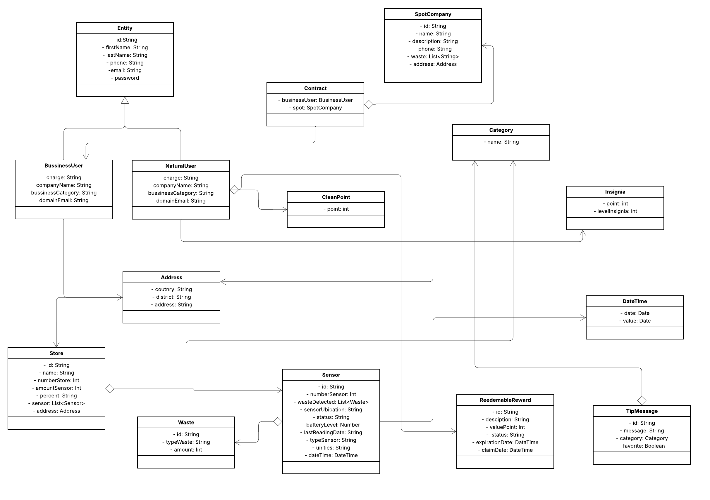

## 4.7.2. Class Dictionary.


**Identity**  
Descripción: Tabla que representa a los usuarios de la empresa, esta es la tabla padre que hereda atributos a las tablas hijas (NaturalUser y BussinessUser) 

|**Campo**|**Tipo de dato**|**Descripción**|
|---------|----------------|---------------|
| id | UUID | Identificador único el usuario |
| firstName | String | Nombre el usuario |
| lastName | String | Apellido del usuario |
| email | String | Correo del usuario |
| password | Strign | Contraseña del usuario |

**BusinessUser**  
Descripción: Tabla que representa al usuario como empresa, esta además de las caracteristicas heredadas, posee las de si misma 

|**Campo**|**Tipo de dato**|**Descripción**|
|---------|----------------|---------------|
| charge | String | Cargo del usuario |
| companyName | String | RazónSocial de la empresa|
| bussinessCategory | String | Categoría a la cual va dirigida la empresa |
| phone | String | Número de contacto de la empresa |
| domainEmail | String | Servidor por el cual los miembros de la empresa podrán unirse|

**ClearPoint**  
Descripción: Tabla que representa los puntos que gana el usuario con la app

|**Campo**|**Tipo de dato**|**Descripción**|
|---------|----------------|---------------|
| point | int | Puntos para el usurio |

**Category**  
Descripción: Tabla que representa la categoría de los residuos que se muestran

|**Campo**|**Tipo de dato**|**Descripción**|
|---------|----------------|---------------|
| name | String | Categoría de residuos |

**Insignia**  
Descripción: Tabla que representa el nivel de puntuación que tiene el usuario al hacer las actividades 

|**Campo**|**Tipo de dato**|**Descripción**|
|---------|----------------|---------------|
| point | Int | Puntos actuales de la insignia |
| levelInsignia | int | Nivel actual de la insignia | 

**Adress**  
Descripción: Tabla que representa la ubicación de alguna entidad 

|**Campo**|**Tipo de dato**|**Descripción**|
|---------|----------------|---------------|
| country | String | País de la entidad |
| disctrict | String | Distrito de la entidad | 
| address | String | Dirección de la entidad | 

**DateTime**  
Descripción: Tabla que representa la fecha  

|**Campo**|**Tipo de dato**|**Descripción**|
|---------|----------------|---------------|
| date | Date | Fecha |
| value | Date | Momento en el que sucede |

**Waste**  
Descripción: Tabla que representa los atributos de residuos   

|**Campo**|**Tipo de dato**|**Descripción**|
|---------|----------------|---------------|
| id | UUID |  Identificador único del residuo |
| type | String | Tipo de residuo | 
| amount | int | Cantidad de residuo |
| category | Category | Categoría del residuo |

**Sensor**  
Descripción: Tabla que representa los sensores que se instalan dentro de la empresa   

|**Campo**|**Tipo de dato**|**Descripción**|
|---------|----------------|---------------|
| id | UUID |  Identificador único del sensor |
| numberSensor | int | Número de sensor en su ubicación |
| wasteDetected | List<Waste> | Lista de residuos detectados por el sensor |
| spotDetected | String | Lugar de detección |
| sensorUbication | String | Lugar donde se ubica el sensor |
| dateTime | DateTime | fecha de detección |
| status | String | Estado del sensor |

**Store**  
Descripción: Tabla que representa los almacenes que la empresa tiene para colocar sus sensores

|**Campo**|**Tipo de dato**|**Descripción**|
|---------|----------------|---------------|
| id | UUID |  Identificador único del Almacén |
| address | Address | Localisación del Almacén |
| numberSotre | int | Numero de Almacé |
| sensor | List<Sensor> | Lista de sensores ubicados en el almacén |
| amountSensor | int | Número total de sensores ubicados en el almacen |
| percentage | Int | Porcentage de residuos encontrados en el almacén |

**SpotCompany**  
Descripción: Tabla que representa los lugares donde el usuario puede entregar materiales para ser reciclados y donde la empresa pueda contratar estos lugares 

|**Campo**|**Tipo de dato**|**Descripción**|
|---------|----------------|---------------|
| id | UUID |  Identificador único del lugar |
| name | String | Nombre del lugar |
| description | String | Descripción del lugar |
| phone | String | Número de contacto del lugar |
| waste | String | Lista de residuos que permiten en el lugar |

**Contract**  
Descripción: Tabla que representa las companías que el usuario de empresa contrata 

|**Campo**|**Tipo de dato**|**Descripción**|
|---------|----------------|---------------|
| bussinessUser | BussinessUser | Companía que contrata a la empresa de resiclaje |
| spot | SpotCompany | Empresa de reciclaje |

**TipMessage**  
Descripción: Tabla que representa los mensajes que la plataforma muestra al usuario como tips  

|**Campo**|**Tipo de dato**|**Descripción**|
|---------|----------------|---------------|
| id | UUID | Identificador único del tip |
| tittle | String | Titulo del mensaje |
| category | Category | Categoría del mensaje que se mostrará |
| favorite | Boolean | Mensaje marcado como favorito |  

**RedeemableReward**  
Descripción: Tabla que representa cuadros que el usuario puede canjear para sumar puntos  

|**Campo**|**Tipo de dato**|**Descripción**|
|---------|----------------|---------------|
| id | UUID | identificador único del cuadro |
| description | String | Mensaje que muestra el cuadro |
| valuePoint | Int | Cantidad de puntos que el usuario canjea puede canjear |
| status | String | Estado del Cuadro Canjeable |
| expirationDate | Date | fecha de expiración del cuadro |
| claimDate | Date | fecha en la que se canjea el cuadro


## 4.8. Database Design.
## 4.8.1. Database Diagram.

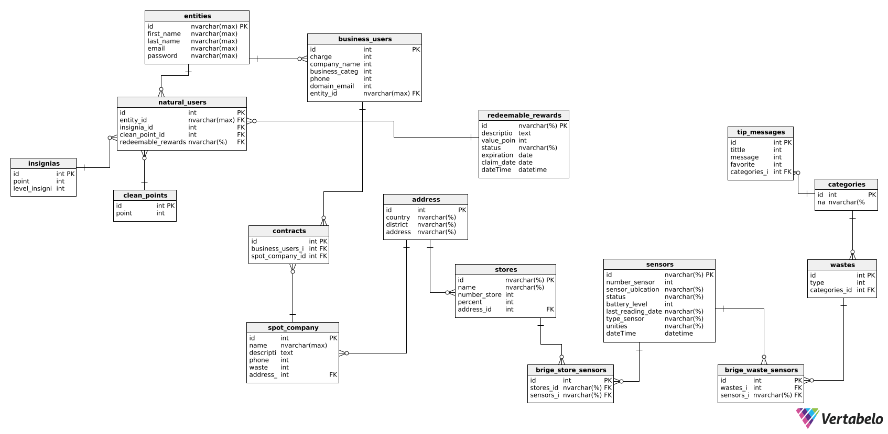


## Capítulo V: Product Implementation, Validation & Deploymentt

### 5.1. Software Configuration Management.

La Gestión de Configuración de Software (SCM, por sus siglas en inglés) es una disciplina en el desarrollo de software encargada de identificar, controlar y rastrear los componentes del software a lo largo de su ciclo de vida. Esta metodología facilita la administración organizada de cambios en documentos, códigos y otros elementos durante el proceso de desarrollo, garantizando así una gestión eficiente y ordenada. Su objetivo principal es mejorar la eficiencia del equipo de desarrollo y minimizar los errores. (Martin, 2023)

### 5.1.1. Software Development Environment Configuration.

**Directrices de Desarrollo para CleanView**

En esta sección, presentaremos las convenciones y prácticas recomendadas que hemos adoptado en HTML, CSS y JavaScript para el desarrollo de CleanView, nuestra plataforma tecnológica orientada a la gestión eficiente de residuos en empresas. Este conjunto de lineamientos ha sido diseñado para garantizar una estructura coherente del código, facilitar su mantenibilidad y optimizar el rendimiento de nuestra solución en tiempo real.

Dado que CleanView busca responder a los desafíos actuales en torno a la sostenibilidad empresarial —como la reducción de costos operativos y el cumplimiento de normativas ambientales—, estas buenas prácticas permiten que nuestro sistema se mantenga robusto, escalable y alineado con los principios de innovación y responsabilidad ética promovidos por la Universidad Peruana de Ciencias Aplicadas.

A continuación, detallaremos cómo se aplican estas convenciones en cada una de las tecnologías utilizadas, contribuyendo a una plataforma confiable que apoya a las empresas en el monitoreo, análisis y reducción de desechos mediante inteligencia artificial y análisis de datos en tiempo real.

**Definición de Requisitos**

Antes de iniciar el desarrollo de CleanView, resulta fundamental definir con precisión los requisitos funcionales y técnicos que darán forma a la plataforma. Estos requisitos reflejan nuestro compromiso con la sostenibilidad ambiental, la eficiencia operativa y el cumplimiento normativo, y se enfocan en proporcionar herramientas tecnológicas efectivas para empresas que buscan mejorar su gestión de residuos. Tales como:

- **Automatización de Procesos:** Desarrollo de funcionalidades que optimicen y automaticen procesos de gestión de residuos, reduciendo la intervención manual y mejorando la eficiencia operativa.
- **Gestión Inteligente de Datos:** Implementación de bases de datos robustas que permitan una administración precisa, segura y accesible de la información relacionada con residuos y reciclaje.
- **Personalización por Empresa:** Capacidades de configuración adaptables a las necesidades específicas de cada empresa, considerando su tamaño, sector y ubicación.
- **Colaboración y Monitoreo en Tiempo Real:** Herramientas que fomenten la colaboración entre equipos de trabajo y permitan un seguimiento en tiempo real del cumplimiento de objetivos ambientales, integrando metodologías ágiles de gestión.

**Elección de la Tecnología**

Con base en estos requisitos, hemos seleccionado un conjunto de tecnologías modernas que nos permiten construir una solución escalable, segura y de alto rendimiento para CleanView. Estas tecnologías no solo responden a las necesidades del sistema, sino que también aseguran una experiencia de usuario intuitiva y eficiente, alineada con nuestra misión de promover la sostenibilidad mediante la innovación tecnológica.

- **Frontend:** Angular para una interfaz de usuario dinámica y receptiva, que permita una interacción fluida con las herramientas de gestión y análisis.

- **Configuración del Entorno de Desarrollo** ItelliJ IDEA

  - **Editor de Código**: IntelliJ IDEA.
  - **Propósito**: Desarrollo de software y edición de código.
  - **Ruta de descarga**: https://www.jetbrains.com/idea/download/

- **Editor de Código:** Visual Studio Code

  - **Propósito:** Desarrollo y edición de código con soporte extensivo para JavaScript y herramientas de desarrollo.
  - **Ruta de descarga:** https://code.visualstudio.com/

- **Control de Versiones:** Git, con repositorios en GitHub.
  - **Propósito:** Gestión de versiones y colaboración en el código.
  - **Ruta de descarga:** https://git-scm.com/
  - **Repositorio:** https://github.com/1ASI0729-2510-4313-G1-CleanView

**Product UX/UI Design**

- **UI/UX:** Crear una interfaz amigable y accesible para los usuarios.
  - **Herramienta:** Figma
  - **Propósito:** Diseño de prototipos y interfaces de usuario.
  - **Ruta del Figma**: https://www.figma.com/design/bXnTP7xfO3bneisawRwlM5/Untitled?node-id=0-1&p=f&t=OTruJWbPB0L0sV6e-0


**Software Development**
**HTML:**

- **Descripción:** El lenguaje base de etiquetado para aplicaciones web sera empleado en este proyecto.
- **Enlace:** https://www.w3schools.com/html/default.asp
  **CSS:**
- **Descripción:** Cascade Styles Sheet maneja el diseño visual de la landing page.
- **Enlace:** https://www.w3schools.com/css/default.asp

Con CleanView, buscamos no solo ofrecer herramientas tecnológicas avanzadas para la gestión eficiente de residuos, sino también posicionarnos como un socio estratégico para las empresas. Nuestra plataforma está diseñada para impulsar el crecimiento sostenible de nuestros clientes, ayudándolos a cumplir con las normativas ambientales, optimizar sus procesos operativos y destacar en un mercado cada vez más competitivo y comprometido con la responsabilidad ambiental.

### 5.1.2. Source Code Management.

**Gestión de Cambios en el Código Fuente con GitHub**

En esta sección, nuestro equipo detalla los métodos y la estructura organizativa para gestionar los cambios en el código fuente utilizando GitHub como plataforma de control de versiones. Hemos configurado un repositorio remoto en GitHub para almacenar el código fuente y facilitar la colaboración entre los miembros del equipo. Los URLs de los repositorios son los siguientes:

- **Landing Page**: https://github.com/1ASI0729-2510-4313-G1-CleanView/Landing-Page
- **Frontend Web Applications**: 
- **Backend Web Applications**: 

**Estructura del Repositorio**

Hemos organizado el repositorio en ramas específicas para diferentes etapas del desarrollo, garantizando un flujo de trabajo ordenado y eficiente. La estructura de ramas es la siguiente:

- **Main branch (rama principal):** Contiene la versión estable y lista para producción del software.
- **Develop branch:** Contiene el código en desarrollo que se integrará en la rama principal después de ser probado y validado.

Además, para el desarrollo de nuevas funcionalidades, creamos ramas específicas siguiendo las convenciones de nomenclatura:

- **Feature branches:** Ramas dedicadas al desarrollo de nuevas características. La nomenclatura para estas ramas es `feature/nueva-funcionalidad`.

Implementamos GitFlow, un modelo de ramificación diseñado por Vincent Driessen, que incluye las siguientes ramas:

- **Main branch:** Rama principal que alberga el código estable y preparado para producción.
- **Develop branch:** Rama de desarrollo donde se integran nuevas funcionalidades y correcciones antes de ser fusionadas a la rama principal.
- **Feature branches:** Creadas a partir de `develop` para añadir nuevas características, siguiendo la nomenclatura `feature/nueva-funcionalidad`.
- **Release branches:** Preparadas para la liberación de nuevas versiones, permitiendo pruebas finales y corrección de errores antes del despliegue a producción.
- **Hotfix branches:** Utilizadas para corregir errores críticos en producción, siguiendo la nomenclatura `hotfix/correccion-critica`.

**Mensajes de Commits**

Adoptamos el estándar Conventional Commits para los mensajes de nuestros commits, lo que facilita la comprensión del historial de cambios y la automatización de versiones. Ejemplos de mensajes son:

- **feat:** Añadir nueva funcionalidad, por ejemplo, `feat: implementar sistema de notificaciones`.
- **fix:** Corregir errores, por ejemplo, `fix: solucionar problema con la validación de datos`.
- **docs:** Actualizar documentación, por ejemplo, `docs: actualizar guía de instalación`.
- **style:** Aplicar formato, por ejemplo, `style: ajustar estilo de código según las pautas`.
- **refactor:** Mejorar el código sin cambiar su funcionalidad, por ejemplo, `refactor: optimizar el rendimiento del módulo de usuario`.
- **test:** Añadir o modificar pruebas, por ejemplo, `test: añadir pruebas para la funcionalidad de autenticación`.

**Documentación**

La documentación del proyecto se encuentra en el archivo `README.md` dentro del repositorio. Este archivo proporciona detalles sobre la configuración, el uso del software y las guías para contribuir al proyecto.

### 5.1.3. Source Code Style Guide & Conventions.

En el _Source Code Style Guide_, presentaremos las convenciones, estilos, diseños y principios aplicados en los lenguajes utilizados durante el desarrollo de nuestro producto. Los lenguajes y herramientas empleados incluyen:

**LENGUAJES UTILIZADOS**

- **_HTML_** : Estructura del contenido en la web, utilizando etiquetas semánticas para mejorar la accesibilidad.
- **_CSS_**: Estilos y diseño visual del software, garantizando una experiencia de usuario óptima.
- **_JavaScript_**: Lógica y funcionalidad interactiva, permitiendo la automatización y personalización del software.
- **_TypeScript_**: Superset de JavaScript que añade tipado estático y otras características para mejorar la mantenibilidad y la detección de errores en tiempo de compilación.

**HTML**

- **Nombres Descriptivos:** Utiliza nombres de clases e IDs que sean descriptivos y significativos, facilitando la comprensión del propósito de cada elemento. Por ejemplo, en lugar de `box`, usa `project-card`.

- **Indentación:** Indenta correctamente el código HTML para mejorar la legibilidad y mantener una estructura clara.

- **Etiquetas Semánticas:** Emplea etiquetas semánticas apropiadas, como `<header>`, `<nav>`, `<main>`, y `<footer>`, para mejorar la accesibilidad y el SEO del sitio.
- **Comentarios:** Usa comentarios para explicar secciones complejas o partes importantes del código HTML, facilitando la comprensión para otros desarrolladores.

**CSS**

- **Nombres Descriptivos:** Utiliza nombres de clases y selectores que sean descriptivos y coherentes para facilitar la identificación y el mantenimiento de los estilos. Por ejemplo, usa `btn-submit` en lugar de `btn`.
- **Agrupación y Comentarios:** Agrupa propiedades relacionadas y separa secciones de CSS con comentarios claros, como /_ Estilos de botones _/. Esto organiza el código y facilita su navegación.
- **Preferencia por Clases:** Prefiere el uso de clases en lugar de IDs para estilos reutilizables y más flexibles.
- **Compatibilidad y Prefijos:** Utiliza prefijos de vendedor y asegúrate de que el código sea compatible con diferentes navegadores cuando sea necesario.
- **Medidas Relativas:** Usa medidas relativas como `em`, `rem`, y `%` en lugar de medidas absolutas para mejorar la flexibilidad y la accesibilidad del diseño.

**JavaScript**

- **Nombres Descriptivos:** Usa nombres de variables y funciones que sean descriptivos y significativos para que el código sea autoexplicativo, `fetchProjectData` en lugar de `getData`..
- **Comentarios:** Incluye comentarios para explicar la lógica compleja o el propósito de las funciones. Esto facilita la comprensión y el mantenimiento del código.
- **Espacios y Sangrías:** Utiliza espacios en blanco y sangrías para mejorar la legibilidad del código. Sigue un estilo consistente en todo el código.
- **Modularidad:** Evita la creación de funciones globales. Utiliza módulos o patrones de diseño para modularizar el código y evitar conflictos de nombres.
- **Convención de Nombres:** Emplea `camelCase` para nombrar variables y funciones, siguiendo una convención consistente.

**TypeScript**

- **Tipado Estático:** Utiliza el tipado estático de TypeScript para definir los tipos de variables, parámetros de funciones y retornos. Esto ayuda a detectar errores de manera anticipada. Por ejemplo, en lugar de `let age = "25"`, define el tipo correctamente: `let age: number = 25`.

- **Interfaces y Tipos Personalizados:** Define interfaces y tipos personalizados para describir la forma de los objetos y otros datos complejos. Esto mejora la claridad del código y facilita su mantenimiento. Ejemplo:

  ```typescript
  interface Project {
    id: number;
    name: string;
    description: string;
  }
  ```

- **Decoradores y Clases:** Emplea clases y decoradores para aprovechar las características orientadas a objetos de TypeScript, facilitando la organización del código, especialmente en Angular. Ejemplo de clase:

  ```typescript
  class User {
    constructor(public name: string, public age: number) {}
  }
  ```

- **Manejo de Errores en Tiempo de Compilación:** TypeScript permite identificar errores en tiempo de compilación, lo que reduce problemas en tiempo de ejecución. Aprovecha este control para escribir código más seguro.

- **Convención de Nombres:** Sigue las mismas convenciones de JavaScript, utilizando `camelCase` para variables y funciones, pero aplicando también la convención `PascalCase` para clases e interfaces.

- **Convenciones y Nomenclaturas:** Es necesario definir las convenciones y nomenclaturas que se utilizarán en el proyecto. Esto incluye el uso de `camelCase` para variables y funciones, `PascalCase` para clases e interfaces, y nombres de métodos descriptivos para mejorar la legibilidad del código.

**Comentarios**

- **Propósito y Complejidad:** Utiliza comentarios para explicar el propósito de bloques de código, funciones o partes complejas del código. Asegúrate de que añadan valor y contexto.
- **Actualización de Comentarios:** Mantén los comentarios actualizados a medida que el código evoluciona para evitar información desactualizada.
- **Evita Comentarios Redundantes:** Evita comentarios obvios o redundantes que no añaden información útil. Los comentarios deben proporcionar claridad y contexto adicional.

**Convenciones y Nomenclaturas**

- **Referencias de Nomenclatura:** Para la nomenclatura de elementos, adoptaremos convenciones inspiradas en **BEM (Block Element Modifier)** y **OOCSS (Object-Oriented CSS)**, promoviendo claridad y reutilización.

- **Estructura de Nombres:** Los nombres de las clases deben ser compuestos por tres partes: bloque, elemento y modificador. Por ejemplo, un botón de envío puede llamarse `btn--primary`, donde `btn` es el bloque y `primary` es el modificador.

### 5.1.4. Software Deployment Configuration.

En los siguientes pasos se explicará cómo llevar a cabo la implementación de nuestro sitio web utilizando GitHub Pages

**Deploy con GitHub Pages:**
En primer lugar, accedemos al repositorio de GitHub donde se encuentra nuestro proyecto y luego navegamos hacia la configuración del repositorio.

* LINK LANDING PAGE DESPLEGADA: https://1asi0729-2510-4313-g1-cleanview.github.io/Landing-Page/


Dentro del menú de ajustes, elegimos la opción "Pages".

**Control de Versiones**

- **Uso de Git:** Mantén un historial completo de cambios y facilita el manejo de diferentes versiones del código.

En la sección de GitHub Pages, escogemos la rama principal (main) en el menú desplegable de la sección "Branch" y guardamos la configuración presionando el botón "Save".
Después de unos momentos, recibiremos el enlace a nuestro sitio web publicado en GitHub Pages.

### 5.2 Landing Page, Services & Applications Implementation.

El desarrollo, testeo y despliegue de nuestra landing page es importante para que nuestros clientes puedan acceder a la información sobre nuestra empresa y producto a través de una interfaz con diseño responsivo, navegación intuitiva y solo con información relevante. Esta primera etapa nos permite crear un diseño conceptual sobre la estética que nuestra aplicación completa y lista para su uso. Estas etapas nos ayudaran a dar una primera impresión a los clientes para validar ideas e identificar problemas que se deben solucionar.


### 5.2.1 . Sprint 1

El primer sprint representa una etapa clave dentro de nuestro marco de trabajo basado en la metodología ágil Scrum. Durante este periodo inicial en el desarrollo de CleanView, se llevan a cabo reuniones orientadas a fortalecer el conocimiento entre los integrantes del equipo, permitiendo identificar fortalezas individuales y fomentar una colaboración efectiva.

Asimismo, se realiza la asignación de tareas enfocadas en convertir los requerimientos y funcionalidades previamente definidos en una landing page funcional, la cual no solo represente visualmente a CleanView, sino que también cumpla con principios de usabilidad y heurísticas de diseño. Este primer entregable constituye la base visual y técnica del proyecto, alineada con nuestros objetivos de sostenibilidad y eficiencia operativa.

#### 5.2.1.1 Sprint Planning 1.

El sprint planning es una reunion antes de cada sprint en la metodologia Scrum donde el equipo elige las user stories que va a transformar en un producto tangible. Tambien define que como se van a separar los trabajos y quien sera responsable. Nuestro objetivo sera construir un plan resolubre en un tiempo determinado que sera lo que dure el sprint, para crearlo fomentaremos la colaboracion para que todos sepan y entiendas los objetivos y prioridades.

| Sprint #| Sprint 1|
| -- | -- |
| **Sprint Planning Background**||
| **Date**| 14/04/2025|
| **Time**| 18:00 PM|
| **Location**| Discord (Reunión virtual)|
| **Prepared By**| Sandoval Paiva, Valentino|
| **Attendees (to planning meeting)** | Renzo Sebastian Uribe Livia, Fabian Alejandro Oliva Lopez, Marcia Victoria Melgarejo Gomez, Gabriel Fernando Gordon Salas, Valentino Sandoval Paiva|
| **Sprint Goal & User Stories**||
| **Sprint 1 Goal**| Nuestro enfoque está en finalizar el informe y desplegar nuestra Landing Page desde el repositorio de GitHub. Creemos que esto entrega una experiencia de usuario optimizada a nuestros clientes. Esto se confirmará cuando todas las tareas se muevan a la columna "Terminado" en Trello. |
| **Sprint 1 Velocity**| ------ |
| **Sum of Story Points**| 8 |

#### 5.2.1.2 Sprint Backlog 1.

Para el primer sprint backlog, recopilamos historias de usuario relacionadas con la página de inicio (landing page) . Para organizar y administrar estas historias de usuario, las dividimos en tareas fáciles de realizar y las asignamos a los miembros del equipo de manera efectiva, utilizamos la herramienta Trello. Nos concentramos en completar las historias de usuario durante este sprint, con el objetivo principal de crear una landing page completa con un diseño atractivo y fácil de usar. Gracias a Trello, pudimos colaborar efectivamente y seguir el progreso de las tareas, lo que nos permitió abordar y resolver

### **Sprint Backlog: Landing Page de CleanView**

| **ID**   | **Historia de Usuario**  | **Tarea ID** | **Descripción de la Tarea** | **Duración Estimada** | **Responsable** | **Estado** |
|----------|--------------------------|--------------|----------------------------|-----------------------|-----------------|------------|
| **US-001** | **Navegación Clara y Eficiente** | **TA001** | Crear el menú de navegación en la parte superior de la página. | 2 horas | Renzo Sebastian Uribe Livia | Done |
|          |                          | **TA002** | Implementar enlaces que redirijan correctamente a las secciones correspondientes. | 2 horas | Gabriel Fernando Gordon Salas | Done |
|          |                          | **TA003** | Probar la funcionalidad de navegación en diferentes dispositivos y navegadores. | 1 hora | Fabian Alejandro Oliva Lopez | Done |
| **US-002** | **Accesos Visibles para Login/Registro** | **TA004** | Diseñar botones de "Iniciar sesión" y "Registrarse" en el header. | 1 hora | Marcia Victoria Melgarejo Gomez | Done |
|          |                          | **TA005** | Implementar funcionalidad de los botones para redirigir a las páginas de login y registro. | 1.5 horas | Renzo Sebastian Uribe Livia | Done |
|          |                          | **TA006** | Verificar accesibilidad de los botones en dispositivos móviles. | 1 hora | Valentino Sandoval Paiva | Done |
| **US-003** | **Comprensión del Valor de la Plataforma** | **TA007** | Redactar los beneficios clave de la plataforma. | 1 hora | Marcia Victoria Melgarejo Gomez | Done |
|          |                          | **TA008** | Diseñar y crear una sección de beneficios destacando los puntos clave. | 2 horas | Gabriel Fernando Gordon Salas | Done |
|          |                          | **TA009** | Añadir íconos gráficos que refuercen visualmente los beneficios. | 1.5 horas | Fabian Alejandro Oliva Lopez | Done |
| **US-004** | **Información de Recompensas y Reciclaje** | **TA010** | Crear una sección que explique el sistema de recompensas y reciclaje. | 2 horas | Valentino Sandoval Paiva | Done |
|          |                          | **TA011** | Implementar gráficos visuales que representen las recompensas obtenidas. | 1.5 horas | Renzo Sebastian Uribe Livia | Done |
| **US-005** | **Diseño Responsivo en Móviles** | **TA012** | Revisar el diseño general para asegurar que se adapte correctamente a diferentes dispositivos. | 2 horas | Marcia Victoria Melgarejo Gomez | Done |
|          |                          | **TA013** | Realizar pruebas de visualización en smartphones y tablets. | 1 hora | Gabriel Fernando Gordon Salas | Done |
| **US-006** | **Botones Accesibles en Dispositivos Táctiles** | **TA014** | Ajustar el tamaño de los botones para que sean fácilmente seleccionables en dispositivos táctiles. | 1.5 horas | Valentino Sandoval Paiva | Done |
|          |                          | **TA015** | Realizar pruebas de interacción táctil para verificar la accesibilidad. | 1 hora | Renzo Sebastian Uribe Livia | Done |
| **US-007** | **Uso de Imágenes y Gráficos Ilustrativos** | **TA016** | Seleccionar imágenes y gráficos ilustrativos de la plataforma. | 2 horas | Fabian Alejandro Oliva Lopez | Done |
|          |                          | **TA017** | Integrar las imágenes dentro de las secciones explicativas de la landing page. | 1.5 horas | Gabriel Fernando Gordon Salas | Done |
| **US-008** | **Visualización de Recompensas Atractiva** | **TA018** | Crear íconos visuales para representar las recompensas obtenidas. | 1.5 horas | Marcia Victoria Melgarejo Gomez | Done |
|          |                          | **TA019** | Añadir los íconos en la sección de recompensas y asegurarse de que sean atractivos. | 1.5 horas | Valentino Sandoval Paiva | Done |
| **US-009** | **Transparencia de la Empresa** | **TA020** | Redactar y añadir la sección "Sobre Nosotros" que describa la misión, visión y valores de CleanView. | 2 horas | Renzo Sebastian Uribe Livia | Done |
| **US-010** | **Credibilidad de la Plataforma** | **TA021** | Incluir información sobre la experiencia y alianzas estratégicas de CleanView. | 2 horas | Gabriel Fernando Gordon Salas | Done |
| **US-011** | **Contacto Directo vía Formulario** | **TA022** | Crear un formulario de contacto funcional y sencillo. | 1.5 horas | Marcia Victoria Melgarejo Gomez | Done |
|          |                          | **TA023** | Implementar la funcionalidad de envío de mensajes. | 1 hora | Valentino Sandoval Paiva | Done |
| **US-012** | **Formulario de Contacto Sencillo** | **TA024** | Simplificar el diseño del formulario para que sea rápido de completar. | 1 hora | Renzo Sebastian Uribe Livia | Done |
|          |                          | **TA025** | Asegurar que el formulario sea intuitivo y fácil de usar. | 1 hora | Fabian Alejandro Oliva Lopez | Done |


Link Trello: 

#### 5.2.1.3 Development Evidence for Sprint Review

En esta sección se explica y presenta los avances en implementación con relación a los productos de la solución según el alcance del Sprint: Landing Page, Web Applications, Web Services. La sección inicia con una introducción que resume los principales avances en la implementación. A continuación se presenta la tabla que incluye, para cada repositorio, los commits relacionados con la implementación.

| **Repository**     | **Branch**                                | **Commit Id** | **Commit Message**                              | **Commit Message Body**                           | **Committed on (Date)** |
|----------------|-------------------------------------------|---------------|-------------------------------------------------|---------------------------------------------------|-------------------------|
| LandingPage       | main                               | 93d0247035c1bdbae3eaa20a3e121da162267e4f        | first commit                                    | Estructura inicial del proyecto: archivos .html, .css e imágenes. | 26/04/2025              |
| Report       | feature/Sprint2-sprintBacklog-services_Documentation_Evidence | 75c0c75        | Se realizo la agregacion de los videos y paginas | Created the README file.                          | 25/09/2024              |
| Report       | development                               | 6548432        | feat:Testing Suite Evidence for Sprint Review   | feat:Testing Suite Evidence for Sprint Review     | 25/09/2024              |
| Report       | development                               | a19b6ac        | feature:Sprint Backlog  update                 | Se realizo una actualizacion del product backlog | 25/09/2024              |
| Report       | development                               | 29ca9f3        | feature/execution-evidence-from-sprint-review   | feature/execution-evidence-from-sprint-review     | 24/09/2024              |
| Report       | docs/landingpage-deployment-evidence      | 7fe8f1f        | feature: added landing page deployment evidence | feature: added landing page deployment evidence   | 24/09/2024              |
| Report       | fix/diagrama-clases                       | 6e41532        | feature: Add bounded context Reports images and Information | feature: Add bounded context Reports images and Information | 24/09/2024              |


#### 5.2.1.4 Testing Suite Evidence for Sprint Review.

Durante este sprint 1 el equipo se enfocó en el desarrollo de la lading page por lo cual no se requirio pruebas de testing.

#### 5.2.1.5 Execution Evidence for Sprint Review.

En este Sprint, los miembros del equipo de desarrollo de software de CleanView han completado y desplegado la Landing Page. A continuación, mostramos imágenes que demuestran cómo nuestra página presenta de manera clara e intuitiva la información sobre nuestro producto y nuestra empresa.

<p align="center">
  
  <br>
  Vista general de la Landing Page, destacando el diseño limpio y moderno que permite a los usuarios navegar fácilmente por la información.
</p>

<p align="center">
  
  <br>
  Sección de soluciones clave del producto, mostrando cómo se presentan de manera atractiva y accesible para atraer a los usuarios.
</p>

<p align="center">
  
  <br>
La sección “How Work” está diseñada para ofrecer una explicación visual y sencilla del funcionamiento de la plataforma CleanView, diferenciando la experiencia para empresas y usuarios individuales. A través de tarjetas ilustradas y pasos numerados, se guía a cada tipo de usuario en el proceso de uso de la plataforma, desde el registro hasta la interacción con funciones clave como la recolección de residuos, sugerencias personalizadas y generación de reportes.

Esta sección tiene como objetivo proporcionar una comprensión rápida y accesible del valor y operatividad de CleanView, contribuyendo a una mejor experiencia de usuario desde el primer contacto con la plataforma.
</p>

<p align="center">
  
  <br>
 La sección Contacto de CleanView está diseñada para facilitar una comunicación directa y efectiva entre los usuarios y el equipo de soporte. Está compuesta por dos áreas diferenciadas: un panel informativo con los canales de contacto oficiales (correo electrónico, teléfono fijo y número móvil) y un formulario interactivo donde los usuarios pueden enviar consultas, comentarios o solicitudes personalizadas.

Esta interfaz intuitiva permite ingresar datos básicos como nombre, teléfono, correo electrónico y mensaje, simplificando el proceso de atención y garantizando una respuesta oportuna. De esta manera, CleanView refuerza su compromiso con la atención al cliente y el acompañamiento continuo en el uso de la plataforma.
</p>


</p>

#### 5.2.1.7 Software Deployment Evidence for Sprint Review.

**Resumen**
Durante este Sprint, nos hemos enfocado en el despliegue de la landing page. Las actividades realizadas incluyen la configuración del entorno de desarrollo y el despliegue inicial del sitio. A continuación, se detalla el proceso seguido para el despliegue de la landing page.

**Actividades Realizadas**

- Creación de Cuentas y Configuración de Recursos:

Proveedor de Hosting: Selección y configuración de la cuenta en el proveedor de hosting para desplegar la landing page.
Configuración del Entorno: Establecimiento del entorno de desarrollo y producción para la landing page.

- Configuración de Proyectos para Integración:

Repositorio de Código: Configuración del repositorio en GitHub para la integración continua y despliegue automático.
Automatización: Configuración de scripts y herramientas para la automatización del despliegue.

- Despliegue de la Landing Page:

Subida de Archivos: Transferencia de archivos y recursos al servidor de hosting.
Verificación: Comprobación de que la landing page se despliega correctamente y está accesible en la web.

**Deploy del Landing Page**

**Capturas de Pantalla**

- Repositorio de Landing Page:
  

**Enlace al Repositorio**: https://github.com/1ASI0729-2510-4313-G1-CleanView/Landing-Page

#### 5.2.1.8 Team Collaboration Insights during Sprint.

En esta sección, se presenta un análisis detallado de la colaboración del equipo durante el Sprint. Durante este sprint, las actividades de implementación se organizaron siguiendo una metodología ágil, garantizando una colaboración fluida entre los miembros del equipo. Se exponen capturas de los analíticos de colaboración y de los commits realizados en GitHub, lo que permite visualizar la contribución individual de cada miembro del equipo.

- Diseño y Desarrollo:
  Diseño de la Landing Page: Desarrollo y diseño completo de la landing page, incluyendo la creación de secciones y funcionalidad.
  Implementación: Realización de las tareas de codificación, pruebas y ajustes necesarios para completar la página.
- Documentación y Despliegue:
  Documentación: Creación de documentación relevante para la landing page, incluyendo capturas de pantalla y descripciones.
  Despliegue: Configuración del entorno de despliegue y transferencia de archivos al servidor.

**Landing Page**


- Valentino Sandoval Paiva: 
- Renzo Sebastian Uribe Livia	
- Fabian Alejandro Oliva Lopez	
- Marcia Victoria Melgarejo Gomez	
- Gabriel Fernando Gordon Salas	


**Report:**


- Renzo Sebastian Uribe Livia	
- Fabian Alejandro Oliva Lopez	
- Marcia Victoria Melgarejo Gomez	
- Gabriel Fernando Gordon Salas	
- Valentino Sandoval Paiva: 

## 5.2.2. Sprint 2

### 5.2.2.1 Sprint Planning 2

En este Sprint 2, durante la reunión de planificación, el equipo seleccionará las historias de usuario que se transformarán en resultados concretos. Se definirá la distribución de tareas y asignaremos responsabilidades a cada miembro. El objetivo será crear un plan realista que podamos completar dentro del tiempo establecido. Fomentaremos la colaboración y aseguraremos que todos comprendan los objetivos y prioridades del sprint.

| Sprint #| Sprint 2|
| -- | -- |
| **Sprint Planning Background**||
| **Date**| 10/05/2025|
| **Time**| 18:00 PM|
| **Location**| Discord (Reunión virtual)|
| **Prepared By**|Valentino Sandoval Paiva|
| **Attendees (to planning meeting)** | Valentino Sandoval Paiva, Renzo Uribe, Fabian Oliva, Valentino Sandoval, Marcia Melgarejo, Gabriel Gordon |
| **Sprint Goal & User Stories**||
| **Sprint 1 Goal**| El objetivo principal de este sprint es avanzar en la creación de la primera versión funcional de la aplicación web, estableciendo las bases de los distintos contextos de la aplicación. Esto incluirá la estructura básica de cada módulo o bounded context, la integración inicial de los componentes de la interfaz, y la mejora significativa de la landing page, garantizando una experiencia de usuario fluida y responsiva. También se implementará la funcionalidad de internacionalización (i18n) para permitir que la aplicación soporte múltiples idiomas. El sprint se considerará completado cuando todas las tareas relacionadas con estos avances estén marcadas como "Terminado". |
| **Sprint 1 Velocity**| 19 |
| **Sum of Story Points**| 63 |


### 5.2.2.2 Aspect Leaders and Collaborators

En esta sección se presenta el Leadership-and-Collaboration Matrix (LACX), que define quién es el líder y quiénes son los colaboradores para cada aspecto del Sprint. Estos aspectos pueden incluir funcionalidades, bounded contexts, o cualquier otro elemento relevante del alcance del Sprint, con el fin de mejorar la claridad y comunicación dentro del equipo.

| Team Member         | GitHub Username   | Frontend (L/C) | Testing (L/C) | UX/UI Design (L/C) | Documentación (L/C) | Coordinación (L/C) |
|---------------------|-------------------|----------------|----------------|---------------------|----------------------|---------------------|
| Marcia  Melgarejo        | Mevi1217          | C              | L              | C                   | C                    | C                   |
| Gabriel  Gordon      | Silent343         | L              | C              | C                   | C                    | C                   |
| Fabian Oliva        | FabulousFabStar   | C              | C              | L                   | C                    | C                   |
| Renzo Uribe     | JKOlimpo          | C              | C              | C                   | L                    | C                   |
| Valentino Sandoval  | SoyValzzz         | C              | C              | C                   | C                    | L                   |

### 5.2.2.3 Sprint Backlog 2

Durante el segundo sprint backlog, nos enfocamos en recolectar y trabajar en historias de usuario centradas en el desarrollo de la aplicación web. Para gestionar estas historias de manera eficiente, las desglosamos en tareas pequeñas y manejables, lo que facilitó su asignación entre los distintos miembros del equipo. Utilizamos la herramienta Trello para organizar el flujo de trabajo, asignar responsabilidades y monitorear el avance de cada actividad. Esta plataforma nos permitió mantener una comunicación clara, detectar cuellos de botella a tiempo y asegurarnos de que todos estuviéramos alineados con los objetivos del sprint.

El enfoque principal de este sprint fue avanzar en la consolidación de una aplicación web funcional, visualmente atractiva y con una experiencia de usuario intuitiva. Gracias a la organización efectiva y la colaboración continua, pudimos cumplir con varias de las historias de usuario planificadas, abordar los retos surgidos durante el proceso y mejorar progresivamente tanto el diseño como la estructura de la aplicación.

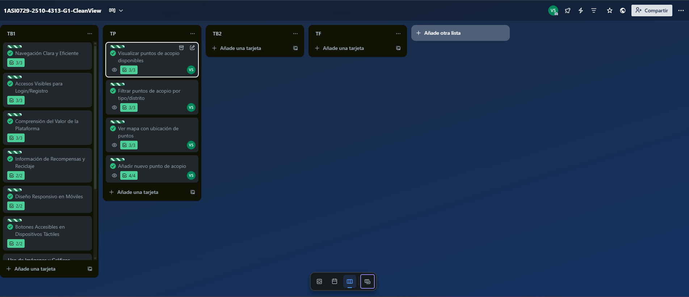

Link Trello: https://trello.com/b/GTdLG6Ox/1asi0729-2510-4313-g1-cleanview


| **ID**     | **Historia de Usuario**                    | **Tarea ID** | **Descripción de la Tarea**                             | **Duración Estimada** | **Responsable**    | **Estado** |
| ---------- | ------------------------------------------ | ------------ | ------------------------------------------------------- | --------------------- | ------------------ | ---------- |
| **US-028** | Visualizar puntos de acopio disponibles    | **TA028-1**  | Diseñar lista y tarjetas para puntos de acopio.         | 4 horas               | Valentino Sandoval | Done       |
|            |                                            | **TA028-2**  | Integrar datos y mostrar información relevante.         | 4 horas               | Valentino Sandoval | Done       |
|            |                                            | **TA028-3**  | Implementar función "Ver más" para detalles ampliados.  | 4 horas               | Valentino Sandoval | Done       |
| **US-029** | Filtrar puntos de acopio por tipo/distrito | **TA029-1**  | Crear filtros para tipo de residuo y distrito.          | 4 horas               | Valentino Sandoval | Done       |
|            |                                            | **TA029-2**  | Programar lógica para filtrar datos en backend.         | 4 horas               | Valentino Sandoval | Done       |
|            |                                            | **TA029-3**  | Probar actualización dinámica de la lista filtrada.     | 4 horas               | Valentino Sandoval | Done       |
| **US-030** | Ver mapa con ubicación de puntos           | **TA030-1**  | Integrar mapa con marcadores para cada punto de acopio. | 4 horas               | Valentino Sandoval | Done       |
|            |                                            | **TA030-2**  | Obtener coordenadas geográficas y vincular con puntos.  | 4 horas               | Valentino Sandoval | Done       |
|            |                                            | **TA030-3**  | Validar visualización y usabilidad del mapa.            | 4 horas               | Valentino Sandoval | Done       |
| **US-032** | Añadir nuevo punto de acopio | **TA032-1**  | Crear formulario para registro de nuevos puntos de acopio.   | 4 horas               | Valentino Sandoval | Done      |
|            |                              | **TA032-2**  | Implementar validaciones de campos del formulario.           | 4 horas               | Valentino Sandoval | Done      |
|            |                              | **TA032-3**  | Programar lógica de guardado del punto de acopio en backend. | 4 horas               | Valentino Sandoval | Done      |
|            |                              | **TA032-4**  | Integrar ubicación en el mapa al ingresar dirección válida.  | 4 horas               | Valentino Sandoval | Done      |


### 5.2.2.4 Development Evidence for Sprint Review

| Repository                                                              | Branch         | CommitId                                 | Commit message                                | Commit message body                                          | Committed on |
| ----------------------------------------------------------------------- | -------------- | ---------------------------------------- | --------------------------------------------- | ------------------------------------------------------------ | ------------ |
| [Frontend](https://github.com/1ASI0729-2510-4313-G1-CleanView/Frontend) | master         | bc2332b3ca0793fc3411bcfb1963b1744eb617a1 | feat(home): update home UI                    | feat(home): updated layout and improved responsiveness       | 12/05/2025   |
| [Frontend](https://github.com/1ASI0729-2510-4313-G1-CleanView/Frontend) | master         | 6cb48ee6bbd3c09a6bc02fabc78342688eda3c56 | fix(control-panel): fix display issues        | fix(control-panel): resolved conditional rendering bugs      | 12/05/2025   |
| [Frontend](https://github.com/1ASI0729-2510-4313-G1-CleanView/Frontend) | master         | 75771150eeb039ee7f76dccb71dc487b6f096ad4 | fix(collection): cleanup unused services      | fix(collection): removed deprecated services/entities        | 12/05/2025   |
| [Frontend](https://github.com/1ASI0729-2510-4313-G1-CleanView/Frontend) | master         | c18f16a025faea9c596f0933257fe4d27cf5ff4c | fix(reports): fix data integration            | fix(reports): synced with updated mock db                    | 12/05/2025   |
| [Frontend](https://github.com/1ASI0729-2510-4313-G1-CleanView/Frontend) | develop        | 2fdf1099507d613bc9b976501ccdeb95ace6031d | feat(reports): improve chart rendering        | feat(reports): adjusted chart scales and styling             | 12/05/2025   |
| [Frontend](https://github.com/1ASI0729-2510-4313-G1-CleanView/Frontend) | develop        | 92179279efbf603a066004b84962be4df3b19ba7 | fix(control-panel): connection fix            | fix(control-panel): resolved API connection issues           | 12/05/2025   |
| [Frontend](https://github.com/1ASI0729-2510-4313-G1-CleanView/Frontend) | develop        | 599a45848edbfa7b085775d9025a253a4a6cfe84 | fix(home): fix routing issues                 | fix(home): corrected route configuration                     | 12/05/2025   |
| [Frontend](https://github.com/1ASI0729-2510-4313-G1-CleanView/Frontend) | develop        | 75771150eeb039ee7f76dccb71dc487b6f096ad4 | fix(collection): cleanup unused services      | fix(collection): removed deprecated services/entities        | 12/05/2025   |
| [Frontend](https://github.com/1ASI0729-2510-4313-G1-CleanView/Frontend) | feature/report | a63b1cc3916a2aae22dd58da5483745bee675b4b | feat(reports): fix graphics                   | feat(reports): fixed alignment and colors in graphs          | 12/05/2025   |
| [Frontend](https://github.com/1ASI0729-2510-4313-G1-CleanView/Frontend) | develop        | 6b1c1e8b59ee86d00012023aec46fdb7b6937840 | feat(collection): add mock data for dashboard | feat(collection): added db json for bins and pickups         | 12/05/2025   |
| [Frontend](https://github.com/1ASI0729-2510-4313-G1-CleanView/Frontend) | develop        | af22c287ef80ad83d9edc231598cb63c36de7b77 | feat(collection): new collection zones added  | feat(collection): integrated new zones into map view         | 12/05/2025   |
| [Frontend](https://github.com/1ASI0729-2510-4313-G1-CleanView/Frontend) | develop        | e323578c35e488aa061173f8e1435d07980be68c | feat(control-panel): add control settings     | feat(control-panel): added UI for configuring parameters     | 12/05/2025   |
| [Frontend](https://github.com/1ASI0729-2510-4313-G1-CleanView/Frontend) | develop        | e9484e915408a5e8f53fbe4949b2a16d1f10ebe9 | feat(sustainable-actions): new feature module | feat(sustainable-actions): created logic for action tracking | 12/05/2025   |
| [Frontend](https://github.com/1ASI0729-2510-4313-G1-CleanView/Frontend) | develop        | 456b31b3d7aba571d1985ec1abaf9f774d38aca9 | feat(reports): add report section             | feat(reports): new UI for waste and impact reports           | 12/05/2025   |


### 5.2.2.5 Execution Evidence for Sprint Review

Durante este segundo sprint, el equipo trabajó en el desarrollo de los distintos bounded contexts del dominio de CleanView, utilizando el framework Vue.js para estructurar la aplicación. Con el apoyo de bibliotecas como Vuetify (u otra, si usaron una diferente), se implementaron funcionalidades clave que mejoraron la experiencia del usuario. Se priorizó la creación de componentes reutilizables y modulares, asegurando una interfaz moderna, dinámica y responsiva. Además, se cuidó la integración de cada módulo dentro de la arquitectura general del proyecto. Este sprint fue clave para establecer una base sólida y escalable para el desarrollo futuro de la plataforma.

# LANDING PAGE

LANDING PAGE: https://1asi0729-2510-4313-g1-cleanview.github.io/Landing-Page/


<p align="center">
  
  <br>
  Vista general de la Landing Page, destacando el diseño limpio y moderno que permite a los usuarios navegar fácilmente por la información.
</p>

<p align="center">
  
  <br>
  Sección de soluciones clave del producto, mostrando cómo se presentan de manera atractiva y accesible para atraer a los usuarios.
</p>

<p align="center">
  
  <br>
La sección “How Work” está diseñada para ofrecer una explicación visual y sencilla del funcionamiento de la plataforma CleanView, diferenciando la experiencia para empresas y usuarios individuales. A través de tarjetas ilustradas y pasos numerados, se guía a cada tipo de usuario en el proceso de uso de la plataforma, desde el registro hasta la interacción con funciones clave como la recolección de residuos, sugerencias personalizadas y generación de reportes.

Esta sección tiene como objetivo proporcionar una comprensión rápida y accesible del valor y operatividad de CleanView, contribuyendo a una mejor experiencia de usuario desde el primer contacto con la plataforma.
</p>

<p align="center">
  
  <br>
 La sección Contacto de CleanView está diseñada para facilitar una comunicación directa y efectiva entre los usuarios y el equipo de soporte. Está compuesta por dos áreas diferenciadas: un panel informativo con los canales de contacto oficiales (correo electrónico, teléfono fijo y número móvil) y un formulario interactivo donde los usuarios pueden enviar consultas, comentarios o solicitudes personalizadas.

Esta interfaz intuitiva permite ingresar datos básicos como nombre, teléfono, correo electrónico y mensaje, simplificando el proceso de atención y garantizando una respuesta oportuna. De esta manera, CleanView refuerza su compromiso con la atención al cliente y el acompañamiento continuo en el uso de la plataforma.
</p>


</p>

# WEB APPLICATION:

LINK DEL FRONTEND DESPLEGADO: https://frontend-web-applications.vercel.app/

## ***Collection Bounded-Context***

*Home page*

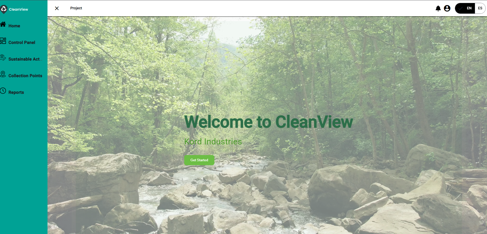

*Panel de control*

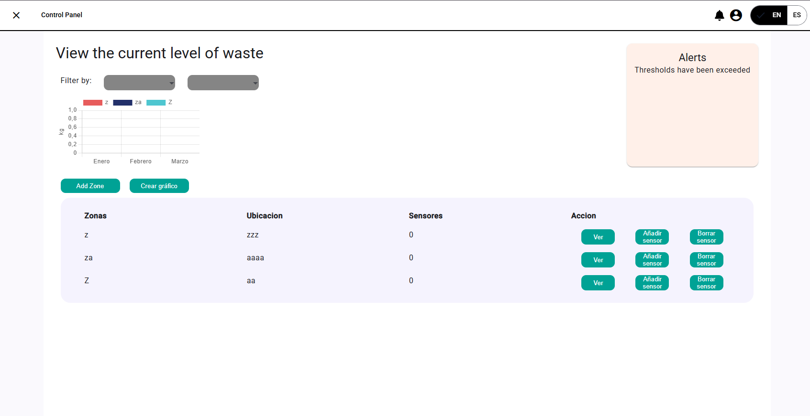


*Seccion de puntos de Acopio*

La interfaz muestra una lista de puntos de acopio para reciclaje en la parte izquierda, con información como:

- Nombre del punto (ej. San Isidro Recicla)

- Horario de atención

- Tipos de materiales reciclables (Papel, Cartón, Plástico, etc.)

- Teléfono de contacto

Cada tarjeta tiene un botón "Ver más".
A la derecha, se muestra un mapa interactivo (con Leaflet) que señala con pines la ubicación de estos puntos de acopio en la ciudad de Lima, Perú.

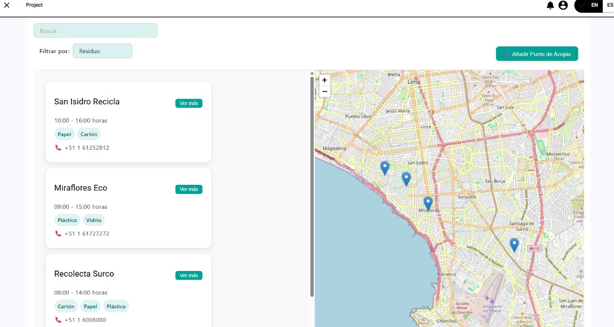

*Añadir un punto de acopio*

Se abre un formulario modal titulado “Nuevo Punto de Acopio”.
Este formulario permite ingresar los datos de un nuevo punto:
- Nombre
- Horario
- Teléfono
- Materiales (separados por coma)
- Latitud y longitud

Al final del formulario hay botones de Cancelar y Guardar.

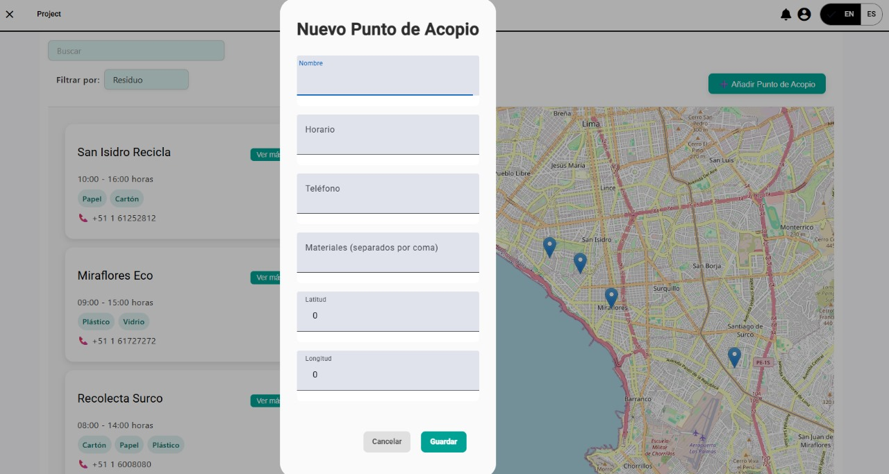

*Sección de Acciones Sostenibles*
Interfaz principal
La interfaz muestra consejos o tips sostenibles destacados en forma de tarjetas. En la parte superior se encuentra un botón “Agregar Acción Sostenible”, y más abajo:

Un buscador para filtrar acciones sostenibles por texto.

Filtros por categoría (ej. Almacenamiento, Mejora Operativa, Normativa).

Lista de acciones sostenibles:

Título de la acción (ej. Optimiza el uso del aire acondicionado)

Descripción breve

Íconos de acciones:

Marcar como favorito

Eliminar acción (si aplica)

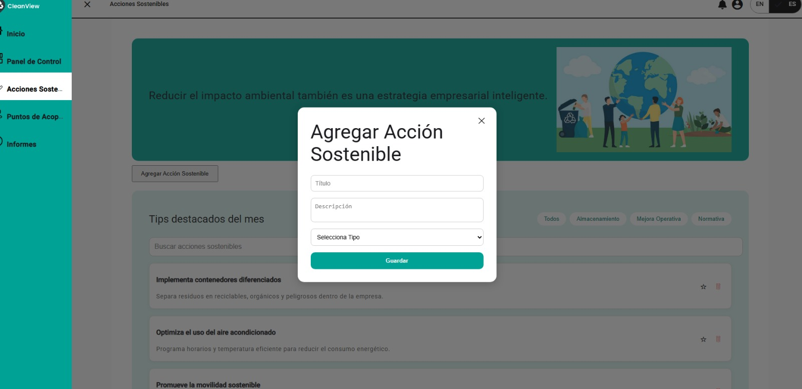

Agregar una acción sostenible
Al hacer clic en el botón “Agregar Acción Sostenible”, se abre un formulario modal con el título:
📝 Nueva Acción Sostenible

Campos del formulario:

Título: Nombre de la acción sostenible.

Descripción: Explicación breve o consejo.

Categoría: Selector (Almacenamiento, Mejora Operativa, Normativa, etc.)

Fecha (opcional): Cuándo se realizó la acción (puede usarse para registro o gamificación futura).

Botones al final del formulario:

“Guardar” → Registra la acción y la muestra en la lista principal.

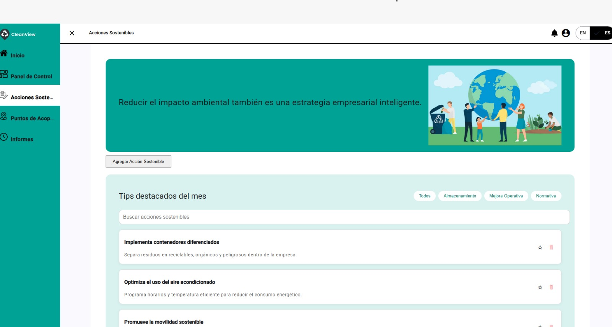

**Reports*

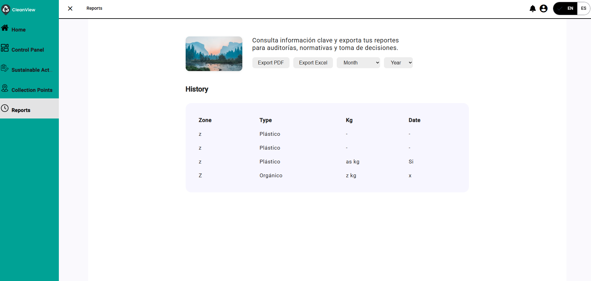


### 5.2.2.6 Services Documentation Evidence for Sprint Review

No se emplearon servicios adicionales, ya que este primer sprint se centró exclusivamente en la implementación de la primera versión del web application.

### 5.2.2.7 Software Deployment Evidence for Sprint Review

En este Sprint, hemos llevado a cabo diversas actividades relacionadas con el despliegue (Deployment) de nuestra plataforma, asegurando que todos los componentes estén correctamente configurados y listos para su uso. 

Las actividades de despliegue abarcan múltiples productos, incluyendo la Landing Page, aplicaciones web y servicios web. A continuación, se detallan los pasos realizados, junto con capturas de pantalla que ilustran el proceso y brindan una visión clara de cada etapa.

**Landing Page**
Para la Landing Page se ha implementado utilizando GitHub Pages, lo que facilita su acceso y gestión.


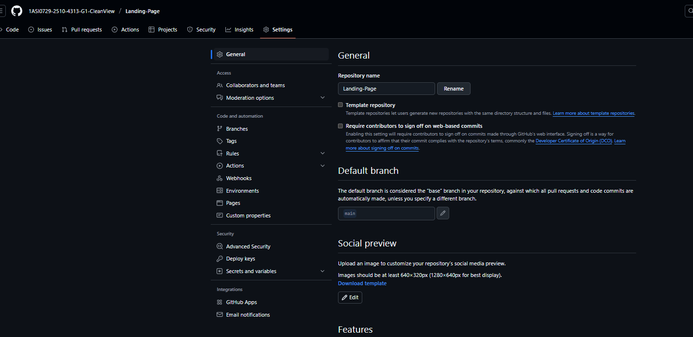

En la seccion pages, dentro de la configuracion del repositorio, escoger la rama deseada y seleccionar save para hacer el deploy de esta.

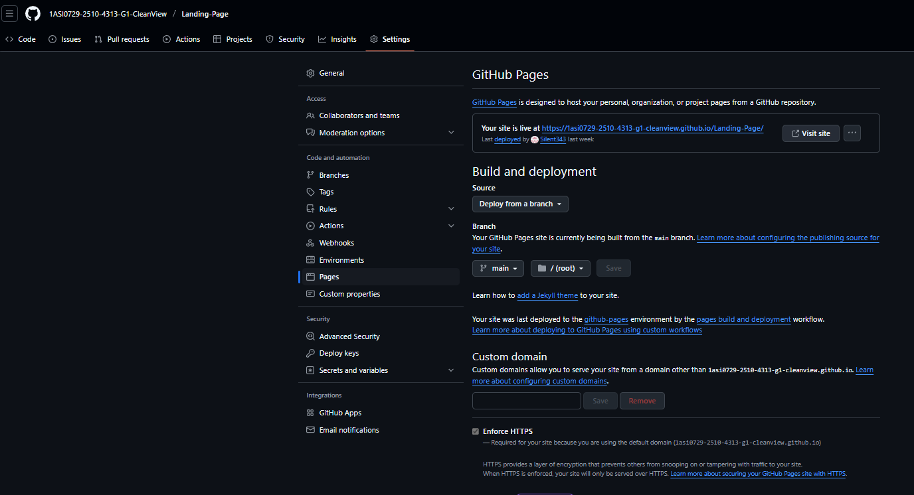

Pasados unos minutos se generará el link para acceder a la landing page.

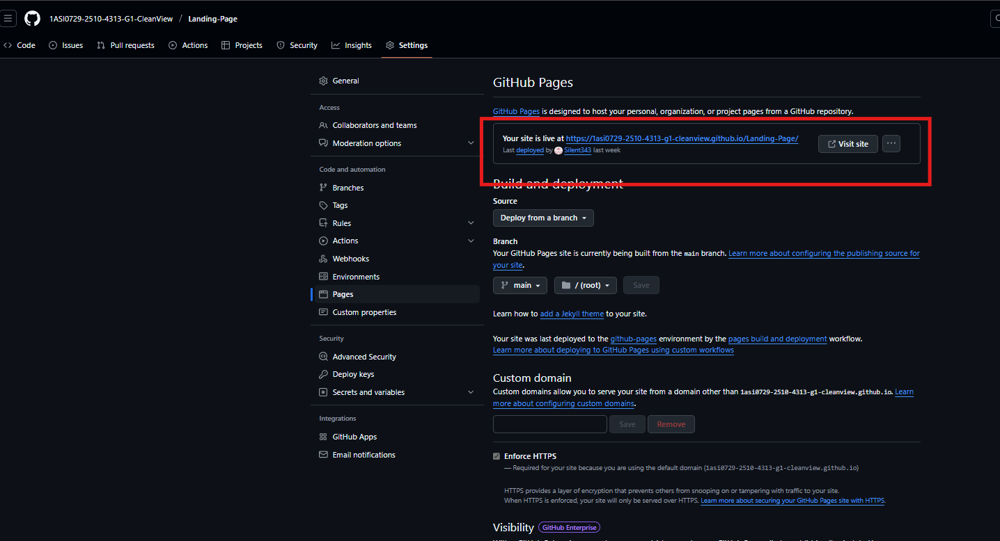

Adicionalmente Podemos seleccionar use your GitHub pages website en las opciones de about del repositorio, para poder acceder de una manera mas rapida al link.

Finalmente nos dará un link directo a la Landing page desplegada: https://1asi0729-2510-4313-g1-cleanview.github.io/Landing-Page/

**Frontend**

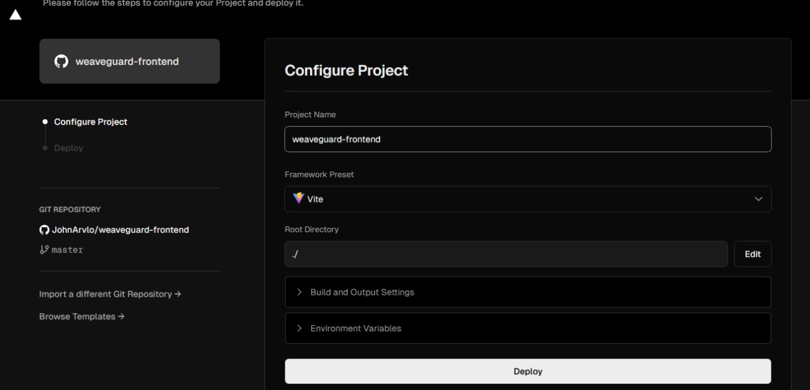

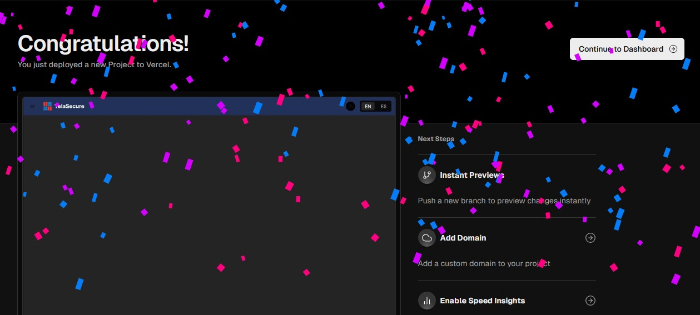

LINK FRONTEND DESPLEGADA: https://frontend-web-applications.vercel.app/


### 5.2.2.8. Team Collaboration Insights during Sprint.

Durante este sprint, el equipo trabajó en las mejoras de la landing page y en la primera versión funcional de la aplicación web. Las tareas se organizaron siguiendo metodologías ágiles, lo que permitió una colaboración fluida entre todos los miembros.

Se utilizaron herramientas como Trello y GitHub para coordinar actividades y visualizar las contribuciones individuales, respaldadas por capturas de analíticos y commits.

Avances:
- Landing Page: Se mejoró el diseño, haciéndolo más interactivo y responsivo.

- Aplicación Web: Se construyó una versión inicial con estructura base, rutas y lógica principal.

- Documentación y Despliegue: Se documentaron los avances y se configuró un entorno de prueba para desplegar la app.

**Landing Page**

En este sprint en la LandingPage no hubieron muchos cambios significativos, mas que nada solo el cambio de idioma.

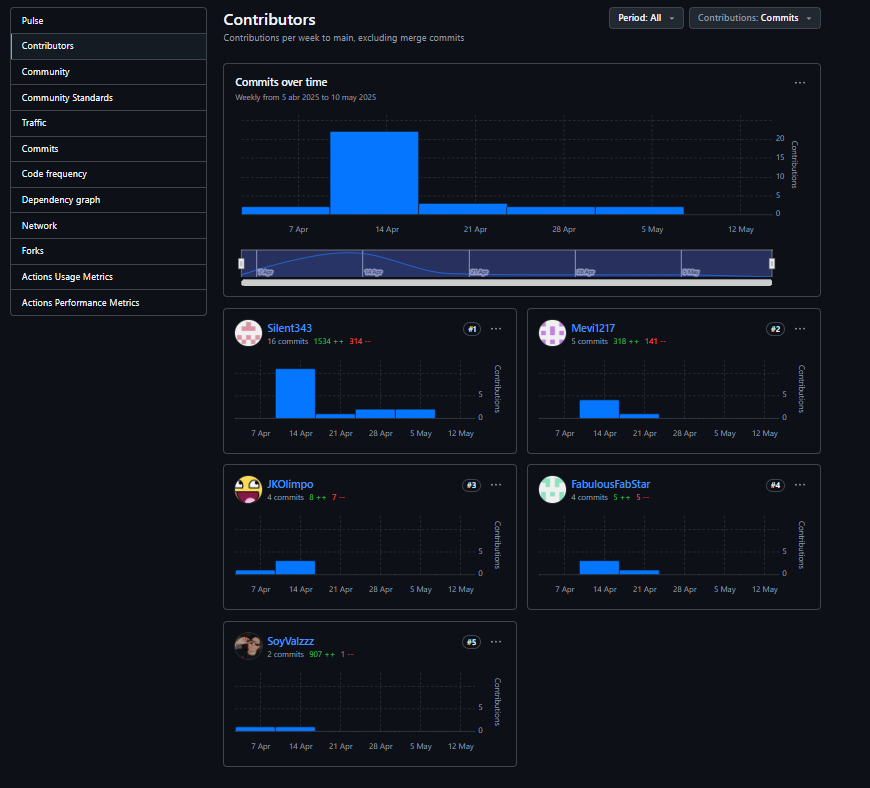

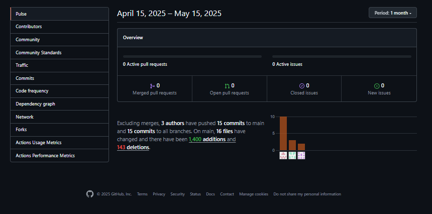


- Valentino Sandoval Paiva: 2
- Renzo Sebastian Uribe Livia: 4
- Fabian Alejandro Oliva Lopez: 4
- Marcia Victoria Melgarejo Gomez: 5
- Gabriel Fernando Gordon Salas. 16


**Report:**


- Renzo Sebastian Uribe Livia: 13
- Fabian Alejandro Oliva Lopez: 21
- Marcia Victoria Melgarejo Gomez: 42
- Gabriel Fernando Gordon Salas: 28
- Valentino Sandoval Paiva: 8


## 5.2.3. Sprint 3

### 5.2.3.1 Sprint Planning 3

Durante el Sprint 3, el equipo centró sus esfuerzos en el desarrollo del BackEnd de CleanView utilizando Java. Este sprint fue clave para implementar las primeras funcionalidades del servidor y establecer la estructura base del sistema. También se realizaron mejoras en el FrontEnd para integrarlo con el BackEnd, avanzando así hacia una versión más funcional del proyecto.

| Sprint #| Sprint 3|
| -- | -- |
| **Sprint Planning Background**||
| **Date**| 10/06/2025|
| **Time**| 18:00 PM|
| **Location**| Discord (Reunión virtual)|
| **Prepared By**|Valentino Sandoval Paiva|
| **Attendees (to planning meeting)** | Valentino Sandoval Paiva, Renzo Uribe, Fabian Oliva, Valentino Sandoval, Marcia Melgarejo, Gabriel Gordon |
| **Sprint Goal & User Stories**||
| **Sprint 1 Goal**| Nuestro enfoque está en finalizar el BackEnd individual, cada uno con su Bounded Context lanzarlo localmente. Creemos que esto, nos ayudara a mejorar y a entender el BackEnd. Esto se confirmará cuando todas las tareas se muevan a la columna "Terminado" en Trello. |
| **Sprint 1 Velocity**|  |
| **Sum of Story Points**|  |


### 5.2.3.2 Aspect Leaders and Collaborators

En esta sección se presenta el Leadership-and-Collaboration Matrix (LACX), que define quién es el líder y quiénes son los colaboradores para cada aspecto del Sprint. Estos aspectos pueden incluir funcionalidades, bounded contexts, o cualquier otro elemento relevante del alcance del Sprint, con el fin de mejorar la claridad y comunicación dentro del equipo.
| Team Member          | GitHub Username   | Frontend (L/C) | Backend (L/C) | Testing (L/C) | UX/UI Design (L/C) | Documentación (L/C) | Coordinación (L/C) |
| -------------------- | ----------------- | -------------- | ------------- | ------------- | ------------------ | ------------------- | ------------------ |
| Marcia Melgarejo     | Mevi1217          | C              | C             | L             | C                  | C                   | C                  |
| Gabriel Gordon       | Silent343         | C              | L             | C             | C                  | C                   | C                  |
| Fabian Oliva         | FabulousFabStar   | L              | C             | C             | C                  | L                   | C                  |
| Renzo Uribe          | JKOlimpo          | C              | C             | C             | L                  | C                   | L                  |
| Valentino Sandoval   | SoyValzzz         | C              | C             | C             | C                  | C                   | C                  |


### 5.2.3.3 Sprint Backlog 3

Para el Sprint Backlog 3, recopilamos historias de usuario enfocadas principalmente en el desarrollo del BackEnd. Estas historias fueron desglosadas en tareas concretas y manejables, lo que facilitó su asignación entre los miembros del equipo. Utilizamos Trello como herramienta de gestión para organizar y dar seguimiento al progreso, lo que mejoró significativamente nuestra coordinación. Esta estructura nos permitió enfocarnos en completar las funcionalidades clave del BackEnd y resolver los desafíos técnicos de manera más ágil y colaborativa.


### 5.2.2.4 Development Evidence for Sprint Review

Para el BackEnd, generamos un archivo .jar del proyecto utilizando el comando mvn clean package. Este archivo fue subido a un repositorio en GitHub, y desde allí realizamos el despliegue del servicio utilizando Railway como plataforma. Esta integración nos permitió poner en marcha el servidor de manera rápida y eficiente, facilitando las pruebas y la conexión con el FrontEnd.

Commits realizados en el repositorio de frontend durante el sprint 3:

Commits realizados en el repositorio de la Landing Page durante el sprint 3:

Commits realizados en el repositorio de Backend durante el sprint 3:


### 5.2.3.5 Testing Suite Evidence for Sprint Review.

### 5.2.3.6 Execution Evidence for Sprint Review

# Landin Page


Acontinuación se entrega el enlace a la landing page desplegada, actualizada y la última version.
LANDING PAGE: https://1asi0729-2510-4313-g1-cleanview.github.io/Landing-Page/

<p align="center">
  
  <br>
 
</p>

<p align="center">
  
  <br>
  
</p>

<p align="center">
  
  <br>
</p>

<p align="center">
  
  <br>
</p>
</p>

# FrontEnd:

LINK DEL FRONTEND DESPLEGADO: https://frontend-web-applications.vercel.app/

- **Bounded Context: Collection**

*Home page*


*Panel de control*


*Seccion de puntos de Acopio*


*Añadir un punto de acopio*


- **Bounded Context: Sustainable Actions**


- **Bounded Context: Reports**


Video About-the-Product:

### 5.2.3.7 Services Documentation Evidence for Sprint Review


Para el sprint 3 se documentaron ** endpoints repartidos en * controladores (). 
Además se empleó swagger para hacer las pruebas a los endpoints.
Link al repositorio de backend: 

<h3> Collection Bounded Context</h3>

**CollectionPointsController**

| **Tag**          | **HTTP Verbs** | **Endpoint**                     | **Summary**                  | **Description**                         | **OperationId**          |
| ---------------- | -------------- | -------------------------------- | ---------------------------- | --------------------------------------- | ------------------------ |
| CollectionPoints | POST           | /api/v1/collection-points        | Create Collection Point      | Create a new collection point           | CreateCollectionPoint    |
| CollectionPoints | GET            | /api/v1/collection-points/{id}   | Get Collection Point by Id   | Get a collection point by its ID        | GetCollectionPointById   |
| CollectionPoints | GET            | /api/v1/collection-points        | Get All Collection Points    | Retrieve all collection points          | GetAllCollectionPoints   |
| CollectionPoints | GET            | /api/v1/collection-points/search | Get Collection Point by Name | Retrieve a collection point by its name | GetCollectionPointByName |
| CollectionPoints | PUT            | /api/v1/collection-points/{id}   | Update Collection Point      | Update an existing collection point     | UpdateCollectionPoint    |
| CollectionPoints | DELETE         | /api/v1/collection-points/{id}   | Delete Collection Point      | Delete a collection point by its ID     | DeleteCollectionPoint    |


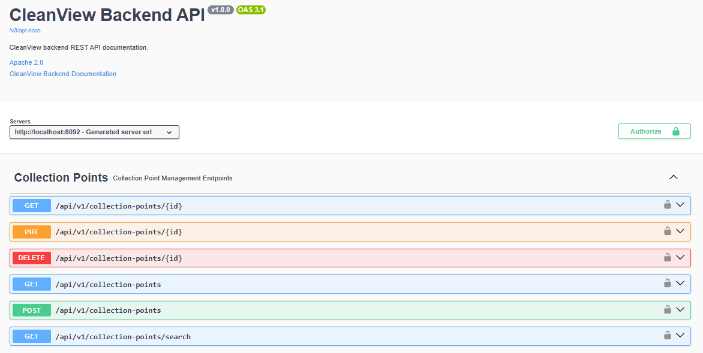


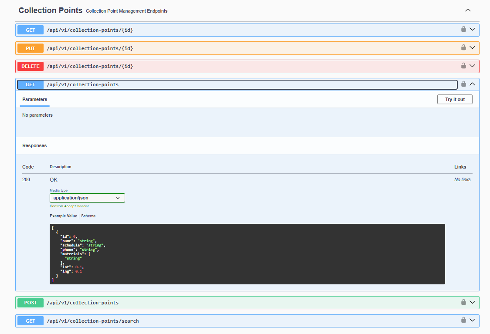

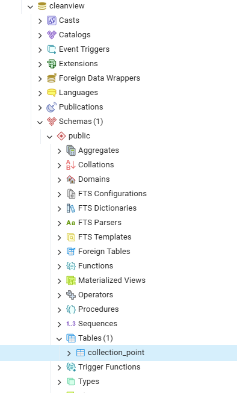

### 5.2.3.8 Software Deployment Evidence for Sprint Review

En este Sprint, hemos llevado a cabo diversas actividades relacionadas con el despliegue (Deployment) de nuestra plataforma, asegurando que todos los componentes estén correctamente configurados y listos para su uso. 

Las actividades de despliegue abarcan múltiples productos, incluyendo la Landing Page, aplicaciones web y servicios web. A continuación, se detallan los pasos realizados, junto con capturas de pantalla que ilustran el proceso y brindan una visión clara de cada etapa.

**Landing Page**
Para la Landing Page se ha implementado utilizando GitHub Pages, lo que facilita su acceso y gestión.


En la seccion pages, dentro de la configuracion del repositorio, escoger la rama deseada y seleccionar save para hacer el deploy de esta.


Pasados unos minutos se generará el link para acceder a la landing page.


Adicionalmente Podemos seleccionar use your GitHub pages website en las opciones de about del repositorio, para poder acceder de una manera mas rapida al link.

Finalmente nos dará un link directo a la Landing page desplegada: https://1asi0729-2510-4313-g1-cleanview.github.io/Landing-Page/

**Frontend**


LINK FRONTEND DESPLEGADA: https://frontend-web-applications.vercel.app/

**BackEnd**


### 5.2.3.9. Team Collaboration Insights during Sprint.

Durante este sprint, el equipo trabajó en las mejoras de la landing page y en la primera versión funcional de la aplicación web. Las tareas se organizaron siguiendo metodologías ágiles, lo que permitió una colaboración fluida entre todos los miembros.

Se utilizaron herramientas como Trello y GitHub para coordinar actividades y visualizar las contribuciones individuales, respaldadas por capturas de analíticos y commits.

Avances:
- Landing Page: Se mejoró el diseño, haciéndolo más interactivo y responsivo.

- Aplicación Web: Se construyó una versión inicial con estructura base, rutas y lógica principal.

- Documentación y Despliegue: Se documentaron los avances y se configuró un entorno de prueba para desplegar la app.

**Landing Page**

En este sprint en la LandingPage no hubieron muchos cambios significativos, mas que nada solo el cambio de idioma.


- Valentino Sandoval Paiva: 2
- Renzo Sebastian Uribe Livia: 4
- Fabian Alejandro Oliva Lopez: 4
- Marcia Victoria Melgarejo Gomez: 5
- Gabriel Fernando Gordon Salas. 16


**Report:**


- Renzo Sebastian Uribe Livia: 13
- Fabian Alejandro Oliva Lopez: 21
- Marcia Victoria Melgarejo Gomez: 42
- Gabriel Fernando Gordon Salas: 28
- Valentino Sandoval Paiva: 8


<div id='6.'><h2>Conclusiones</h2></div>

El desarrollo de CleanView representó un desafío enriquecedor que permitió al equipo demostrar un alto grado de compromiso, organización y trabajo colaborativo. A través de la implementación de bounded contexts como Home, Control Panel, Sustainable Actions, Collection y Reports, se logró construir una solución enfocada en la gestión ambiental y el monitoreo de residuos. Durante el proceso, se aplicaron metodologías ágiles, diseño centrado en el usuario, integración continua en GitHub, y prácticas de Domain Driven Design, lo que facilitó una estructura de código escalable y alineada a los objetivos del sistema. La planificación y documentación también jugaron un rol crucial, permitiendo una ejecución clara y coordinada entre los miembros.

Entre los beneficios obtenidos con la solución destacan la optimización de recursos mediante el control de residuos, la automatización de procesos en el panel de control, y la generación de reportes que facilitan una toma de decisiones informada. CleanView también promueve la sostenibilidad al reducir el impacto ambiental y fomenta la satisfacción del usuario final a través de una interfaz intuitiva y funcionalidades clave. Este proyecto no solo fortaleció las habilidades técnicas del equipo, sino que consolidó aprendizajes sobre comunicación efectiva, gestión de proyectos y colaboración interdisciplinaria.

<div id='7.'><h2>Bibliografía</h2></div>

Manual de conservación (2002). Manual de conservación preventiva de textiles. [https://www.cnct.cl/documentos/manualconservacion.pdf](https://www.cnct.cl/documentos/manualconservacion.pdf)

Delta (2023). Problemas de calidad de los productos textiles: ¿cómo resolverlos?. [https://deltamaquinastexteis.com.br/es/problemas-de-calidad-de-los-productos-textiles-como-resolverlos/](https://deltamaquinastexteis.com.br/es/problemas-de-calidad-de-los-productos-textiles-como-resolverlos/)

Sociedad Nacional de Industrias (2024). Resultados encuesta de opinión industrial (EOI). [https://sni.org.pe/wp-content/uploads/2024/07/Resultados_EOI-II-TRIM-2024-1.pdf](https://sni.org.pe/wp-content/uploads/2024/07/Resultados_EOI-II-TRIM-2024-1.pdf)

Lean UX (2021). Lean UX, 3rd Edition. [https://learning.oreilly.com/library/view/lean-ux-3rd/9781098116293/](https://learning.oreilly.com/library/view/lean-ux-3rd/9781098116293/)

Hospodor, C., & Porto, C. (2021). *Vue.js 3 By Example: Build eight real-world applications from the ground up using Vue 3, Vuex, and Vue Router*. https://www.packtpub.com/product/vuejs-3-by-example/9781838826345

Bonnin, H. (2020). *Vue.js 3 Cookbook: Discover actionable solutions for building modern web apps with the latest Vue features and TypeScript*. https://www.packtpub.com/product/vuejs-3-cookbook/9781838826222

Kotsifas, E. (2021). *Full-Stack Web Development with Vue.js and Node: Build scalable and powerful web apps with modern web stack: MongoDB, Vue, Node, and Express*. https://www.packtpub.com/product/full-stack-web-development-with-vuejs-and-node/9781788831147

Roig, P. (2021). *Getting Started with Firebase for Web Developers: A Comprehensive Guide to Integrating Google Firebase with Your Web App*. https://www.amazon.com/dp/B08KHL2J5Y

Brown, G., & Mullen, S. (2019). *Google Cloud Platform for Architects: Design and Manage Powerful Cloud Solutions*. https://www.packtpub.com/product/google-cloud-platform-for-architects/9781788833073

Thomas, C. (2020). *Firebase Cookbook: Over 70 recipes for building high-quality web and mobile applications*. https://www.packtpub.com/product/firebase-cookbook/9781788292399

Date, C. J. (2019). *Database Design and Relational Theory: Normal Forms and All That Jazz* (2nd ed.). https://link.springer.com/book/10.1007/978-1-4842-5540-7

Fowler, M. (2016). *NoSQL Distilled: A Brief Guide to the Emerging World of Polyglot Persistence*. https://www.pearson.com/en-us/subject-catalog/p/nosql-distilled-a-brief-guide-to-the-emerging-world-of-polyglot-persistence/P200000009587/9780133036121

Kleppmann, M. (2017). *Designing Data-Intensive Applications: The Big Ideas Behind Reliable, Scalable, and Maintainable Systems*. https://www.oreilly.com/library/view/designing-data-intensive-applications/9781491903063/

1Chacon, S., & Straub, B. (2014). *Pro Git* (2nd ed.). Disponible también en línea de forma gratuita. https://git-scm.com/book/en/v2

Bell, J. (2018). *GitLab Quick Start Guide: Build a DevOps culture and collaborate effectively with GitLab for CI/CD*. https://www.packtpub.com/product/gitlab-quick-start-guide/9781788837613

Avelino, M. (2019). *GitHub Essentials: Become a Git and GitHub expert with this fast-paced guide*. https://www.packtpub.com/product/github-essentials/9781789538502

Scott, D., & Farrelly, M. (2021). *UI is Communication: How to Design Intuitive, User Centered Interfaces by Focusing on Effective Communication*. https://www.elsevier.com/books/ui-is-communication/scott/978-0-12-396980-8

Henke, R. (2020). *UX Design 2020: Complete Beginner's Guide to Become an Effective UX/UI Designer*. https://www.amazon.com/dp/B08KHL2J5Y

Kang, M. (2018). *Figma for UX/UI Design: The Comprehensive Guide*. https://www.amazon.com/dp/B07KHL2J5Y

Palepu, V. (2021). *Hands-On Test-Driven Development with JavaScript: A practical guide to TDD, automated testing, and continuous integration*. https://www.packtpub.com/product/hands-on-test-driven-development-with-javascript/9781838820213

Hendrickson, E. (2017). *Explore It!: Reduce Risk and Increase Confidence with Exploratory Testing*. https://pragprog.com/titles/ehxta/explore-it/

Meszaros, G. (2007). *xUnit Test Patterns: Refactoring Test Code*. https://www.pearson.com/store/p/xunit-test-patterns/P100000009587


<div id='8.'><h2>Anexos</h2></div>


